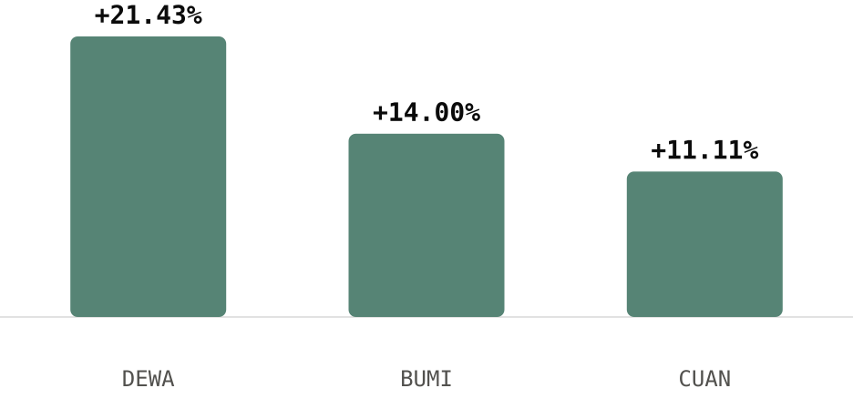
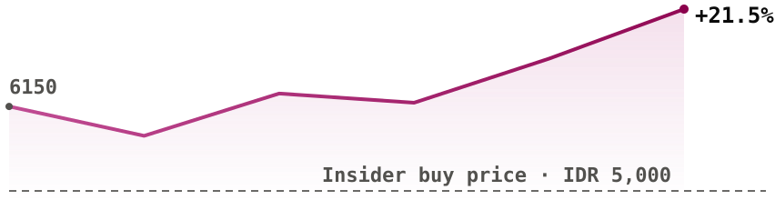

# Tariffs hit the banks, not the miners

**Issue #30 | 28 July 2026 | week of 20-24 July | data as of 24 July 2026**

Hi there,

## Key Data Bites

- IDX total market cap closed at **IDR 10,866.94T**, up **+1.13% WoW**, less than a third of the prior week's +3.96%.
- The gain didn't hold through the week. Market cap peaked mid-week at IDR 11,064.99T on Wednesday, then gave back **1.79%** into Friday's close.
- **LQ45 -1.15%** and **IDX30 -1.57%** both lagged the whole market's +1.13% gain, so the blue chips underperformed an otherwise positive week.
- LQ45 breadth was **20 up, 23 down**, two unchanged, nearly even, so the index-level decline was concentrated in a few heavily weighted names rather than broad selling.
- [$DEWA](https://sectors.app/idx/dewa?utm_source=newsletter&utm_medium=email&utm_campaign=weekly-insights-v2_2026-07-28&utm_content=key-data-bites&utm_term=dewa) was the best LQ45 name at **+21.43%**, closing at IDR 442.
- [$BMRI](https://sectors.app/idx/bmri?utm_source=newsletter&utm_medium=email&utm_campaign=weekly-insights-v2_2026-07-28&utm_content=key-data-bites&utm_term=bmri) was the worst at **-7.81%**, closing at IDR 4,130.
- [$BUMI](https://sectors.app/idx/bumi?utm_source=newsletter&utm_medium=email&utm_campaign=weekly-insights-v2_2026-07-28&utm_content=key-data-bites&utm_term=bumi) topped LQ45 daily volume on **all five sessions**, peaking at 12.06B shares on Thursday.
- The Oil, Gas & Coal sub-sector, home to three of the week's five best LQ45 performers, carries a median P/E of **10.30x**.

## Top Weekly Movers

Measured across the **45 LQ45 constituents**, 17 July close to 24 July close. `companies/top-changes` returned a live snapshot dated 27 July, outside this window, so movers here are computed directly from constituent closes; see the appendix.

**Top Gainers** (20-24 Jul)

| Ticker | Close (IDR) | WoW |
|---|---|---|
| [$DEWA](https://sectors.app/idx/dewa?utm_source=newsletter&utm_medium=email&utm_campaign=weekly-insights-v2_2026-07-28&utm_content=top-movers&utm_term=dewa) | 442 | +21.43% |
| [$BUMI](https://sectors.app/idx/bumi?utm_source=newsletter&utm_medium=email&utm_campaign=weekly-insights-v2_2026-07-28&utm_content=top-movers&utm_term=bumi) | 171 | +14.00% |
| [$CUAN](https://sectors.app/idx/cuan?utm_source=newsletter&utm_medium=email&utm_campaign=weekly-insights-v2_2026-07-28&utm_content=top-movers&utm_term=cuan) | 700 | +11.11% |
| [$MEDC](https://sectors.app/idx/medc?utm_source=newsletter&utm_medium=email&utm_campaign=weekly-insights-v2_2026-07-28&utm_content=top-movers&utm_term=medc) | 1,325 | +7.72% |
| [$ESSA](https://sectors.app/idx/essa?utm_source=newsletter&utm_medium=email&utm_campaign=weekly-insights-v2_2026-07-28&utm_content=top-movers&utm_term=essa) | 640 | +7.56% |

**Top Losers** (20-24 Jul)

| Ticker | Close (IDR) | WoW |
|---|---|---|
| [$BMRI](https://sectors.app/idx/bmri?utm_source=newsletter&utm_medium=email&utm_campaign=weekly-insights-v2_2026-07-28&utm_content=top-movers&utm_term=bmri) | 4,130 | -7.81% |
| [$EXCL](https://sectors.app/idx/excl?utm_source=newsletter&utm_medium=email&utm_campaign=weekly-insights-v2_2026-07-28&utm_content=top-movers&utm_term=excl) | 2,410 | -6.59% |
| [$KLBF](https://sectors.app/idx/klbf?utm_source=newsletter&utm_medium=email&utm_campaign=weekly-insights-v2_2026-07-28&utm_content=top-movers&utm_term=klbf) | 720 | -5.26% |
| [$BBTN](https://sectors.app/idx/bbtn?utm_source=newsletter&utm_medium=email&utm_campaign=weekly-insights-v2_2026-07-28&utm_content=top-movers&utm_term=bbtn) | 1,205 | -4.37% |
| [$UNTR](https://sectors.app/idx/untr?utm_source=newsletter&utm_medium=email&utm_campaign=weekly-insights-v2_2026-07-28&utm_content=top-movers&utm_term=untr) | 25,500 | -3.95% |

## What the Data Unearthed

### Tariffs hit the banks hardest, even the one with a profit beat

- Four of the week's five worst LQ45 performers sit in financials or consumer-facing sectors that new US tariff news hit hardest on Friday: Bank Mandiri ([$BMRI](https://sectors.app/idx/bmri?utm_source=newsletter&utm_medium=email&utm_campaign=weekly-insights-v2_2026-07-28&utm_content=data-unearthed&utm_term=bmri)) **-7.81%**, XLSMART Telecom Sejahtera ([$EXCL](https://sectors.app/idx/excl?utm_source=newsletter&utm_medium=email&utm_campaign=weekly-insights-v2_2026-07-28&utm_content=data-unearthed&utm_term=excl)) **-6.59%**, and Bank Tabungan Negara ([$BBTN](https://sectors.app/idx/bbtn?utm_source=newsletter&utm_medium=email&utm_campaign=weekly-insights-v2_2026-07-28&utm_content=data-unearthed&utm_term=bbtn)) **-4.37%**.
- New US tariffs announced Friday sent the IHSG down 1.88% to 6,196.43, with foreign investors net selling IDR 759.46B on the session, led by [$BMRI](https://sectors.app/idx/bmri?utm_source=newsletter&utm_medium=email&utm_campaign=weekly-insights-v2_2026-07-28&utm_content=data-unearthed&utm_term=bmri) at IDR 386.06B out. ([CNBC Indonesia](https://www.cnbcindonesia.com/market/20260724160943-17-753660/ihsg-ditutup-terkoreksi-188-ke-level-6196))
- [$BMRI](https://sectors.app/idx/bmri?utm_source=newsletter&utm_medium=email&utm_campaign=weekly-insights-v2_2026-07-28&utm_content=data-unearthed&utm_term=bmri)'s own results that same day showed consolidated net profit up **24.4% YoY to IDR 30.40T**, with credit growth outpacing the industry average. ([CNN Indonesia](https://www.cnnindonesia.com/ekonomi/20260724161501-625-1384577/bank-mandiri-perkuat-sinergi-ekosistem-dan-kredit-di-kuartal-ii-2026))
- Analysts covering the sector attributed the bank-stock slide to profit-taking and foreign selling rather than the earnings themselves, with the BI Rate holding steady at 5.75% through the week. ([Kontan](https://keuangan.kontan.co.id/news/saham-bank-tertekan-di-akhir-pekan-ini-sentimen-pekan-depan))
- The earnings print and the price move are two separate facts pointing opposite ways this week: profit growth up, share price down.

### Foreign sellers hit the week's biggest gainers too

- Bumi Resources ([$BUMI](https://sectors.app/idx/bumi?utm_source=newsletter&utm_medium=email&utm_campaign=weekly-insights-v2_2026-07-28&utm_content=data-unearthed&utm_term=bumi)), Petrindo Jaya Kreasi ([$CUAN](https://sectors.app/idx/cuan?utm_source=newsletter&utm_medium=email&utm_campaign=weekly-insights-v2_2026-07-28&utm_content=data-unearthed&utm_term=cuan)) and Darma Henwa ([$DEWA](https://sectors.app/idx/dewa?utm_source=newsletter&utm_medium=email&utm_campaign=weekly-insights-v2_2026-07-28&utm_content=data-unearthed&utm_term=dewa)) were three of the week's five biggest LQ45 gainers.
- The same Friday press report naming [$BMRI](https://sectors.app/idx/bmri?utm_source=newsletter&utm_medium=email&utm_campaign=weekly-insights-v2_2026-07-28&utm_content=data-unearthed&utm_term=bmri)'s foreign outflow also named all three of these gainers among the session's largest foreign net sells: [$BUMI](https://sectors.app/idx/bumi?utm_source=newsletter&utm_medium=email&utm_campaign=weekly-insights-v2_2026-07-28&utm_content=data-unearthed&utm_term=bumi) at IDR 142.89B out and [$CUAN](https://sectors.app/idx/cuan?utm_source=newsletter&utm_medium=email&utm_campaign=weekly-insights-v2_2026-07-28&utm_content=data-unearthed&utm_term=cuan) at IDR 123.37B out, with [$DEWA](https://sectors.app/idx/dewa?utm_source=newsletter&utm_medium=email&utm_campaign=weekly-insights-v2_2026-07-28&utm_content=data-unearthed&utm_term=dewa) named without a specific figure. ([CNBC Indonesia](https://www.cnbcindonesia.com/market/20260724160943-17-753660/ihsg-ditutup-terkoreksi-188-ke-level-6196))
- All three still closed the week up double digits, so whatever offset the foreign selling in these three names outweighed it, unlike in [$BMRI](https://sectors.app/idx/bmri?utm_source=newsletter&utm_medium=email&utm_campaign=weekly-insights-v2_2026-07-28&utm_content=data-unearthed&utm_term=bmri) where the foreign outflow lined up with the week's worst LQ45 return.
- The data shows foreign flow moving opposite the price in two different directions this week, out of a loser and out of three winners alike, so foreign selling alone does not explain either move.

### An insider cluster bought Singaraja Putra a third below its market price

- Singaraja Putra ([$SINI](https://sectors.app/idx/sini?utm_source=newsletter&utm_medium=email&utm_campaign=weekly-insights-v2_2026-07-28&utm_content=data-unearthed&utm_term=sini)) closed the week at **IDR 7,475**, up **21.54%** from the prior Friday's IDR 6,150.
- Four filings lodged on 24 July show a cluster of insiders, including Petrosea, Autum Prima Indonesia and Ever Grace International Trading, buying a combined **664,048,000 shares at IDR 5,000 each**, per the filings' own cluster tally.
- The trades were dated 23 July, the same session [$SINI](https://sectors.app/idx/sini?utm_source=newsletter&utm_medium=email&utm_campaign=weekly-insights-v2_2026-07-28&utm_content=data-unearthed&utm_term=sini) closed the market day at IDR 6,800, so the insiders paid **26% below** that day's close and **33% below** Friday's IDR 7,475.
- Autum Prima Indonesia's own stake fell from 30% to 16.99% in its filing even as it bought shares, a sign the register also carried a dilution from the other insiders' purchases that session, not just this one holder's own trade.
- Ever Grace International Trading went from a **0% to 7.48%** stake in the single filing, the largest new position among the cluster.

**Follow us on [Instagram](https://www.instagram.com/sectorsapp) and
[Threads](https://www.threads.net/@sectorsapp) to find out more.**

## Insider Filings

Five most recent disclosures in the 20-24 July window.

| Date | Holder | Ticker | Type | Shares | Stake |
|---|---|---|---|---|---|
| 24 Jul | Petrosea | [$SINI](https://sectors.app/idx/sini?utm_source=newsletter&utm_medium=email&utm_campaign=weekly-insights-v2_2026-07-28&utm_content=insider-filings&utm_term=sini) | Buy | +237.89M | 0.250% to 19.880% |
| 24 Jul | Siwie Honoris | [$MICE](https://sectors.app/idx/mice?utm_source=newsletter&utm_medium=email&utm_campaign=weekly-insights-v2_2026-07-28&utm_content=insider-filings&utm_term=mice) | Buy | +0.42M | 0.047% to 0.117% |
| 24 Jul | Autum Prima Indonesia | [$SINI](https://sectors.app/idx/sini?utm_source=newsletter&utm_medium=email&utm_campaign=weekly-insights-v2_2026-07-28&utm_content=insider-filings&utm_term=sini) | Buy | +60.00M | 30.000% to 16.990% |
| 24 Jul | Petrosea | [$SINI](https://sectors.app/idx/sini?utm_source=newsletter&utm_medium=email&utm_campaign=weekly-insights-v2_2026-07-28&utm_content=insider-filings&utm_term=sini) | Buy | +239.11M | 0.250% to 19.880% |
| 24 Jul | Ever Grace International Trading | [$SINI](https://sectors.app/idx/sini?utm_source=newsletter&utm_medium=email&utm_campaign=weekly-insights-v2_2026-07-28&utm_content=insider-filings&utm_term=sini) | Buy | +90.00M | 0.000% to 7.480% |

Four of the week's five most recent filings are the [$SINI](https://sectors.app/idx/sini?utm_source=newsletter&utm_medium=email&utm_campaign=weekly-insights-v2_2026-07-28&utm_content=insider-filings&utm_term=sini) insider cluster, bought at IDR 5,000 against a market price above IDR 6,800; see What the Data Unearthed.

## Other Major Headlines

- JP Morgan upgraded [$BBRI](https://sectors.app/idx/bbri?utm_source=newsletter&utm_medium=email&utm_campaign=weekly-insights-v2_2026-07-28&utm_content=headlines&utm_term=bbri) to Overweight and raised its target price to IDR 3,400.
  ([CNBC Indonesia](https://www.cnbcindonesia.com/market/20260720172207-17-752330/jp-morgan-balik-arah-target-harga-bbri-naik-jadi-segini))
- President Prabowo announced Danantara, Indonesia's new sovereign wealth fund, with more than $1 trillion in assets.
  ([CNBC Indonesia](https://www.cnbcindonesia.com/market/20260720164008-17-752311/prabowo-bangga-ri-punya-danantara-ungkap-prestasi-penting-ini))
- The Indonesia Stock Exchange will launch a gold-backed ETF on 10 August 2026.
  ([CNBC Indonesia](https://www.cnbcindonesia.com/market/20260723171013-17-753348/siap-siap-etf-emas-diluncurkan-10-agustus-2026))
- BEI flagged forced-delisting risk for 59 listed companies, including Wijaya Karya, Waskita Karya, Solusi Bangun Indonesia and Indofarma.
  ([Kontan](https://investasi.kontan.co.id/news/bei-ancam-forced-delisting-59-emiten-investor-wajib-waspada))
- [$AKRA](https://sectors.app/idx/akra?utm_source=newsletter&utm_medium=email&utm_campaign=weekly-insights-v2_2026-07-28&utm_content=headlines&utm_term=akra) declared an interim dividend of IDR 1 trillion alongside H1 profit of IDR 1.43 trillion.
  ([Bisnis](https://market.bisnis.com/read/20260723/192/1990566/akra-bagi-dividen-rp1-triliun-laba-tembus-rp143-triliun))

[Read more market news](https://sectors.app/indonesia/news?utm_source=newsletter&utm_medium=email&utm_campaign=weekly-insights-v2_2026-07-28&utm_content=headlines)

## What's Ahead

**Next five trading days (28 Jul-3 Aug)**

| Tue 28 | Wed 29 | Thu 30 | Fri 31 | Mon 3 |
|---|---|---|---|---|
| — | **Stock split** [$MLPT](https://sectors.app/idx/mlpt?utm_source=newsletter&utm_medium=email&utm_campaign=weekly-insights-v2_2026-07-28&utm_content=whats-ahead&utm_term=mlpt) 1:25 | — | — | — |

**Beyond the week**

| Date | Ticker | Action | Detail |
|---|---|---|---|
| 11 Aug | [$EMTK](https://sectors.app/idx/emtk?utm_source=newsletter&utm_medium=email&utm_campaign=weekly-insights-v2_2026-07-28&utm_content=whats-ahead&utm_term=emtk) | AGM | 14:00 |
| 4 Sep | [$BBTN](https://sectors.app/idx/bbtn?utm_source=newsletter&utm_medium=email&utm_campaign=weekly-insights-v2_2026-07-28&utm_content=whats-ahead&utm_term=bbtn) | AGM | 14:00 |

[See the upcoming dividend calendar](https://sectors.app/indonesia/calendars/dividend-calendar?utm_source=newsletter&utm_medium=email&utm_campaign=weekly-insights-v2_2026-07-28&utm_content=whats-ahead)

## Track this yourself

Set up a **watchlist** to receive Sectors exclusive reports on the tickers and sectors you
care about, and a [workflow](https://sectors.app/workflow?utm_source=newsletter&utm_medium=email&utm_campaign=weekly-insights-v2_2026-07-28&utm_content=cta) to alert you when they move.

[Set up your watchlist](https://sectors.app/watchlist?utm_source=newsletter&utm_medium=email&utm_campaign=weekly-insights-v2_2026-07-28&utm_content=cta)

## Upcoming Events

**Hermes Agent x Sectors Community Meetup: Build a Financial AI Agent That Learns and Improves**

Install Hermes Agent, connect it to live IDX and SGX market data through the Sectors skill, and watch it write its own analytical skills. A casual, hands-on community meetup in Jakarta on building a self-improving financial AI agent.

- **Date:** 1st August, 2026
- **Time:** 13.00 – 16.00 (GMT+7)
- **Venue:** Block71, Ariobimo Sentral Building, 8th Floor, Jl. H. Rasuna Said, South Jakarta
- **Language:** English (by Andreas Christianto)

[Register here](https://supertype.ai/events/hermes)

**Appendix: Sectors API endpoints (fields used)**
- `idx-total/?start=2026-07-01&end=2026-07-28` — market cap headline, WoW, mid-week peak
- `index-daily/lq45/`, `index-daily/idx30/` — index levels, both windows
- `companies/top-changes/?classifications=top_gainers,top_losers&periods=7d` — checked, `latest_close_date` (27 Jul) did not match the window's Friday (24 Jul), so not used for Top Movers
- `companies/?where=indices in ['LQ45']`, `daily/<TICKER>/` for all 45 constituents — Top Movers, LQ45 universe, breadth
- `most-traded/?n_stock=3` — volume leaders
- `subsector/report/oil-gas-coal/` — median P/E
- `company/corporate-actions/<TICKER>/` across the LQ45 names plus SINI and 21 other tickers surfaced in filings/movers — What's Ahead
- `filings/?limit=30&offset=0` — Insider Filings, SINI cluster
- `news/?end=<day>&limit=30` called once per day, 20-24 Jul — Other Major Headlines, What the Data Unearthed citations
- Foreign-flow figures in What the Data Unearthed are cited from press reporting (CNBC Indonesia), not a Sectors API field; the Supabase MCP connector for the exchange-definition query was unavailable this run, see appendix note below

**Unattended-run defaults applied (`NEWSLETTER_UNATTENDED=1`)**
- Issue type: not named in the run request beyond "weekly-insights-v2," which is also the documented unattended default for an unnamed weekly send.
- Foreign flow: the Supabase MCP connector needed for `scripts/fixed-queries/foreign-flow-range.sql` (exchange definition) was not available in this runner. Per the documented default, the figure was omitted from Key Data Bites rather than substituted with the broker-domicile `foreign-flow/{symbol}` endpoint. The two press-cited foreign-flow figures used in What the Data Unearthed are news-sourced (CNBC Indonesia), not computed by this skill, and carry their own citation.
- Block 4 visuals: no social card URLs were supplied for this run. All three What the Data Unearthed charts were generated with `scripts/charts.mjs` instead of pulled from the carousel pipeline's card bucket, per the documented unattended default. The Instagram/Threads credit line under each image was skipped accordingly; the standing follow-us CTA at the end of the block was kept.
- `$NEWSLETTER_HOME/samples/weekly-insights-v2/` was present this run and was used as the section-order and format reference (its `queries.md` explicitly flags its foreign-flow rows as superseded and not to be copied, which this issue honored).
- Upcoming events sheet fetched live and reachable; one still-upcoming row (Hermes Agent meetup, 1 Aug 2026) was included. The n8n workshop row present in the skill's worked sample no longer appears in the live sheet as of this run, most likely already past or removed by the sheet owner.
- Issue numbering: no prior delivered issue exists yet in `$NEWSLETTER_HOME` (only the skill's own sample, issue #28, dated 13 Jul 2026, window 6-10 Jul). Assuming an uninterrupted weekly cadence, this issue (window 20-24 Jul) is the second one after that sample and is numbered **#30**. This is an inferred sequence number, not confirmed against a prior send log, flagging for reviewer correction if the actual sequence differs.
- Send date: this run executed on a Tuesday (28 July), one day after the usual Monday cadence. Per Hard rule 11, the issue date used throughout (frontmatter, header, delivery folder, UTM campaign) is the actual date this draft was generated, not a computed Monday.

---
*This newsletter is data reporting and market commentary, not investment advice or a
recommendation to buy or sell any security. Figures are from sectors.app as of 2026-07-24
unless otherwise cited. Do your own research.*
