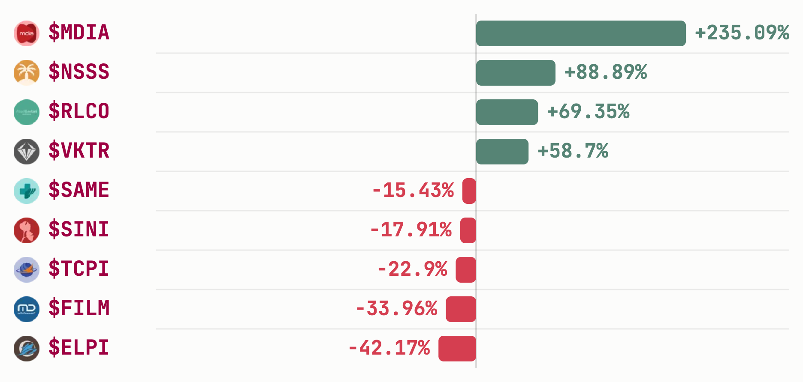

# The month closed up 9% and held most of the gain

**Issue | 1 August 2026 | trailing 30 days, 1–31 July | data as of 31 July 2026**

IDX total market cap closed the window at **IDR 10,919.63T**, up **+9.11%** from IDR
10,007.95T on 1 July across 23 trading days. The window's high came late: **IDR
11,064.99T on 22 July**, +10.56% from the window's start. By 31 July the market had
given back **-1.31%** off that peak, roughly an eighth of the month's total gain, not the
sharper pullback of prior windows.

## Top Movers

Ranked on 30-day price change to 31 July.

**Gainers**

| Ticker | Close | 30d |
|---|---:|---:|
| [**$MDIA**](https://sectors.app/idx/mdia?utm_source=newsletter&utm_medium=email&utm_campaign=monthly-market-pulse_2026-08-01&utm_content=top-movers&utm_term=mdia) | 191 | +235.09% |
| [**$NSSS**](https://sectors.app/idx/nsss?utm_source=newsletter&utm_medium=email&utm_campaign=monthly-market-pulse_2026-08-01&utm_content=top-movers&utm_term=nsss) | 1,105 | +88.89% |
| [**$RLCO**](https://sectors.app/idx/rlco?utm_source=newsletter&utm_medium=email&utm_campaign=monthly-market-pulse_2026-08-01&utm_content=top-movers&utm_term=rlco) | 5,250 | +69.35% |
| [**$VKTR**](https://sectors.app/idx/vktr?utm_source=newsletter&utm_medium=email&utm_campaign=monthly-market-pulse_2026-08-01&utm_content=top-movers&utm_term=vktr) | 730 | +58.70% |

**Losers**

| Ticker | Close | 30d |
|---|---:|---:|
| [**$ELPI**](https://sectors.app/idx/elpi?utm_source=newsletter&utm_medium=email&utm_campaign=monthly-market-pulse_2026-08-01&utm_content=top-movers&utm_term=elpi) | 720 | -42.17% |
| [**$FILM**](https://sectors.app/idx/film?utm_source=newsletter&utm_medium=email&utm_campaign=monthly-market-pulse_2026-08-01&utm_content=top-movers&utm_term=film) | 1,060 | -33.96% |
| [**$TCPI**](https://sectors.app/idx/tcpi?utm_source=newsletter&utm_medium=email&utm_campaign=monthly-market-pulse_2026-08-01&utm_content=top-movers&utm_term=tcpi) | 5,050 | -22.90% |
| [**$SINI**](https://sectors.app/idx/sini?utm_source=newsletter&utm_medium=email&utm_campaign=monthly-market-pulse_2026-08-01&utm_content=top-movers&utm_term=sini) | 7,450 | -17.91% |
| [**$SAME**](https://sectors.app/idx/same?utm_source=newsletter&utm_medium=email&utm_campaign=monthly-market-pulse_2026-08-01&utm_content=top-movers&utm_term=same) | 296 | -15.43% |

*Nine names ranked by 30-day price change, 1–31 July 2026.*

**One name was dropped from this table.** The screener returned
[**$MLPT**](https://sectors.app/idx/mlpt?utm_source=newsletter&utm_medium=email&utm_campaign=monthly-market-pulse_2026-08-01&utm_content=top-movers&utm_term=mlpt)
as the month's second-largest gainer at +183.09%, but its daily close series contains two
unexplained discontinuities inside the window: roughly 20x down on 21 July (1,040 to 52)
and roughly 27x up in the opposite direction on 29 July (60 to 1,630), consistent with
stock-split-like adjustments landing on different sides of the same window. A 30-day
change measured straight across those breaks is not a price move, so we left it out
rather than print it. Every other name above reconciles exactly against its own daily
series.

## Most traded

Ranked by total share volume summed across all 23 trading days in the window, not a
single day's snapshot.

| Ticker | Company | 30d volume | Days in top 10 | Close |
|---|---|---:|---:|---:|
| [**$BUMI**](https://sectors.app/idx/bumi?utm_source=newsletter&utm_medium=email&utm_campaign=monthly-market-pulse_2026-08-01&utm_content=most-traded&utm_term=bumi) | Bumi Resources | 68.07 billion | 23 / 23 | 165 |
| [**$BNBR**](https://sectors.app/idx/bnbr?utm_source=newsletter&utm_medium=email&utm_campaign=monthly-market-pulse_2026-08-01&utm_content=most-traded&utm_term=bnbr) | Bakrie & Brothers | 53.69 billion | 23 / 23 | 98 |
| [**$DEWA**](https://sectors.app/idx/dewa?utm_source=newsletter&utm_medium=email&utm_campaign=monthly-market-pulse_2026-08-01&utm_content=most-traded&utm_term=dewa) | Darma Henwa | 18.70 billion | 20 / 23 | 460 |
| [**$BIPI**](https://sectors.app/idx/bipi?utm_source=newsletter&utm_medium=email&utm_campaign=monthly-market-pulse_2026-08-01&utm_content=most-traded&utm_term=bipi) | Astrindo Nusantara Infrastruktur | 15.47 billion | 17 / 23 | 142 |
| [**$JGLE**](https://sectors.app/idx/jgle?utm_source=newsletter&utm_medium=email&utm_campaign=monthly-market-pulse_2026-08-01&utm_content=most-traded&utm_term=jgle) | Graha Andrasentra Propertindo | 12.31 billion | 6 / 23 | 64 |

[**$BUMI**](https://sectors.app/idx/bumi?utm_source=newsletter&utm_medium=email&utm_campaign=monthly-market-pulse_2026-08-01&utm_content=most-traded&utm_term=bumi)
and [**$BNBR**](https://sectors.app/idx/bnbr?utm_source=newsletter&utm_medium=email&utm_campaign=monthly-market-pulse_2026-08-01&utm_content=most-traded&utm_term=bnbr)
were the only two names to appear in the daily top ten on every single trading day of the
window. Bumi Resources posted first-half 2026 results on 31 July: revenue up 27.9% to
US$866.8 million and net profit attributable to the parent up 188.4% to US$58.9 million,
with management reaffirming its full-year coal sales target
([Investor.id, 31 July](https://investor.id/market/448689/laba-loncat-bumi-resources-bumi-jaga-target-2026)).
It also stayed in the news as one of several majors cited as a possible buyer for Indika
Energy's coal unit Kideco Jaya Agung, a transaction reported above US$1 billion
([Bloomberg Technoz, 28 July](https://www.bloombergtechnoz.com/detail-news/116403/menebak-calon-pembeli-kideco-yang-bakal-dilepas-indy)).
Those stories ran during the same month as the volume; we are not claiming either one
caused it.

## Broker Flow

Net value traded per broker across the window, from the exchange's daily broker summary.
87 of the 90 brokers in the data were active on all 23 trading days.

**Top net buyers**

| Code | Broker | 30d net |
|---|---|---:|
| [**XL**](https://sectors.app/idx/broker/xl?utm_source=newsletter&utm_medium=email&utm_campaign=monthly-market-pulse_2026-08-01&utm_content=broker-flow&utm_term=xl) | Stockbit Sekuritas Digital | +IDR 1.45T |
| [**PD**](https://sectors.app/idx/broker/pd?utm_source=newsletter&utm_medium=email&utm_campaign=monthly-market-pulse_2026-08-01&utm_content=broker-flow&utm_term=pd) | Indo Premier Sekuritas | +IDR 1.16T |
| [**DX**](https://sectors.app/idx/broker/dx?utm_source=newsletter&utm_medium=email&utm_campaign=monthly-market-pulse_2026-08-01&utm_content=broker-flow&utm_term=dx) | Bahana Sekuritas | +IDR 1.07T |
| [**LG**](https://sectors.app/idx/broker/lg?utm_source=newsletter&utm_medium=email&utm_campaign=monthly-market-pulse_2026-08-01&utm_content=broker-flow&utm_term=lg) | Trimegah Sekuritas Indonesia | +IDR 612.34B |
| [**NI**](https://sectors.app/idx/broker/ni?utm_source=newsletter&utm_medium=email&utm_campaign=monthly-market-pulse_2026-08-01&utm_content=broker-flow&utm_term=ni) | BNI Sekuritas | +IDR 552.02B |

**Top net sellers**

| Code | Broker | 30d net |
|---|---|---:|
| [**ZP**](https://sectors.app/idx/broker/zp?utm_source=newsletter&utm_medium=email&utm_campaign=monthly-market-pulse_2026-08-01&utm_content=broker-flow&utm_term=zp) | Maybank Sekuritas Indonesia | -IDR 4.46T |
| [**BK**](https://sectors.app/idx/broker/bk?utm_source=newsletter&utm_medium=email&utm_campaign=monthly-market-pulse_2026-08-01&utm_content=broker-flow&utm_term=bk) | J.P. Morgan Sekuritas Indonesia | -IDR 2.05T |
| [**YU**](https://sectors.app/idx/broker/yu?utm_source=newsletter&utm_medium=email&utm_campaign=monthly-market-pulse_2026-08-01&utm_content=broker-flow&utm_term=yu) | CGS International Sekuritas Indonesia | -IDR 1.08T |
| [**DP**](https://sectors.app/idx/broker/dp?utm_source=newsletter&utm_medium=email&utm_campaign=monthly-market-pulse_2026-08-01&utm_content=broker-flow&utm_term=dp) | DBS Vickers Sekuritas Indonesia | -IDR 358.32B |
| [**KI**](https://sectors.app/idx/broker/ki?utm_source=newsletter&utm_medium=email&utm_campaign=monthly-market-pulse_2026-08-01&utm_content=broker-flow&utm_term=ki) | Ciptadana Sekuritas Asia | -IDR 217.45B |

The two sides of this table have different shapes. Every one of the five largest net
sellers is the local arm of a foreign house, and the selling is concentrated:
[**ZP**](https://sectors.app/idx/broker/zp?utm_source=newsletter&utm_medium=email&utm_campaign=monthly-market-pulse_2026-08-01&utm_content=broker-flow&utm_term=zp)
alone accounts for more than the next two combined. The buy side is entirely domestic
retail- and institutional-facing brokerages. Indonesian market reporting through the
window described a concentrated foreign net-sell on Tuesday 28 July: Rp 1.07 trillion
market-wide, with Bank Mandiri, Bank Rakyat Indonesia, TPIA, Bumi Resources and
Perusahaan Gas Negara among the names sold, and the IHSG falling 0.89% to 6,130.5 that
session ([Investor.id, 29 July](https://investor.id/market/448245/tekanan-jual-asing-hantam-sahamsaham-unggulan)).
The broker table and that report describe the same month; neither establishes that one
caused the other, and the broker summary records where an order was routed, not the
nationality of whoever placed it.

## Sources

- Market data: [sectors.app](https://sectors.app?utm_source=newsletter&utm_medium=email&utm_campaign=monthly-market-pulse_2026-08-01&utm_content=footer)
- [Investor.id, 31 July 2026](https://investor.id/market/448689/laba-loncat-bumi-resources-bumi-jaga-target-2026) — Bumi Resources first-half 2026 results
- [Bloomberg Technoz, 28 July 2026](https://www.bloombergtechnoz.com/detail-news/116403/menebak-calon-pembeli-kideco-yang-bakal-dilepas-indy) — Kideco divestment, potential acquirers
- [Investor.id, 29 July 2026](https://investor.id/market/448245/tekanan-jual-asing-hantam-sahamsaham-unggulan) — foreign net-sell pressure, 28 July session

## Appendix: Sectors API endpoints (fields used)

- `idx-total/?start=2026-07-01&end=2026-07-31` — `idx_total_market_cap` per date; the
  window's start/end values, and its own intra-window high (22 July), for the headline
  and opening paragraph. 23 rows returned.
- `companies/top-changes/?classifications=top_gainers,top_losers&periods=30d` —
  `price_change`, `last_close_price`, `latest_close_date` for both Top Movers tables.
  `latest_close_date` confirmed as 2026-07-31 on every row before use.
- `daily/{symbol}/?start=2026-07-01&end=2026-07-31` — `close` series for all ten screener
  names, used to validate each reported 30-day change against the underlying prices. This
  is what surfaced the $MLPT discontinuities described above.
- `most-traded/?start=2026-07-01&end=2026-07-31&n_stock=10` — `volume` per symbol per
  date. The endpoint returns a top-N *per day*, so the ranking above is a client-side sum
  of volume per symbol across all 23 date keys, plus a count of days each name appeared.
- `news/?symbols=BUMI&start=2026-07-01&end=2026-07-31` — the cited stories behind the
  Most Traded paragraph.
- Broker Flow: pinned query `scripts/fixed-queries/broker-summary-range.sql` against
  `idx_broker_summary_daily` joined to `idx_broker_registry`, aggregated over
  2026-07-01 to 2026-07-31. The Sectors API's `brokers/top` accepts only a single date, so
  there is no range endpoint for this. 90 broker rows, `days_active` checked per row.

Total Sectors API cost this issue: 4 credits.

---

*This newsletter is data reporting and market commentary, not investment advice or a
recommendation to buy or sell any security. Figures are from sectors.app as of 31 July
2026 unless otherwise cited. Do your own research.*
