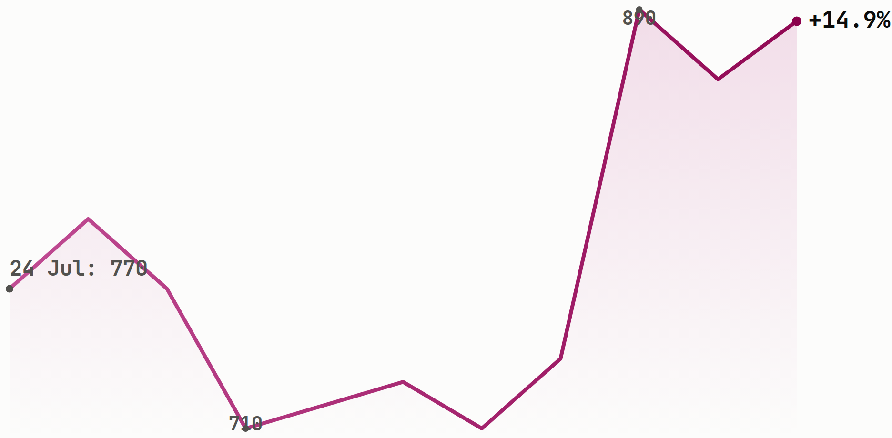

# The index rose every session this week as foreign money flipped back to buying

A rights-issue trading window made VKTR the market's best performer, and a wave of
insider filings briefly doubled Mitra Adiperkasa's stock price before giving almost
all of it back by Friday.

**Issue #32 | 10 August 2026 | week of 3-7 August | data as of 7 August 2026**

## Key Data Bites

*Every session this week closed higher than the last, and foreign investors closed
the week as net buyers for the first time in three weeks.*

- IDX total market cap climbed every single session to close the week at **IDR
  11,208.37T**, up **+2.64% WoW** from a Monday open of IDR 10,891.53T, well ahead of
  the prior week's **+0.48%**.
- **LQ45 +3.07%** and **IDX30 +2.75%** both beat the whole market's +2.64%, so
  large caps outran the broader tape again.
- LQ45 breadth was **35 up, 7 down**, three unchanged, of 45 constituents.
- [**$HRTA**](https://sectors.app/idx/hrta?utm_source=newsletter&utm_medium=email&utm_campaign=weekly-insights-v2_2026-08-10&utm_content=key-data-bites&utm_term=hrta) (Hartadinata Abadi) was the best LQ45 name at **+15.90%**, closing at
  IDR 2,150.
- [**$CPIN**](https://sectors.app/idx/cpin?utm_source=newsletter&utm_medium=email&utm_campaign=weekly-insights-v2_2026-08-10&utm_content=key-data-bites&utm_term=cpin) (Charoen Pokphand Indonesia) was the only LQ45 name to fall more than
  4%, down **-4.56%** to IDR 3,140.
- Foreign investors were **net buyers of IDR 583.99B** market-wide this week, a
  reversal from the prior week's IDR 1.34T net sell.
- [**$BBRI**](https://sectors.app/idx/bbri?utm_source=newsletter&utm_medium=email&utm_campaign=weekly-insights-v2_2026-08-10&utm_content=key-data-bites&utm_term=bbri) led every name in net foreign buying at **+IDR 563.02B**, while
  [**$EMAS**](https://sectors.app/idx/emas?utm_source=newsletter&utm_medium=email&utm_campaign=weekly-insights-v2_2026-08-10&utm_content=key-data-bites&utm_term=emas) led net selling at **-IDR 274.11B**.
- [**$AKRA**](https://sectors.app/idx/akra?utm_source=newsletter&utm_medium=email&utm_campaign=weekly-insights-v2_2026-08-10&utm_content=key-data-bites&utm_term=akra) (AKR Corporindo) went ex-dividend for IDR 50/share on 3 August, a
  mechanical drag behind part of its **-3.07%** week.

## Top Weekly Movers

*Four of the week's five biggest gainers are names outside the LQ45, so the index's
own calm 45-stock breadth hides a much wilder tail underneath it.*

Measured across all IDX-listed names, 7-day trailing window ending 7 August
(`companies/top-changes`, which matches the window's Friday this run).

**Top gainers**

| Ticker | Close (IDR) | 7d change |
|---|---|---|
| [**$VKTR**](https://sectors.app/idx/vktr?utm_source=newsletter&utm_medium=email&utm_campaign=weekly-insights-v2_2026-08-10&utm_content=top-movers&utm_term=vktr) | 885 | +21.23% |
| [**$MDIA**](https://sectors.app/idx/mdia?utm_source=newsletter&utm_medium=email&utm_campaign=weekly-insights-v2_2026-08-10&utm_content=top-movers&utm_term=mdia) | 230 | +20.42% |
| [**$HRTA**](https://sectors.app/idx/hrta?utm_source=newsletter&utm_medium=email&utm_campaign=weekly-insights-v2_2026-08-10&utm_content=top-movers&utm_term=hrta) | 2,150 | +15.90% |
| [**$INTP**](https://sectors.app/idx/intp?utm_source=newsletter&utm_medium=email&utm_campaign=weekly-insights-v2_2026-08-10&utm_content=top-movers&utm_term=intp) | 5,400 | +15.63% |
| [**$FORE**](https://sectors.app/idx/fore?utm_source=newsletter&utm_medium=email&utm_campaign=weekly-insights-v2_2026-08-10&utm_content=top-movers&utm_term=fore) | 795 | +15.22% |

**Top losers**

| Ticker | Close (IDR) | 7d change |
|---|---|---|
| [**$TCPI**](https://sectors.app/idx/tcpi?utm_source=newsletter&utm_medium=email&utm_campaign=weekly-insights-v2_2026-08-10&utm_content=top-movers&utm_term=tcpi) | 3,940 | -21.98% |
| [**$MLPT**](https://sectors.app/idx/mlpt?utm_source=newsletter&utm_medium=email&utm_campaign=weekly-insights-v2_2026-08-10&utm_content=top-movers&utm_term=mlpt) | 1,615 | -16.10% |
| [**$MORA**](https://sectors.app/idx/mora?utm_source=newsletter&utm_medium=email&utm_campaign=weekly-insights-v2_2026-08-10&utm_content=top-movers&utm_term=mora) | 5,250 | -16.00% |
| [**$BUVA**](https://sectors.app/idx/buva?utm_source=newsletter&utm_medium=email&utm_campaign=weekly-insights-v2_2026-08-10&utm_content=top-movers&utm_term=buva) | 785 | -10.80% |
| [**$APIC**](https://sectors.app/idx/apic?utm_source=newsletter&utm_medium=email&utm_campaign=weekly-insights-v2_2026-08-10&utm_content=top-movers&utm_term=apic) | 590 | -10.61% |

[**$MLPT**](https://sectors.app/idx/mlpt?utm_source=newsletter&utm_medium=email&utm_campaign=weekly-insights-v2_2026-08-10&utm_content=top-movers&utm_term=mlpt) (Multipolar Technology) carried out a 25-for-1 stock split back on 21 July;
this week's -16.10% is a real post-split price move, not a split artifact.

## What the Data Unearthed

*Every finding below pairs a price move this week with an insider filing or
corporate action already dated on the record, not a coincidence of timing alone.*

### A tender-offer reshuffle sent MAPI on a one-week round trip

*Insider filings dated 3 and 7 August track a large ownership reshuffle in [**$MAPI**](https://sectors.app/idx/mapi?utm_source=newsletter&utm_medium=email&utm_campaign=weekly-insights-v2_2026-08-10&utm_content=data-unearthed&utm_term=mapi) that ran alongside the stock's climb to IDR 1,895 and its fade back to IDR 1,605 (Instagram: [instagram.com/sectorsapp](https://www.instagram.com/sectorsapp)).*

- Filings lodged 3 August show **Pacific Universal Investments**, **Ocean Continuum**
  and **Samudra (Investment) ("SIPL")** collectively booking more than 20.5 billion
  [**$MAPI**](https://sectors.app/idx/mapi?utm_source=newsletter&utm_medium=email&utm_campaign=weekly-insights-v2_2026-08-10&utm_content=data-unearthed&utm_term=mapi) (Mitra Adiperkasa) shares at an average IDR 1,486, one of them citing
  "proceeds from the mandatory tender offer" as the transaction's purpose.
- The stock opened the week at IDR 1,895 on 3 August, a level it hadn't closed at in
  over a year, then faded every session to close at IDR 1,605 on 7 August.
- A 7 August filing shows **Pacific Universal Investments** cutting its own stake
  right back down, from 87.24% to 57.24%, disposing 4.98 billion shares, while
  **Samudra (Investment)**, now wholly owned by CVC Funds, held its 30% (Kontan, 7
  Aug 2026).
- Even after the round trip, $MAPI still closed the week **+3.22% WoW** against the
  prior Friday's IDR 1,555, since the fade never fully erased Monday's jump.
- Foreign investors added a net **IDR 50.48B** to $MAPI over the same five days
  (exchange definition, `idx_daily_data`), buying alongside the ownership churn
  rather than against it.

### Insiders kept buying ASII while foreign money made its second-biggest exit of the week

*A filing dated 5 August names six insiders who bought [**$ASII**](https://sectors.app/idx/asii?utm_source=newsletter&utm_medium=email&utm_campaign=weekly-insights-v2_2026-08-10&utm_content=data-unearthed&utm_term=asii) shares over the past six months, the same week the stock closed exactly flat against the market's second-largest net foreign sell (Instagram: [instagram.com/sectorsapp](https://www.instagram.com/sectorsapp)).*

- [**$ASII**](https://sectors.app/idx/asii?utm_source=newsletter&utm_medium=email&utm_campaign=weekly-insights-v2_2026-08-10&utm_content=data-unearthed&utm_term=asii) (Astra International) was the market's second-largest net foreign
  sell this week at **-IDR 216.68B**, behind only $EMAS.
- The stock still closed the week exactly unchanged at IDR 5,100, an outcome that
  needs a buyer on the other side of that selling.
- A filing dated 5 August shows insider **Prijono Sugiarto** buying 51,300 shares at
  IDR 5,073, and the filing itself frames it as part of a cluster-buy: Ir Fxl Kesuma
  Msc, Gidion Hasan, Thomas Junaidi Alim W, Gita Tiffani and two other insiders had
  already bought a combined 8,654,300 shares over the prior six months at an average
  IDR 5,916.
- None of these filings are large enough on their own to offset an IDR 216.68B
  foreign sell; they're evidence a buy-side existed, not proof of what absorbed the
  whole flow.

### VKTR's rights-trading week doubled as the market's best

*[**$VKTR**](https://sectors.app/idx/vktr?utm_source=newsletter&utm_medium=email&utm_campaign=weekly-insights-v2_2026-08-10&utm_content=data-unearthed&utm_term=vktr)'s close over the past two weeks, with the 3-7 August rights-trading window landing on the same days it became the exchange's top gainer (chart generated this run, no matching social card was available for the window, see appendix).*

- [**$VKTR**](https://sectors.app/idx/vktr?utm_source=newsletter&utm_medium=email&utm_campaign=weekly-insights-v2_2026-08-10&utm_content=data-unearthed&utm_term=vktr) (VKTR Teknologi Mobilitas) ran a 4-for-7 rights issue with an ex-date
  of 29 July and a trading period of **3-7 August**, exactly this issue's own
  reporting week.
- Over that same week the stock rose from IDR 730 to IDR 885, a **+21.23%** move
  that made it the single best performer on the whole exchange this week, not just
  within LQ45 (`companies/top-changes`).
- Wednesday 5 August alone saw 193.8 million shares change hands, roughly five
  times a typical session for the stock this month, and the close that day marked a
  90-day high (`sectors.app`).
- The rights' own subscription price isn't reliably available via sectors.app (the
  field returned 0), so this reports the ratio and dates only, not the capital
  raised.

**Follow [Instagram](https://www.instagram.com/sectorsapp) and [Threads](https://www.threads.net/@sectorsapp) for daily reads on filings, flows and movers like these.**

## Insider Filings

*One brokerage, Samuel Sekuritas Indonesia, filed three of the week's five most
recent disclosures, the same pattern this desk flagged last week on different
tickers.*

Five most recent disclosures in the 3-7 August window.

| Date | Holder | Ticker | Type | Shares | Stake |
|---|---|---|---|---|---|
| 7 Aug | Reliance Capital Management | [**$RELI**](https://sectors.app/idx/reli?utm_source=newsletter&utm_medium=email&utm_campaign=weekly-insights-v2_2026-08-10&utm_content=insider-filings&utm_term=reli) | Sell | -11.70M | 85.65% to 84.99% |
| 7 Aug | Ir. Gafur Sulistyo Umar Mba | [**$OASA**](https://sectors.app/idx/oasa?utm_source=newsletter&utm_medium=email&utm_campaign=weekly-insights-v2_2026-08-10&utm_content=insider-filings&utm_term=oasa) | Sell | -57.12M | 33.46% to 32.56% |
| 7 Aug | Samuel Sekuritas Indonesia | [**$NSSS**](https://sectors.app/idx/nsss?utm_source=newsletter&utm_medium=email&utm_campaign=weekly-insights-v2_2026-08-10&utm_content=insider-filings&utm_term=nsss) | Buy | +492.08M | 25.67% to 27.74% |
| 7 Aug | Samuel Sekuritas Indonesia | [**$NSSS**](https://sectors.app/idx/nsss?utm_source=newsletter&utm_medium=email&utm_campaign=weekly-insights-v2_2026-08-10&utm_content=insider-filings&utm_term=nsss) | Sell | -204.97M | 27.74% to 26.88% |
| 7 Aug | Samuel Sekuritas Indonesia | [**$RLCO**](https://sectors.app/idx/rlco?utm_source=newsletter&utm_medium=email&utm_campaign=weekly-insights-v2_2026-08-10&utm_content=insider-filings&utm_term=rlco) | Sell | -9.58M | 5.80% to 5.50% |

Samuel Sekuritas Indonesia booked a buy and a sell in [**$NSSS**](https://sectors.app/idx/nsss?utm_source=newsletter&utm_medium=email&utm_campaign=weekly-insights-v2_2026-08-10&utm_content=insider-filings&utm_term=nsss) within the same
minute before selling [**$RLCO**](https://sectors.app/idx/rlco?utm_source=newsletter&utm_medium=email&utm_campaign=weekly-insights-v2_2026-08-10&utm_content=insider-filings&utm_term=rlco) five minutes later, all three filed as its own
17th, 20th and 3rd transactions in the respective names over the past six months.

## Other Major Headlines

*Bank capital and index mechanics, not any single earnings surprise, carried this
week's non-market-data news.*

- Finance Minister Purbaya Yudhi Sadewa announced a further IDR 70 trillion
  injection of government surplus funds into the banking system, split IDR 40
  trillion on 5 August and IDR 30 trillion the following Monday, with the bulk
  going to [**$BBRI**](https://sectors.app/idx/bbri?utm_source=newsletter&utm_medium=email&utm_campaign=weekly-insights-v2_2026-08-10&utm_content=headlines&utm_term=bbri), [**$BBNI**](https://sectors.app/idx/bbni?utm_source=newsletter&utm_medium=email&utm_campaign=weekly-insights-v2_2026-08-10&utm_content=headlines&utm_term=bbni) and [**$BMRI**](https://sectors.app/idx/bmri?utm_source=newsletter&utm_medium=email&utm_campaign=weekly-insights-v2_2026-08-10&utm_content=headlines&utm_term=bmri) ([Kompas](https://money.kompas.com/read/2026/08/05/182118026/purbaya-suntik-lagi-dana-rp-70-triliun-ke-perbankan), 5 Aug 2026).
- [**$UNTR**](https://sectors.app/idx/untr?utm_source=newsletter&utm_medium=email&utm_campaign=weekly-insights-v2_2026-08-10&utm_content=headlines&utm_term=untr) (United Tractors) reported an 88.2% YoY drop in H1 net profit to IDR
  956.28B, which analysts tied to weaker coal RKAB allocations and the temporary
  Martabe gold mine shutdown ([Kontan](https://investasi.kontan.co.id/news/laba-untr-anjlok-88-diversifikasi-bisnis-dan-harga-emas-bisa-jadi-penyelamat), 7 Aug 2026).
- [**$TOWR**](https://sectors.app/idx/towr?utm_source=newsletter&utm_medium=email&utm_campaign=weekly-insights-v2_2026-08-10&utm_content=headlines&utm_term=towr) (Sarana Menara Nusantara) was removed from the LQ45 index effective 3
  August, with analysts flagging short-term selling pressure despite a 12.69% YoY
  revenue gain in H1 ([Kontan](https://investasi.kontan.co.id/news/towr-keluar-dari-lq45-ini-katalis-dan-risiko-yang-perlu-dicermati), 4 Aug 2026).
- The IHSG closed 7 August at 6,409.65, up 1.04% on the day, with an analyst
  flagging that MSCI and FTSE index rebalancing due 21 August could trigger
  two-way volatility ([Kontan](https://investasi.kontan.co.id/news/ihsg-melesat-ke-6409-waspadai-volatilitas-rebalancing-msci-ftse), 7 Aug 2026).
- Sucor Sekuritas reported [**$AKRA**](https://sectors.app/idx/akra?utm_source=newsletter&utm_medium=email&utm_campaign=weekly-insights-v2_2026-08-10&utm_content=headlines&utm_term=akra) H1 net profit up 21% YoY to IDR 1.4
  trillion on 44% revenue growth, keeping a buy rating with an IDR 1,710 target
  ([Bisnis](https://market.bisnis.com/read/20260807/192/1994552/saham-kawasan-industri-potensial-cuan-semester-ii2026-akra-ssia-atau-dmas), 7 Aug 2026).

Read more market headlines at [sectors.app/indonesia/news](https://sectors.app/indonesia/news?utm_source=newsletter&utm_medium=email&utm_campaign=weekly-insights-v2_2026-08-10&utm_content=headlines).

## What's Ahead

*Every scheduled print below lands on a name or sector already named in this issue,
none of them are wire-feed filler.*

**Week of 10-14 August**

| Mon 10 | Tue 11 | Wed 12 | Thu 13 | Fri 14 |
|---|---|---|---|---|
| — | **AGM** [**$EMTK**](https://sectors.app/idx/emtk?utm_source=newsletter&utm_medium=email&utm_campaign=weekly-insights-v2_2026-08-10&utm_content=whats-ahead&utm_term=emtk) 14:00 | — | — | — |

**Beyond the week**

| Date | Ticker | Action | Detail |
|---|---|---|---|
| 4 Sep | [**$BBTN**](https://sectors.app/idx/bbtn?utm_source=newsletter&utm_medium=email&utm_campaign=weekly-insights-v2_2026-08-10&utm_content=whats-ahead&utm_term=bbtn) | AGM | 14:00 |

**Scheduled macro**

| Date | Event | Why it matters |
|---|---|---|
| 18-19 Aug | Bank Indonesia RDG rate decision | Sets the funding-cost backdrop for $BBRI and $BBCA, this week's two biggest names in the foreign-flow table above ([bi.go.id](https://www.bi.go.id/id/publikasi/ruang-media/news-release/Pages/sp_2730825.aspx)) |
| 21 Aug | MSCI and FTSE index rebalancing takes effect | Already flagged by analysts as a two-way volatility risk for $BBCA, $BMRI, $ADRO and $PTBA, all named elsewhere in this issue ([Kontan](https://investasi.kontan.co.id/news/ihsg-melesat-ke-6409-waspadai-volatilitas-rebalancing-msci-ftse), 7 Aug 2026) |
| 16 Sep | FOMC rate decision | Sets the global rate differential behind the same foreign buying and selling that drove this week's $BBRI and $ASII flows ([federalreserve.gov](https://www.federalreserve.gov/monetarypolicy/fomccalendars.htm)) |

See the full [dividend calendar](https://sectors.app/indonesia/calendars/dividend-calendar?utm_source=newsletter&utm_medium=email&utm_campaign=weekly-insights-v2_2026-08-10&utm_content=whats-ahead) for ex-dates beyond this list.

## The Other Side

*Every figure below already appeared earlier in this issue; nothing new is
introduced here.*

**The bull read**

- The index climbed every single session this week, +2.64% WoW, with LQ45 (+3.07%)
  and IDX30 (+2.75%) both outrunning the broader market.
- Foreign investors flipped to a net IDR 583.99B buy this week, a genuine reversal
  from the prior week's IDR 1.34T net sell, led by $BBRI at +IDR 563.02B.
- Breadth was broad, not narrow: 35 of 45 LQ45 constituents closed higher on the
  week, only 7 fell.

**The bear read**

- The foreign buying was concentrated, not broad: $BBRI's own +IDR 563.02B alone
  exceeded the market's entire IDR 583.99B net inflow, while $EMAS, $ASII, $AMMN
  and seven other names each saw net sells over IDR 100B.
- [**$ASII**](https://sectors.app/idx/asii?utm_source=newsletter&utm_medium=email&utm_campaign=weekly-insights-v2_2026-08-10&utm_content=other-side&utm_term=asii) closed the week exactly flat against the market's second-largest net
  foreign sell, with only a small, dated insider buy chain as visible evidence of
  the offsetting demand.
- Analysts have already flagged the 21 August MSCI/FTSE rebalancing as a two-way
  volatility risk for several of this week's own names, including $BBCA, $BMRI,
  $ADRO and $PTBA.

**What would settle it**: the 21 August MSCI/FTSE rebalancing is the nearest dated
test. A smooth reconstitution would suggest this week's foreign buying has room to
broaden past $BBRI; a rough one would confirm the flow is as concentrated as this
week's own numbers already suggest.

## Keep the signals coming

Track every name in this issue, and the ones that don't make the cut, with a
[watchlist](https://sectors.app/watchlist?utm_source=newsletter&utm_medium=email&utm_campaign=weekly-insights-v2_2026-08-10&utm_content=cta) for the exclusive reports, or a [workflow](https://sectors.app/workflow?utm_source=newsletter&utm_medium=email&utm_campaign=weekly-insights-v2_2026-08-10&utm_content=cta) alert for the next filing or foreign-flow reversal like the ones above.

## Upcoming Events

**Making Claude your Investment Companion**

A beginner-friendly workshop on turning Claude into a personal investment research
companion, grounded in live IDX & SGX market data through the Sectors MCP, then
learning to ask the right questions to research companies, compare stocks, and stay
on top of your watchlist.

- **Date:** 24th and 25th August, 2026
- **Time:** 18.30 to 21.00 (GMT+7)
- **Medium:** Zoom Conferencing (Online)
- **Language:** English (by Aidityas Adhakim)
- **Intended Audience:** Retail investors and newcomers curious about using AI for investing

[Register here](https://supertype.ai/events/learn-claude)

## Sources

- [Purbaya suntik lagi dana Rp 70 triliun ke perbankan](https://money.kompas.com/read/2026/08/05/182118026/purbaya-suntik-lagi-dana-rp-70-triliun-ke-perbankan), Kompas, 5 Aug 2026
- [Laba UNTR Anjlok 88%, Diversifikasi Bisnis dan Harga Emas Bisa Jadi Penyelamat](https://investasi.kontan.co.id/news/laba-untr-anjlok-88-diversifikasi-bisnis-dan-harga-emas-bisa-jadi-penyelamat), Kontan, 7 Aug 2026
- [TOWR Keluar dari LQ45, Ini Katalis dan Risiko yang Perlu Dicermati](https://investasi.kontan.co.id/news/towr-keluar-dari-lq45-ini-katalis-dan-risiko-yang-perlu-dicermati), Kontan, 4 Aug 2026
- [IHSG Melesat ke 6.409, Waspadai Volatilitas Rebalancing MSCI-FTSE](https://investasi.kontan.co.id/news/ihsg-melesat-ke-6409-waspadai-volatilitas-rebalancing-msci-ftse), Kontan, 7 Aug 2026
- [Saham Kawasan Industri Potensial Cuan Semester II/2026: AKRA, SSIA, atau DMAS?](https://market.bisnis.com/read/20260807/192/1994552/saham-kawasan-industri-potensial-cuan-semester-ii2026-akra-ssia-atau-dmas), Bisnis, 7 Aug 2026
- [Kepemilikan Saham MAPI Berubah, Pacific Universal Lepas 4,98 Miliar Saham](https://investasi.kontan.co.id/news/kepemilikan-saham-mapi-berubah-pacific-universal-lepas-498-miliar-saham), Kontan, 7 Aug 2026
- [Bank Indonesia Tetapkan Jadwal Rapat Dewan Gubernur Bulanan Tahun 2026](https://www.bi.go.id/id/publikasi/ruang-media/news-release/Pages/sp_2730825.aspx), Bank Indonesia
- [FOMC Meeting Calendars](https://www.federalreserve.gov/monetarypolicy/fomccalendars.htm), Federal Reserve

**Appendix: Sectors API endpoints (fields used)**
- `idx-total/` — `idx_total_market_cap` (this week, prior week)
- `index-daily/lq45/`, `index-daily/idx30/` — `price` (this week, prior week, and the
  Friday before the prior week for the prior week's own WoW base)
- `companies/top-changes/?classifications=top_gainers,top_losers&periods=7d` — Top
  Weekly Movers, VKTR's market-wide top-gainer rank
- `companies/?where=indices in ['LQ45']`, `daily/<TICKER>/` across all 45
  constituents — LQ45 breadth, best/worst LQ45 performer
- `company/corporate-actions/<TICKER>/` across the 45 LQ45 constituents plus VKTR,
  MDIA, HRTA, INTP, FORE, TCPI, MLPT, MORA, BUVA, APIC — VKTR rights issue, AKRA
  ex-dividend, MLPT stock split, What's Ahead calendar
- `filings/?limit=30&offset=0..60` — Insider Filings table, MAPI and ASII ownership
  filings in What the Data Unearthed
- `news/?start=<day>&end=<day>&limit=30` called once per day, 3-7 Aug — Other Major
  Headlines
- `company/report/VKTR.JK/?sections=overview` — `all_time_price.90_d_high`
- `daily/VKTR.JK/` — hero chart series
- Foreign flow (exchange definition, `idx_daily_data`, `foreign_buy_volume` /
  `foreign_sell_volume` × `close`) — pinned Supabase query, market-wide and
  MAPI/ASII figures
- Social images from [instagram.com/sectorsapp](https://www.instagram.com/sectorsapp)

---
*This newsletter is data reporting and market commentary, not investment advice or a
recommendation to buy or sell any security. Figures are from sectors.app as of 7
August 2026 unless otherwise cited. Do your own research.*
