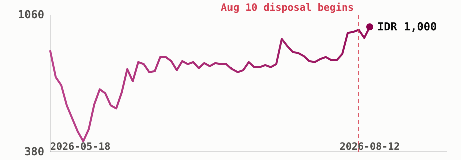

# DSSA releases buyback shares as its rally outruns profit

PT Dian Swastatika Sentosa Tbk ([**$DSSA**](https://sectors.app/idx/dssa?utm_source=newsletter&utm_medium=email&utm_campaign=single-company-deep-dive_2026-08-12&utm_content=trigger&utm_term=dssa))
began transferring 9.63 billion treasury shares back to the market this week, a
disposal that opened with a Rp1.3 trillion block trade and a same-week pullback in
the stock even as it sits more than double its 90-day low.

## A treasury-share disposal begins

PT Sinar Mas Tunggal holds 59.9% of
[**$DSSA**](https://sectors.app/idx/dssa?utm_source=newsletter&utm_medium=email&utm_campaign=single-company-deep-dive_2026-08-12&utm_content=trigger&utm_term=dssa),
the public 20.4%, and treasury stock the remaining 19.7%, equal to 37.9 billion
shares (sectors.app). On 10 August 2026, the company began releasing up to
9,631,904,000 of those shares, about 5% of total issued capital and roughly a
quarter of the treasury pile, complying with an OJK rule requiring a completed
buyback's shares to be disposed of within three years (Bloomberg Technoz, 11 Aug
2026). PT Sinarmas Sekuritas was appointed exchange member to run the transfer.

The first day of that process produced a Rp1.3 trillion negotiated-market trade,
1.33 billion shares changing hands at an average of IDR 974, about 1.12% below
that day's regular-market close of IDR 985, with Sinarmas Sekuritas as seller and
allocations to RHB Sekuritas Indonesia and Sinarmas Sekuritas as buyers (CNBC
Indonesia, 11 Aug 2026). The next morning, foreign investors were net sellers of
[**$DSSA**](https://sectors.app/idx/dssa?utm_source=newsletter&utm_medium=email&utm_campaign=single-company-deep-dive_2026-08-12&utm_content=trigger&utm_term=dssa)
by IDR 131.35 billion in the first session, the largest net-sell position of any
stock on the exchange that morning, as the stock fell to an intraday low of IDR
935 (CNBC Indonesia, 11 Aug 2026).

## A rally that's outrun three years of falling profit

[**$DSSA**](https://sectors.app/idx/dssa?utm_source=newsletter&utm_medium=email&utm_campaign=single-company-deep-dive_2026-08-12&utm_content=the-read&utm_term=dssa)
has rallied 131% off its own 90-day low even as annual profit has declined for
three straight years running, and the company is now releasing shares equal to
5% of its total count into a market where only about a fifth of the stock trades
freely. That combination, tight float meeting a fresh supply event, is this
issue's read on the week.

## Q1 held steady while full-year profit kept slipping

*DSSA's 90-day price path, up 131% from its own low even before this week's disposal began, and up 5.82% on 12 August alone to close at IDR 1,000 (sectors.app).*

[**$DSSA**](https://sectors.app/idx/dssa?utm_source=newsletter&utm_medium=email&utm_campaign=single-company-deep-dive_2026-08-12&utm_content=the-numbers&utm_term=dssa)'s
only disclosed 2026 quarter held close to flat against a year earlier: revenue of
IDR 11.78 trillion, down 3.7%, and net profit of IDR 1.40 trillion, up 4.7%
(sectors.app). That single steady quarter sits against a longer run of shrinking
full-year results.

| Period | Revenue | Net profit | YoY change |
|---|---|---|---|
| Q1 2026 | IDR 11.78T | IDR 1.40T | +4.7% earnings, -3.7% revenue |
| FY2025 | IDR 46.72T | IDR 3.86T | EPS IDR 20.03, -22.7% vs FY2024 |
| FY2024 | IDR 48.76T | IDR 4.99T | EPS IDR 25.92, -24.1% vs FY2023 |
| FY2023 | IDR 77.42T | IDR 6.58T | EPS IDR 34.16, -29.0% vs FY2022 |

Note for readers checking the chart against older price history elsewhere: a 1:25
stock split took effect 9 April 2026, so per-share prices from before that date
are on a different scale and aren't comparable to the figures in this issue
(sectors.app).

## Priced rich against its own recent history

Measured against its own past, [**$DSSA**](https://sectors.app/idx/dssa?utm_source=newsletter&utm_medium=email&utm_campaign=single-company-deep-dive_2026-08-12&utm_content=valuation&utm_term=dssa)
traded at a price to earnings ratio of 3.30x in 2022 and 9.37x in 2023, both close
to that period's own peer averages of 4.99x and 8.60x (sectors.app). Full-year net
profit has fallen every year since 2022, from IDR 9.28 trillion that year to IDR
3.86 trillion in 2025, a 58% decline even as revenue nearly halved over the same
stretch (sectors.app). Return on equity eased alongside it, from 24.8% in 2023 to
15.9% in 2024 and 10.2% in 2025, still comfortably profitable but a step down each
year (sectors.app). That earnings decline, combined with this year's price rally,
has pushed the stock's current earnings-based valuation well outside the 2022-2023
range shown above and above the sector's 2026 peer average price to earnings ratio
of 11.82x (sectors.app).

## What comes next

No Q2 or first-half 2026 financial statements had been disclosed for
[**$DSSA**](https://sectors.app/idx/dssa?utm_source=newsletter&utm_medium=email&utm_campaign=single-company-deep-dive_2026-08-12&utm_content=whats-ahead&utm_term=dssa)
as of 12 August 2026 (sectors.app), so the next full read on whether the Q1 pace
holds is still ahead. The company's next AGM is scheduled for 10 September 2026,
with no agenda yet published (sectors.app). Institutional ownership data through
31 July 2026 shows Barclays Global Investors NA, Jackson National Asset
Management and DWS Investment S.A. among the period's top buyers, while SSIM Funds
Management and two Dimensional Fund Advisors entities were the largest sellers
(sectors.app), a snapshot from before this week's disposal began. How much of the
remaining treasury allotment gets transferred, and at what pace, is not yet
disclosed.

---

## Upcoming Events

**Making Claude your Investment Companion**

A beginner-friendly workshop on turning Claude into a personal investment research companion, grounded in live IDX & SGX market data through the Sectors MCP, then learning to ask the right questions to research companies, compare stocks, and stay on top of your watchlist.

- **Date:** 24th and 25th August, 2026
- **Time:** 18.30 to 21.00 (GMT+7)
- **Medium:** Zoom Conferencing (Online)
- **Language:** English (by Aidityas Adhakim)
- **Intended Audience:** Retail investors and newcomers curious about using AI for investing

[Register here](https://supertype.ai/events/learn-claude)

**Sources**
- Bloomberg Technoz, "Tiga Saham Baru Masuk Daftar HSC, DSSA & BREN Mulai Distribusi," 11 Aug 2026, https://www.bloombergtechnoz.com/detail-news/117911/tiga-saham-baru-masuk-daftar-hsc-dssa-bren-mulai-distribusi
- CNBC Indonesia, "Ada Transaksi Nego Rp1,3 Triliun di Saham DSSA," 11 Aug 2026, https://www.cnbcindonesia.com/market/20260811093013-17-758160/ada-transaksi-nego-rp13-triliun-di-saham-dssa
- CNBC Indonesia, "Asing Net Sell Rp774 Miliar di Sesi I, Ini Daftar Sahamnya," 11 Aug 2026, https://www.cnbcindonesia.com/market/20260811143432-17-758299/asing-net-sell-rp774-miliar-di-sesi-i-ini-daftar-sahamnya

**Appendix: Sectors API endpoints (fields used)**
- `company/report/DSSA/?sections=overview,valuation,financials,dividend,future,ownership` — `overview.last_close_price`, `overview.daily_close_change`, `valuation.historical_valuation[]` (P/E vs peer average), `financials.historical_financials[]` (revenue, earnings), `financials.historical_eps`, `financials.historical_financial_ratio[]` (ROE), `financials.yoy_quarter_earnings_growth`, `financials.yoy_quarter_revenue_growth`, `ownership.major_shareholders[]`, `ownership.top_transactions`
- `daily/DSSA/?start=2026-05-14&end=2026-08-12` — 90-day close price series (hero chart, 90-day low/rally)
- `company/corporate-actions/DSSA/` — `stock_split[]`, `agm[]`
- `company/get_quarterly_financial_dates/DSSA/` — latest disclosed quarter check
- `financials/quarterly/DSSA/?report_date=2026-03-31`, `financials/quarterly/DSSA/?report_date=2025-03-31` — Q1 2026 vs Q1 2025 revenue/earnings
- `news/?symbols=DSSA&limit=10` — "why now" trigger corroboration (see Sources above)

---
*This newsletter is data reporting and market commentary, not investment advice or a
recommendation to buy or sell any security. Figures are from sectors.app as of
2026-08-12 unless otherwise cited. Do your own research.*
