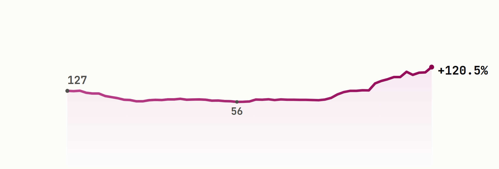

# A rally regulators paused, a family's exit, and a sudden insider sale

Intermedia Capital, Prime Agri Resources (formerly Sampoerna Agro) and Impack Pratama are three founder or tycoon-controlled IDX names, and each is testing that control differently this week.

## Intermedia Capital ([**$MDIA**](https://sectors.app/idx/mdia?utm_source=newsletter&utm_medium=email&utm_campaign=three-stock-story_2026-08-12&utm_content=mdia&utm_term=mdia))

**The story.** Intermedia Capital was set up in 2008 as a private holding vehicle and listed on the IDX on 11 April 2014 (imc.co.id; IDNFinancials). Its sole reported operating asset is broadcaster ANTV, held at 99.99% after News Corp fully divested its own stake. ANTV predates its parent, founded on 25 October 1990 by Aburizal Bakrie and Agung Laksono, on air nationally by March 1993 as "ANTeve" (Wikipedia). Fun fact: Rupert Murdoch's News Corp once owned 20% of ANTV, a 2005 stake it later exited entirely, which is how the channel ended up fully under Bakrie control (VOA Indonesia, 30 Sep 2005). The current story is a rally the exchange itself had to interrupt. IDX suspended MDIA's trading on 5 August 2026 as a "cooling down" measure after the stock roughly doubled in a week, and management told the exchange no undisclosed material information explained the move (CNBC Indonesia, 5 Aug 2026; Katadata, 7 Aug 2026). The suspension lifted the next day, and the rally continued.

*MDIA closed at IDR 280 on 12 August, up 120% from IDR 127 in mid-May and nearly five times its 30 June low of IDR 56, a climb IDX itself paused for a day (sectors.app; CNBC Indonesia, 5 Aug 2026).*

**The people.** Parent company Visi Media Asia ([**$VIVA**](https://sectors.app/idx/viva?utm_source=newsletter&utm_medium=email&utm_campaign=three-stock-story_2026-08-12&utm_content=mdia&utm_term=viva)) owns 83.28% of MDIA (sectors.app). Both sit inside the Bakrie Group, founded by Aburizal Bakrie, and control now runs through his sons: Anindya Bakrie chairs VIVA and leads Indonesia's KADIN chamber of commerce, while younger brother Anindra Ardiansyah "Ardi" Bakrie became MDIA's own President Commissioner after a September 2025 shareholder meeting, having previously built the broadcaster that became tvOne (Wikipedia; IDNFinancials). President Director Ahmad Rahadian Widarmana has run MDIA day to day since December 2024, alongside the same role at ANTV (viva.co.id).

**The numbers.** MDIA is still losing money, but by a shrinking margin: net losses narrowed from IDR 959.52 billion in 2023 to IDR 47.38 billion in 2025, even as revenue kept falling, from IDR 778.05 billion to IDR 605.26 billion over the same stretch. ROE for 2025 is still negative, at -5.02% (sectors.app).

**The outlook.** Sectors.app carries no analyst rating breakdown or growth forecast for MDIA this run, both fields return null, so no consensus is reported. The closest thing to guidance is the exchange's own suspension notice and management's statement that nothing undisclosed is driving the price. MNC Sekuritas analyst Herditya Wicaksana said momentum across Bakrie Group-linked stocks broadly "still has room to rise" short term, a group-wide view rather than an MDIA-specific call, and the same report noted several other Bakrie-linked issuers posted profit declines in the first half of 2026 (Katadata, 7 Aug 2026). Reported here as sourced commentary, not this newsletter's own view.

## Prime Agri Resources, formerly Sampoerna Agro ([**$SGRO**](https://sectors.app/idx/sgro?utm_source=newsletter&utm_medium=email&utm_campaign=three-stock-story_2026-08-12&utm_content=sgro&utm_term=sgro))

**The story.** The listed company began as PT Selapan Jaya, a South Sumatra palm plantation established on 7 June 1993 (Wikipedia Indonesia). Putera Sampoerna, grandson of HM Sampoerna founder Liem Seeng Tee, diversified the family's cigarette fortune into palm oil after selling HM Sampoerna to Philip Morris International in 2005 (CNN Indonesia, 4 Aug 2022). The Sampoerna Strategic Group acquired and renamed the company Sampoerna Agro in February 2007, listing on the IDX four months later, 18 June 2007, at IDR 2,340 a share. Fun fact: its seed-breeding unit, PT Binasawit Makmur, develops the proprietary DxP Sriwijaya oil-palm seed line, licensed from genetics research in Costa Rica and now Indonesia's second-largest premium seed brand by market share (Wikipedia Indonesia). The real news is that the Sampoerna family no longer owns any of it. In November 2025 the family's holding vehicle sold its entire 65.7% controlling stake to AGPA Pte Ltd, a Singapore entity built by South Korea's POSCO International for palm oil, in a deal worth roughly IDR 9.4 trillion (CNBC Indonesia, 21 Nov 2025; Antara News, 20 Nov 2025). An extraordinary general meeting on 13 January 2026 approved the rename to PT Prime Agri Resources Tbk, though the ticker SGRO carried over unchanged (InfoSAWIT, 20 Jan 2026).

**The people.** AGPA Pte Ltd now owns 98.7% of the company (sectors.app). POSCO installed Byoungsun Kong as the new President Commissioner, while Heri Harjanto continues as President Director (sectors.app; InfoSAWIT, 20 Jan 2026). At the time of the sale, then-President Director Bambang Sulistyo said POSCO International was "the most suitable new owner to continue SGRO's positive performance trends and deliver added value for stakeholders" (Antara News, 20 Nov 2025).

**The numbers.** Revenue climbed from IDR 5.62 trillion in 2023 to IDR 6.45 trillion in 2025, while earnings were choppier: up sharply in 2024 before easing back to IDR 547.14 billion in 2025, still above 2023's IDR 483.71 billion. ROE for 2025 is 10.86% (sectors.app).

**The outlook.** Sectors.app returns no analyst consensus for SGRO this run, both forecast fields are null. Management's own disclosed strategy is to build "an integrated agribusiness platform emphasizing innovation, sustainability, and long-term growth" (Medcom.id, 18 Jun 2026). More immediately, head of investor relations Stefanus Darmagiri said the company is focused on plantation intensification, digitalization and replanting through the rest of the year, a response to what he called "uncertainty surrounding global CPO pricing" (Kontan Insight, 30 Jul 2026). Reported here as sourced, attributed statements, not this newsletter's own view.

## Impack Pratama Industri ([**$IMPC**](https://sectors.app/idx/impc?utm_source=newsletter&utm_medium=email&utm_campaign=three-stock-story_2026-08-12&utm_content=impc&utm_term=impc))

**The story.** Impack Pratama was founded in 1981 by Handojo Tjiptodihardjo (Forbes, 10 Mar 2026). His son Haryanto Tjiptodihardjo joined after studying industrial and systems engineering at the University of Southern California, then took over as President Director in 1997 (inilah.com, 9 Oct 2025). The company makes polymer building materials, best known for its Alderon brand of uPVC roofing, and Forbes calls it Indonesia's largest maker of polymer-based roofs by market share, with plants in Indonesia, Australia, Malaysia, New Zealand and Vietnam. Fun fact: in June 2024 Haryanto sold his own privately held Australian company, Mulford Holdings, into IMPC for roughly US$53 million (Forbes, 10 Mar 2026). The current hook is an insider trade. IDX filings show founder vehicle Tunggal Jaya Investama buying steadily through June and July 2026, then on 12 August selling 1.45 billion shares, IDR 1.81 trillion worth, at IDR 1,250 apiece, cutting its stake from 39.764% to 37.12% in a single day, disclosed as "investment realization" (sectors.app). Web coverage of that specific sale isn't available yet since it's same-day, but Tunggal Jaya Investama has run this pattern twice before, selling stakes in August and November 2025 each framed the same way, as realizing investment gains and adding to free float rather than a loss-of-confidence signal (investortrust.id, 26 Nov 2025).

**The people.** Tunggal Jaya Investama and its sister vehicle Harimas Tunggal Perkasa together still control almost 74% of IMPC (sectors.app), and Haryanto Tjiptodihardjo is flagged by sectors.app as a whale investor in his own right. His net worth has swung hard with the stock: Forbes' running estimate went from about US$1.3 billion in 2024 to US$8.9 billion at the end of 2025 as IMPC shares gained nearly tenfold that year, before easing back to roughly US$3.3 billion as of today (VOI.id, 31 Dec 2025; Forbes, accessed 12 Aug 2026).

**The numbers.** IMPC has been the steadiest grower of the three: revenue rose from IDR 3.63 trillion in 2023 to IDR 4.27 trillion in 2025, and earnings grew from IDR 447.79 billion to IDR 620.04 billion over the same period. ROE for 2025 is 18.25%, the highest of the three names here (sectors.app).

**The outlook.** After 1H2026 net income rose 51% year on year, management raised its full-year 2026 net profit guidance to above IDR 800 billion (Antara News, 31 Jul 2026). Analyst Muhammad Wafi at KISI Sekuritas rated the stock Buy with a target of IDR 2,400 and forecast annual revenue growth of 15-20%, while Miftahul Khaer at Kiwoom Sekuritas called management's targets "relatively ambitious but still realistic" (Kontan via TradingView, 4 Feb 2026). Both reported here as sourced consensus, not this newsletter's own view.

## Three names, three answers on control

| Ticker | Revenue, 2023 → 2025 | Earnings, 2023 → 2025 | ROE 2025 |
|---|---|---|---|
| [**$MDIA**](https://sectors.app/idx/mdia?utm_source=newsletter&utm_medium=email&utm_campaign=three-stock-story_2026-08-12&utm_content=numbers-table&utm_term=mdia) | IDR 778.05B → 605.26B | -IDR 959.52B → -47.38B | -5.02% |
| [**$SGRO**](https://sectors.app/idx/sgro?utm_source=newsletter&utm_medium=email&utm_campaign=three-stock-story_2026-08-12&utm_content=numbers-table&utm_term=sgro) | IDR 5.62T → 6.45T | IDR 483.71B → 547.14B | 10.86% |
| [**$IMPC**](https://sectors.app/idx/impc?utm_source=newsletter&utm_medium=email&utm_campaign=three-stock-story_2026-08-12&utm_content=numbers-table&utm_term=impc) | IDR 3.63T → 4.27T | IDR 447.79B → 620.04B | 18.25% |

The Bakrie family is holding on through a rally its own regulator had to pause. The Sampoerna family already let go, selling out to a Korean industrial group two months before the company's name changed to match. And at Impack Pratama, the founder's own holding vehicle just trimmed a stake it had spent two months building, even as the company's earnings keep climbing.

## Upcoming Events

**Making Claude your Investment Companion**

A beginner-friendly workshop on turning Claude into a personal investment research companion, grounded in live IDX & SGX market data through the Sectors MCP, then learning to ask the right questions to research companies, compare stocks, and stay on top of your watchlist.

- **Date:** 24th and 25th August, 2026
- **Time:** 18.30 to 21.00 (GMT+7)
- **Medium:** Zoom Conferencing (Online)
- **Language:** English (by Aidityas Adhakim)
- **Intended Audience:** Retail investors and newcomers curious about using AI for investing

[Register here](https://supertype.ai/events/learn-claude)

## Sources

- [PT Intermedia Capital Tbk, "Our Business"](https://www.imc.co.id/EN/our-business.php)
- [ANTV, Wikipedia](https://en.wikipedia.org/wiki/ANTV)
- [News Corp Ruppert Murdoch akan Membeli 20 Persen Saham ANTV, VOA Indonesia, 30 Sep 2005](https://www.voaindonesia.com/a/a-32-2005-09-30-voa6-85231127/35768.html)
- [Aburizal Bakrie, Wikipedia](https://en.wikipedia.org/wiki/Aburizal_Bakrie)
- [Anindya Bakrie, Wikipedia](https://en.wikipedia.org/wiki/Anindya_Bakrie)
- [Anindya steps down from ANTV parent, replaced by Ardi Bakrie, IDNFinancials](https://www.idnfinancials.com/news/57193/anindya-steps-down-from-antv-parent-replaced-by-ardi-bakrie)
- [Ahmad Rahadian Widarmana Ditunjuk Jadi Dirut PT Intermedia Capital Tbk (MDIA), VIVA.co.id](https://www.viva.co.id/bisnis/1783682-ahmad-rahadian-widarmana-ditunjuk-jadi-dirut-pt-intermedia-capital-tbk-mdia-simak-formasi-terbarunya)
- [BEI Gembok Saham MDIA dan WIKA, Ini Penyebabnya, CNBC Indonesia, 5 Aug 2026](https://www.cnbcindonesia.com/market/20260805094649-17-756657/bei-gembok-saham-mdia-dan-wika-ini-penyebabnya)
- [Menilik Kans Emiten Grup Bakrie BNBR, BUMI, VKTR, MDIA Usai Lonjakan Harga Saham, Katadata, 7 Aug 2026](https://katadata.co.id/amp/finansial/bursa/6a7556a2d527d/menilik-kans-emiten-grup-bakrie-bnbr-bumi-vktr-mdia-usai-lonjakan-harga-saham)
- [Sampoerna Agro, Wikipedia Indonesia](https://id.wikipedia.org/wiki/Sampoerna_Agro)
- [Putera Sampoerna, Cucu Bos Rokok yang Banting Setir ke Bisnis Sawit, CNN Indonesia, 4 Aug 2022](https://www.cnnindonesia.com/ekonomi/20220804170550-92-830419/putera-sampoerna-cucu-bos-rokok-yang-banting-setir-ke-bisnis-sawit)
- [Emiten Sawit RI (SGRO) Dicaplok Raksasa Korea, Nilainya Fantastis, CNBC Indonesia, 21 Nov 2025](https://www.cnbcindonesia.com/market/20251121090049-17-687305/emiten-sawit-ri--sgro--dicaplok-raksasa-korea-nilainya-fantastis)
- [Grup Sampoerna jual seluruh saham SGRO kepada AGPA Pte. Ltd, Antara News, 20 Nov 2025](https://www.antaranews.com/berita/5253877/grup-sampoerna-jual-seluruh-saham-sgro-kepada-agpa-pte-ltd)
- [Sampoerna Agro Resmi Berganti Prime Agri Resources, Posco Rombak Komisaris Utama, InfoSAWIT, 20 Jan 2026](https://www.infosawit.com/2026/01/20/sampoerna-agro-resmi-berganti-jadi-prime-agri-resources-posco-rombak-komisaris-utama/)
- [Prime Agri Resources Resmi Jadi Identitas Baru SGRO, Siap Perkuat Industri Sawit Nasional, Medcom.id, 18 Jun 2026](https://www.medcom.id/ekonomi/bisnis/lKY38MPb-prime-agri-resources-resmi-jadi-identitas-baru-sgro-siap-perkuat-industri-sawit-nasional)
- [Prime Agri Resources (SGRO) Genjot Produksi Minyak Sawit, Kontan Insight, 30 Jul 2026](https://insight.kontan.co.id/news/prime-agri-resources-sgro-genjot-produksi-minyak-sawit)
- [Haryanto Tjiptodihardjo, Forbes, updated 10 Mar 2026](https://www.forbes.com/profile/haryanto-tjiptodihardjo/)
- [Profil Haryanto Tjiptodihardjo, inilah.com, 9 Oct 2025](https://www.inilah.com/haryanto-tjiptodihardjo)
- [Wealth of Conglomerate Haryanto Tjiptodihardjo Owner of Impack Pratama Reaches US$8.9 Billion in 2025, VOI.id, 31 Dec 2025](https://voi.id/en/economy/547945)
- [IMPC 51% Net Profit Surge in 1H2026, Upgrades Full-Year Target Above IDR 800 Billion, Antara News, 31 Jul 2026](https://en.antaranews.com/amp/news/424888/impc-51-net-profit-surge-in-1h2026-upgrades-full-year-target-above-idr-800-billion)
- [Impack Pratama (IMPC) 2026 target coverage, Kontan via TradingView, 4 Feb 2026](https://id.tradingview.com/news/kontan:4ba9142f587ea:0/)
- [Hanya Lepas 1,27% Saham, Investor Ini Raup Rp 1,61 Triliun dari Impack Pratama (IMPC), investortrust.id, 26 Nov 2025](https://investortrust.id/market/86659/hanya-lepas-1-27-saham-investor-ini-raup-rp-1-61-triliun-dari-impack-pratama-impc)

**Appendix: Sectors API endpoints (fields used)**
- `companies/top-changes/?classifications=top_gainers,top_losers&periods=30d`, `filings/?limit=20` — candidate discovery for the three picks
- `company/report/{MDIA,SGRO,IMPC}.JK/?sections=overview,management,ownership,financials,future` — `overview.last_close_price`/`all_time_price` (price context), `management.key_executives[]` (the people section), `ownership.major_shareholders[]`/`whale_investors[]`/`conglomerates_group[]` (the people section), `financials.historical_financials[]`/`historical_financial_ratio[]` (the numbers table), `future.company_growth_forecasts`/`analyst_rating_breakdown` (checked, both null for all three, no consensus reported)
- `daily/MDIA.JK/?start=2026-05-14&end=2026-08-12` — 90-day close price series (hero chart)
- `filings/?limit=20` — structured fields (`holding_before`/`holding_after`, `share_percentage_before`/`share_percentage_after`, `transaction_value`, `price_transaction[]`) for IMPC's 12 August 2026 insider sale

---
*This newsletter is data reporting and market commentary, not investment advice or a
recommendation to buy or sell any security. Figures are from sectors.app as of
2026-08-12 unless otherwise cited. Do your own research.*
