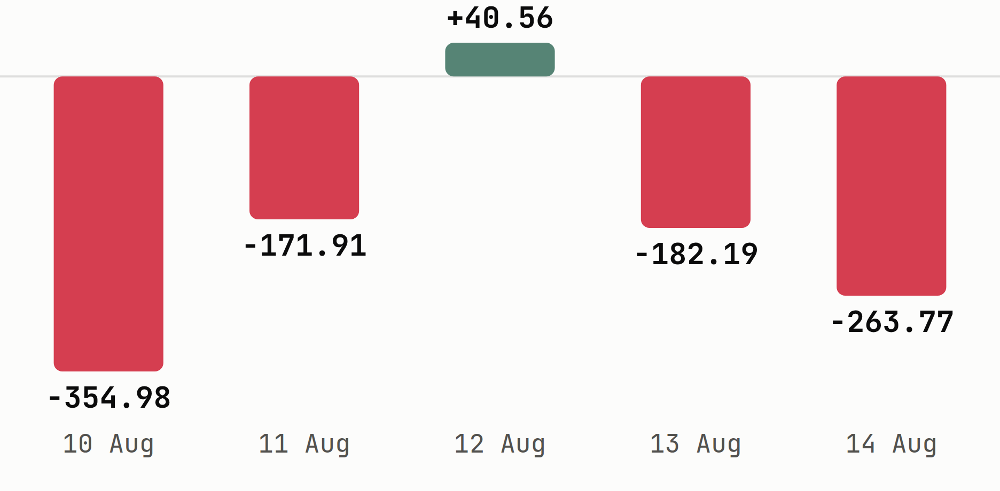
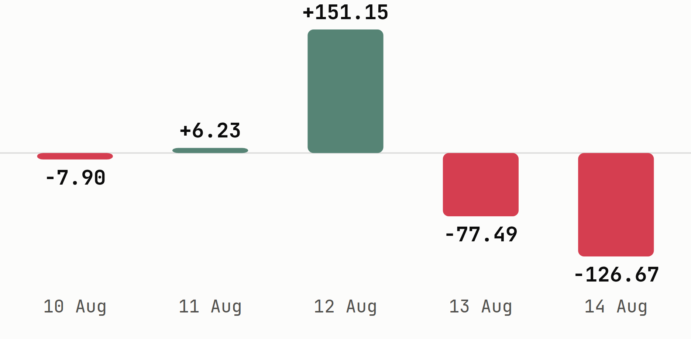

# Blue-chip benchmarks fell this week even as the broader index gained

Foreign investors flipped to an IDR 2.37 trillion net sell, a reversal from last
week's net buy, led by a single IDR 932.28B exit from Chandra Asri Pacific.

**Issue #33 | 16 August 2026 | week of 10-14 August | data as of 14 August 2026**

## Key Data Bites

*LQ45 and IDX30 both fell for the week even as the market-cap-weighted total
gained, so the index's headline number hid broad blue-chip weakness underneath it.*

- IDX total market cap swung through the week, dipping Tuesday and Thursday before
  a Friday rebound, to close at **IDR 11,239.91T**, up **+1.01% WoW** from a Monday
  open of IDR 11,127.67T, behind the prior week's **+2.91%**.
- **LQ45 -1.25%** and **IDX30 -1.58%**, both measured Friday to Friday, fell for the
  week even as the whole market's total gained, a reversal from the past two
  weeks' pattern of large caps outrunning the tape.
- LQ45 breadth was **10 up, 32 down**, three unchanged, of 45 constituents.
- [**$ISAT**](https://sectors.app/idx/isat?utm_source=newsletter&utm_medium=email&utm_campaign=weekly-insights-v2_2026-08-16&utm_content=key-data-bites&utm_term=isat) (Indosat) was the best LQ45 name at **+17.05%**, closing at IDR
  2,540.
- [**$MAPI**](https://sectors.app/idx/mapi?utm_source=newsletter&utm_medium=email&utm_campaign=weekly-insights-v2_2026-08-16&utm_content=key-data-bites&utm_term=mapi) (Mitra Adiperkasa) was the worst LQ45 name at **-6.85%**, closing at
  IDR 1,495.
- Foreign investors were **net sellers of IDR 2.37T** market-wide this week, a
  reversal from the prior week's IDR 583.99B net buy.
- [**$TPIA**](https://sectors.app/idx/tpia?utm_source=newsletter&utm_medium=email&utm_campaign=weekly-insights-v2_2026-08-16&utm_content=key-data-bites&utm_term=tpia) led every name in net foreign selling at **-IDR 932.28B**, while
  [**$BBRI**](https://sectors.app/idx/bbri?utm_source=newsletter&utm_medium=email&utm_campaign=weekly-insights-v2_2026-08-16&utm_content=key-data-bites&utm_term=bbri) led net buying at **+IDR 307.99B**.
- [**$BUMI**](https://sectors.app/idx/bumi?utm_source=newsletter&utm_medium=email&utm_campaign=weekly-insights-v2_2026-08-16&utm_content=key-data-bites&utm_term=bumi) (Bumi Resources) topped daily trading volume every single session
  this week, 2.0 to 4.5 billion shares a day, yet its own price barely moved,
  closing at IDR 181 against Monday's IDR 187.

## Top Weekly Movers

*All five of the week's biggest gainers sit outside the LQ45, an even wider gap
than last week's four of five, so the index's calm 45-stock breadth still hides a
much wilder tail underneath it.*

Measured across all IDX-listed names, 7-day trailing window ending 14 August
(`companies/top-changes`, which matches the window's Friday this run).

**Top gainers**

| Ticker | Close (IDR) | 7d change |
|---|---|---|
| [**$GIAA**](https://sectors.app/idx/giaa?utm_source=newsletter&utm_medium=email&utm_campaign=weekly-insights-v2_2026-08-16&utm_content=top-movers&utm_term=giaa) | 76 | +40.74% |
| [**$MDIA**](https://sectors.app/idx/mdia?utm_source=newsletter&utm_medium=email&utm_campaign=weekly-insights-v2_2026-08-16&utm_content=top-movers&utm_term=mdia) | 280 | +21.74% |
| [**$ARKO**](https://sectors.app/idx/arko?utm_source=newsletter&utm_medium=email&utm_campaign=weekly-insights-v2_2026-08-16&utm_content=top-movers&utm_term=arko) | 5,400 | +19.21% |
| [**$BYAN**](https://sectors.app/idx/byan?utm_source=newsletter&utm_medium=email&utm_campaign=weekly-insights-v2_2026-08-16&utm_content=top-movers&utm_term=byan) | 14,400 | +19.01% |
| [**$MGLV**](https://sectors.app/idx/mglv?utm_source=newsletter&utm_medium=email&utm_campaign=weekly-insights-v2_2026-08-16&utm_content=top-movers&utm_term=mglv) | 9,975 | +18.40% |

**Top losers**

| Ticker | Close (IDR) | 7d change |
|---|---|---|
| [**$NSSS**](https://sectors.app/idx/nsss?utm_source=newsletter&utm_medium=email&utm_campaign=weekly-insights-v2_2026-08-16&utm_content=top-movers&utm_term=nsss) | 860 | -17.70% |
| [**$MLPT**](https://sectors.app/idx/mlpt?utm_source=newsletter&utm_medium=email&utm_campaign=weekly-insights-v2_2026-08-16&utm_content=top-movers&utm_term=mlpt) | 1,415 | -12.38% |
| [**$IMPC**](https://sectors.app/idx/impc?utm_source=newsletter&utm_medium=email&utm_campaign=weekly-insights-v2_2026-08-16&utm_content=top-movers&utm_term=impc) | 1,405 | -11.91% |
| [**$ELPI**](https://sectors.app/idx/elpi?utm_source=newsletter&utm_medium=email&utm_campaign=weekly-insights-v2_2026-08-16&utm_content=top-movers&utm_term=elpi) | 665 | -10.74% |
| [**$RLCO**](https://sectors.app/idx/rlco?utm_source=newsletter&utm_medium=email&utm_campaign=weekly-insights-v2_2026-08-16&utm_content=top-movers&utm_term=rlco) | 4,510 | -10.25% |

[**$MLPT**](https://sectors.app/idx/mlpt?utm_source=newsletter&utm_medium=email&utm_campaign=weekly-insights-v2_2026-08-16&utm_content=top-movers&utm_term=mlpt) (Multipolar Technology) has now landed among the market's biggest
losers in back-to-back weeks since its 25-for-1 split on 21 July, extending its
post-split slide rather than reversing it.

## What the Data Unearthed

*Every finding below pairs this week's price action with a structured filing or a
market-wide flow figure already on the record, not a coincidence of timing alone.*

### A director's stake jumped to 2.93% the same week IMPC fell 11.91%

*A filing dated 14 August tracks director Phillip Tjipto's stake rising to 2.93% in [**$IMPC**](https://sectors.app/idx/impc?utm_source=newsletter&utm_medium=email&utm_campaign=weekly-insights-v2_2026-08-16&utm_content=data-unearthed&utm_term=impc), the same week the stock fell to IDR 1,405 (Instagram: [instagram.com/sectorsapp](https://www.instagram.com/sectorsapp)).*

- $IMPC (Impack Pratama Industri) fell from IDR 1,595 to IDR 1,405 this week, a
  **-11.91%** move that put it third among the market's biggest losers.
- A filing dated 14 August shows director Phillip Tjipto's stake rising from
  0.29% to 2.93%, a transfer of 1.45 billion shares.
- The same 1.45 billion share count appears on the other side of a filing dated 12
  August: major holder Tunggal Jaya Investama's own stake fell from 39.764% to
  37.12% over that period, so this reads as an internal transfer between an
  existing holder and a director, not fresh open-market buying.
- Foreign investors were light but steady net sellers of $IMPC across all five
  sessions, totaling **-IDR 19.25B** for the week, a fraction of the size of the
  insider transfer itself.
- Nothing in the filing record explains the price decline on its own; the
  transfer and the fall are concurrent, not proven cause and effect.

### Chandra Asri absorbed the market's single biggest foreign exit, and its price fell to match

*[**$TPIA**](https://sectors.app/idx/tpia?utm_source=newsletter&utm_medium=email&utm_campaign=weekly-insights-v2_2026-08-16&utm_content=data-unearthed&utm_term=tpia)'s daily net foreign flow this week, in IDR billion (chart generated this run, no matching social card was available for the window, see appendix).*

- $TPIA (Chandra Asri Pacific) saw net foreign selling of **-IDR 932.28B** this
  week, the largest of any name on the exchange (exchange definition,
  `idx_daily_data`).
- Foreign investors sold on four of the week's five sessions; only 12 August
  (+IDR 40.56B) broke the run.
- The stock's own close fell alongside it, from IDR 2,230 on 7 August to IDR
  2,010 on 14 August, a **-9.87%** week.
- $TPIA isn't an LQ45 constituent, so this flow and price move sit entirely
  outside the benchmark tables above; this and $CUAN below are the market's own
  wider tail.

### CUAN's rally traced back to Prajogo Pangestu's own filing, not the foreign buying the wires reported

*[**$CUAN**](https://sectors.app/idx/cuan?utm_source=newsletter&utm_medium=email&utm_campaign=weekly-insights-v2_2026-08-16&utm_content=data-unearthed&utm_term=cuan)'s daily net foreign flow this week, in IDR billion (chart generated this run, no matching social card was available for the window, see appendix).*

- A filing dated 11 August shows Prajogo Pangestu, $CUAN's (Petrindo Jaya Kreasi)
  controlling shareholder, buying 51.7 million shares at an average IDR 709.50,
  lifting his own stake from 80.372% to 80.418%.
- The stock closed at IDR 710 the next session, then spiked to IDR 870 on 12
  August, a single-day jump of 22.5%, before fading to IDR 825 by Friday, a
  **+11.49%** week overall and the second-best LQ45 performer after $ISAT.
- News coverage on 12 August credited foreign investors with a Rp135.3 billion net
  buy in $CUAN that day, part of a wider move into Prajogo-affiliated names ahead
  of MSCI's review (Bisnis, 12 Aug 2026). The exchange-definition data for that
  same session shows a **+IDR 151.15B** net foreign inflow, corroborating the
  direction of that day's reported buying, if not its exact size.
- That inflow didn't hold: foreign investors sold a net IDR 77.49B and IDR
  126.67B over the following two sessions, so the week as a whole closed as a
  **-IDR 54.69B** net foreign sell, even after Monday's price spike.
- Taken together, Wednesday's rally leans at least as much on the buying already
  on record from Prajogo Pangestu's own filing two days earlier as on the single
  day of foreign demand the same week's news coverage described.

**Follow [Instagram](https://www.instagram.com/sectorsapp) and [Threads](https://www.threads.net/@sectorsapp) for daily reads on filings, flows and movers like these.**

## Insider Filings

*A single filing accounts for most of the week's disclosed share volume, and it
came from a holder selling into one of the week's biggest gainers.*

Five most recent disclosures in the 10-14 August window.

| Date | Holder | Ticker | Type | Shares | Stake |
|---|---|---|---|---|---|
| 14 Aug | Nextier Datamate Center | [**$MGLV**](https://sectors.app/idx/mglv?utm_source=newsletter&utm_medium=email&utm_campaign=weekly-insights-v2_2026-08-16&utm_content=insider-filings&utm_term=mglv) | Sell | -52.93M | 74.06% to 71.28% |
| 14 Aug | Sugiman Layanto | [**$WINS**](https://sectors.app/idx/wins?utm_source=newsletter&utm_medium=email&utm_campaign=weekly-insights-v2_2026-08-16&utm_content=insider-filings&utm_term=wins) | Buy | +5.99M | 7.87% to 7.90% |
| 14 Aug | Siwie Honoris | [**$MICE**](https://sectors.app/idx/mice?utm_source=newsletter&utm_medium=email&utm_campaign=weekly-insights-v2_2026-08-16&utm_content=insider-filings&utm_term=mice) | Buy | +0.09M | 0.143% to 0.158% |
| 14 Aug | Samuel Sekuritas Indonesia | [**$BKSL**](https://sectors.app/idx/bksl?utm_source=newsletter&utm_medium=email&utm_campaign=weekly-insights-v2_2026-08-16&utm_content=insider-filings&utm_term=bksl) | Buy | +932.67M | 3.51% to 4.07% |
| 14 Aug | Buana Graha Utama | [**$MICE**](https://sectors.app/idx/mice?utm_source=newsletter&utm_medium=email&utm_campaign=weekly-insights-v2_2026-08-16&utm_content=insider-filings&utm_term=mice) | Buy | +0.02M | 48.419% to 48.422% |

[**$MGLV**](https://sectors.app/idx/mglv?utm_source=newsletter&utm_medium=email&utm_campaign=weekly-insights-v2_2026-08-16&utm_content=insider-filings&utm_term=mglv) (Panca Anugrah Wisesa) was the week's fifth-best gainer market-wide at
+18.40%, which makes
Nextier Datamate Center's sale the one filing above that ran against, rather than
with, its own ticker's direction that week.

## Other Major Headlines

*An index reshuffle and two bank earnings prints, not any single market-data
surprise, carried this week's non-Sectors news.*

- A rumored merger between [**$GIAA**](https://sectors.app/idx/giaa?utm_source=newsletter&utm_medium=email&utm_campaign=weekly-insights-v2_2026-08-16&utm_content=headlines&utm_term=giaa) (Garuda Indonesia) and Pelita Air drove
  the stock's move to the top of the market's gainers list this week, though
  analysts warned the underlying fundamentals don't yet support the rally
  ([Kontan](https://investasi.kontan.co.id/news/rumor-merger-garuda-dan-pelita-kerek-saham-giaa-analis-ingatkan-risiko-fundamental), 10 Aug 2026).
- MSCI's August review removed [**$GOTO**](https://sectors.app/idx/goto?utm_source=newsletter&utm_medium=email&utm_campaign=weekly-insights-v2_2026-08-16&utm_content=headlines&utm_term=goto) (GoTo Gojek Tokopedia) from its
  Global Standard Index over persistently low liquidity, and downgraded
  [**$CPIN**](https://sectors.app/idx/cpin?utm_source=newsletter&utm_medium=email&utm_campaign=weekly-insights-v2_2026-08-16&utm_content=headlines&utm_term=cpin) (Charoen Pokphand Indonesia) to the Small Cap index, weighing on the
  IHSG on the day of the announcement ([Kontan](https://investasi.kontan.co.id/news/msci-pertahankan-status-indonesia-sebagai-emerging-market-ihsg-berpeluang-rebound), 13 Aug 2026).
- [**$BBCA**](https://sectors.app/idx/bbca?utm_source=newsletter&utm_medium=email&utm_campaign=weekly-insights-v2_2026-08-16&utm_content=headlines&utm_term=bbca) (Bank Central Asia) reported a 1.57% rise in net profit to IDR
  35.25 trillion and 8.38% loan growth through July 2026 ([Kontan](https://keuangan.kontan.co.id/news/laba-bca-bbca-naik-157-capai-rp-3525-triliun-hingga-juli-2026-kredit-naik-838), 14 Aug 2026).
- [**$BMRI**](https://sectors.app/idx/bmri?utm_source=newsletter&utm_medium=email&utm_campaign=weekly-insights-v2_2026-08-16&utm_content=headlines&utm_term=bmri) (Bank Mandiri) reported a 24% year-on-year increase in net profit
  to IDR 33.01 trillion for July 2026 ([Kontan](https://keuangan.kontan.co.id/news/bank-mandiri-bmri-catat-laba-bersih-tumbuh-24-jadi-rp-3301-triliun-pada-juli-2026), 14 Aug 2026).
- President Prabowo's state-of-the-nation speech on 14 August was credited with a
  1.59% single-day rebound in the IHSG, though the outlook for further gains
  remained unclear to the analysts quoted ([Kontan](https://investasi.kontan.co.id/news/pidato-presiden-prabowo-bikin-ihsg-rebound-159-bisakah-ihsg-lanjut-menguat), 14 Aug 2026).

Read more market headlines at [sectors.app/indonesia/news](https://sectors.app/indonesia/news?utm_source=newsletter&utm_medium=email&utm_campaign=weekly-insights-v2_2026-08-16&utm_content=headlines).

## What's Ahead

*Every scheduled print below lands on a name or sector already named in this
issue, none of them are wire-feed filler.*

**Week of 17-21 August**

| Mon 17 | Tue 18 | Wed 19 | Thu 20 | Fri 21 |
|---|---|---|---|---|
| — | — | — | **Rights** [**$ENRG**](https://sectors.app/idx/enrg?utm_source=newsletter&utm_medium=email&utm_campaign=weekly-insights-v2_2026-08-16&utm_content=whats-ahead&utm_term=enrg) trading opens | — |

$ENRG's 1-for-2 rights issue at IDR 310/share went ex-date 14 August, with the
new shares' trading window running 20-28 August.

**Beyond the week**

| Date | Ticker | Action | Detail |
|---|---|---|---|
| 3 Sep | [**$MGLV**](https://sectors.app/idx/mglv?utm_source=newsletter&utm_medium=email&utm_campaign=weekly-insights-v2_2026-08-16&utm_content=whats-ahead&utm_term=mglv) | AGM | 14:00 |
| 4 Sep | [**$BBTN**](https://sectors.app/idx/bbtn?utm_source=newsletter&utm_medium=email&utm_campaign=weekly-insights-v2_2026-08-16&utm_content=whats-ahead&utm_term=bbtn) | AGM | 14:00 |
| 11 Sep | [**$WIFI**](https://sectors.app/idx/wifi?utm_source=newsletter&utm_medium=email&utm_campaign=weekly-insights-v2_2026-08-16&utm_content=whats-ahead&utm_term=wifi) | AGM | 14:00 |
| 30 Sep | [**$TLKM**](https://sectors.app/idx/tlkm?utm_source=newsletter&utm_medium=email&utm_campaign=weekly-insights-v2_2026-08-16&utm_content=whats-ahead&utm_term=tlkm) | AGM | 14:00 |
| 2 Oct | [**$BRNA**](https://sectors.app/idx/brna?utm_source=newsletter&utm_medium=email&utm_campaign=weekly-insights-v2_2026-08-16&utm_content=whats-ahead&utm_term=brna) | Rights ex-date | 5:9 ratio at IDR 685 |

**Scheduled macro**

| Date | Event | Why it matters |
|---|---|---|
| 18-19 Aug | Bank Indonesia RDG rate decision | Sets the funding-cost backdrop for $BBRI, this week's top net foreign buy, and $BBCA, named in Headlines above ([bi.go.id](https://www.bi.go.id/id/publikasi/ruang-media/news-release/Pages/sp_2730825.aspx)) |
| 31 Aug (after close) | MSCI August Index Review takes effect | Removes $GOTO and downgrades $CPIN out of the Global Standard Index, both named in Headlines above; changes are reflected in trading from 1 September ([Bisnis](https://market.bisnis.com/read/20260813/7/1996072/brief-insight-selamat-dari-frontier-market-indonesia-masih-punya-pr-besar-di-msci), 13 Aug 2026) |
| 16 Sep | FOMC rate decision | Sets the global rate differential behind the same foreign selling that drove this week's $TPIA and $BMRI flows ([federalreserve.gov](https://www.federalreserve.gov/monetarypolicy/fomccalendars.htm)) |

See the full [dividend calendar](https://sectors.app/indonesia/calendars/dividend-calendar?utm_source=newsletter&utm_medium=email&utm_campaign=weekly-insights-v2_2026-08-16&utm_content=whats-ahead) for ex-dates beyond this list.

## The Other Side

*Every figure below already appeared earlier in this issue; nothing new is
introduced here.*

**The bull read**

- IDX total market cap still gained +1.01% WoW despite a choppy week, with
  Friday's session alone up sharply after President Prabowo's speech, so
  broad-market demand outside the benchmark constituents held up.
- All five of the week's biggest gainers were non-LQ45 names, each posting a
  double-digit weekly move, a sign risk appetite is alive well beyond the 45
  benchmark constituents.
- $BBCA and $BMRI both posted real profit growth this week, +1.57% and +24%
  year-on-year respectively, a fundamentally supportive backdrop even as both
  banks' own share prices barely moved.

**The bear read**

- LQ45 (-1.25%) and IDX30 (-1.58%) both fell for the week even as the
  broader index rose, and breadth inside the benchmark was lopsided: only 10 of
  45 constituents closed higher, 32 fell.
- Foreign investors flipped to a net IDR 2.37 trillion sell this week, a sharp
  reversal from the prior week's IDR 583.99B net buy, led by a single IDR
  932.28B exit from $TPIA.
- MSCI's decision to drop $GOTO and downgrade $CPIN out of its Global Standard
  Index takes effect 31 August, a real, dated passive-outflow risk for two names
  already sitting near multi-month lows.

**What would settle it**: the 31 August MSCI effective date is the nearest
concrete test. A smooth reconstitution with limited follow-through selling in
$GOTO and $CPIN would support the bull case that this week's broader-market
resilience is the more durable signal; a sharp index-fund unwind in those two
names would instead confirm the bear case that this week's blue-chip weakness
and foreign outflow are the leading indicator.

## Keep the signals coming

Track every name in this issue, and the ones that don't make the cut, with a
[watchlist](https://sectors.app/watchlist?utm_source=newsletter&utm_medium=email&utm_campaign=weekly-insights-v2_2026-08-16&utm_content=cta) for the exclusive reports, or a [workflow](https://sectors.app/workflow?utm_source=newsletter&utm_medium=email&utm_campaign=weekly-insights-v2_2026-08-16&utm_content=cta) alert for the next filing or foreign-flow reversal like the ones above.

## Upcoming Events

**Making Claude your Investment Companion**

A beginner-friendly workshop on turning Claude into a personal investment research
companion, grounded in live IDX & SGX market data through the Sectors MCP, then
learning to ask the right questions to research companies, compare stocks, and stay
on top of your watchlist.

- **Date:** 24th and 25th August, 2026
- **Time:** 18.30 to 21.00 (GMT+7)
- **Medium:** Zoom Conferencing (Online)
- **Language:** English (by Aidityas Adhakim)
- **Intended Audience:** Retail investors and newcomers curious about using AI for investing

[Register here](https://supertype.ai/events/learn-claude)

## Sources

- [Rumor Merger Garuda dan Pelita Kerek Saham GIAA, Analis Ingatkan Risiko Fundamental](https://investasi.kontan.co.id/news/rumor-merger-garuda-dan-pelita-kerek-saham-giaa-analis-ingatkan-risiko-fundamental), Kontan, 10 Aug 2026
- [Foreign investors heavily buy Prajogo Pangestu-affiliated stocks ahead of MSCI review](https://market.bisnis.com/read/20260812/7/1995737/asing-borong-saham-prajogo-jelang-pengumuman-msci), Bisnis, 12 Aug 2026
- [MSCI Pertahankan Status Indonesia sebagai Emerging Market, IHSG Berpeluang Rebound](https://investasi.kontan.co.id/news/msci-pertahankan-status-indonesia-sebagai-emerging-market-ihsg-berpeluang-rebound), Kontan, 13 Aug 2026
- [Brief Insight: Selamat dari Frontier Market, Indonesia Masih Punya PR Besar di MSCI](https://market.bisnis.com/read/20260813/7/1996072/brief-insight-selamat-dari-frontier-market-indonesia-masih-punya-pr-besar-di-msci), Bisnis, 13 Aug 2026
- [Laba BCA (BBCA) Naik 1,57% Capai Rp 35,25 Triliun hingga Juli 2026, Kredit Naik 8,38%](https://keuangan.kontan.co.id/news/laba-bca-bbca-naik-157-capai-rp-3525-triliun-hingga-juli-2026-kredit-naik-838), Kontan, 14 Aug 2026
- [Bank Mandiri (BMRI) Catat Laba Bersih Tumbuh 24% Jadi Rp33,01 Triliun pada Juli 2026](https://keuangan.kontan.co.id/news/bank-mandiri-bmri-catat-laba-bersih-tumbuh-24-jadi-rp-3301-triliun-pada-juli-2026), Kontan, 14 Aug 2026
- [Pidato Presiden Prabowo Bikin IHSG Rebound 1,59%, Bisakah IHSG Lanjut Menguat?](https://investasi.kontan.co.id/news/pidato-presiden-prabowo-bikin-ihsg-rebound-159-bisakah-ihsg-lanjut-menguat), Kontan, 14 Aug 2026
- [Bank Indonesia Tetapkan Jadwal Rapat Dewan Gubernur Bulanan Tahun 2026](https://www.bi.go.id/id/publikasi/ruang-media/news-release/Pages/sp_2730825.aspx), Bank Indonesia
- [FOMC Meeting Calendars](https://www.federalreserve.gov/monetarypolicy/fomccalendars.htm), Federal Reserve

**Appendix: Sectors API endpoints (fields used)**
- `idx-total/` — `idx_total_market_cap` (this week, prior week)
- `index-daily/lq45/`, `index-daily/idx30/` — `price` (this week, prior week's Friday
  base)
- `companies/top-changes/?classifications=top_gainers,top_losers&periods=7d` — Top
  Weekly Movers
- `companies/?where=indices in ['LQ45']`, `daily/<TICKER>/` across all 45
  constituents — LQ45 breadth, best/worst LQ45 performer, $CUAN's price series
- `company/corporate-actions/<TICKER>/` across the 45 LQ45 constituents plus GIAA,
  MDIA, ARKO, BYAN, MGLV, NSSS, MLPT, IMPC, ELPI, RLCO, TPIA, BREN, BRNA, ENRG,
  AVIA, DOOH and MAPI — What's Ahead calendar
- `filings/?limit=30&offset=0..210` — Insider Filings table, IMPC and CUAN filings
  in What the Data Unearthed
- `news/?start=<day>&end=<day>&limit=30` called once per day, 10-14 Aug — Other
  Major Headlines
- `daily/TPIA.JK/`, `daily/CUAN.JK/`, `daily/IMPC.JK/` — price series for What the
  Data Unearthed
- Foreign flow (exchange definition, `idx_daily_data`, `foreign_buy_volume` /
  `foreign_sell_volume` × `close`) — pinned Supabase query, market-wide and
  TPIA/CUAN/IMPC/BBRI figures
- Social images from [instagram.com/sectorsapp](https://www.instagram.com/sectorsapp)

---
*This newsletter is data reporting and market commentary, not investment advice or a
recommendation to buy or sell any security. Figures are from sectors.app as of 14
August 2026 unless otherwise cited. Do your own research.*
