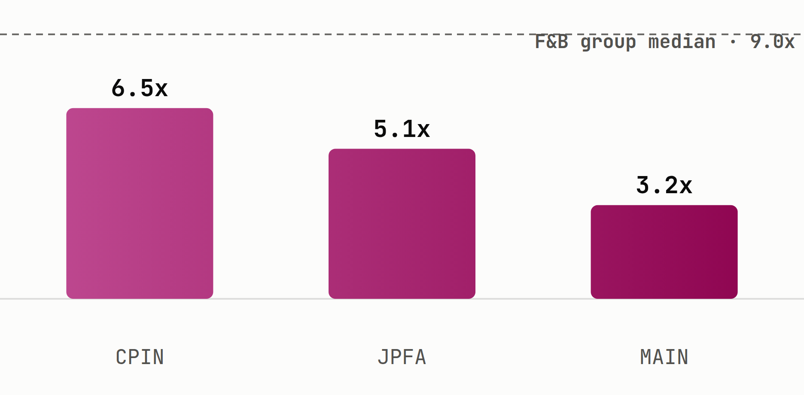

# CPIN closed at a 52-week low, and its closest peers trade even cheaper

Charoen Pokphand Indonesia ([**$CPIN**](https://sectors.app/idx/cpin?utm_source=newsletter&utm_medium=email&utm_campaign=sector-spotlight_2026-08-20&utm_content=hook&utm_term=cpin)) lost its place in MSCI's Global Standard Index this month, and on 2026 earnings its own valuation multiple is still richer than either of its direct poultry peers (sectors.app).

## The group

Charoen Pokphand Indonesia ([**$CPIN**](https://sectors.app/idx/cpin?utm_source=newsletter&utm_medium=email&utm_campaign=sector-spotlight_2026-08-20&utm_content=group&utm_term=cpin)) sits inside IDX's Food & Beverage sub-sector, a group that spans everything from palm oil planters to packaged snacks and coffee chains, alongside the poultry and animal-feed producers CPIN itself belongs to. That whole group trades at a **median 2026 P/E of 9.0x**, the cheapest multiple it has carried across the past five years, down from 12.2x in 2025 and 15.1x in 2023 (sectors.app). Even so, the group's own market cap **rose 3.2% over the past week** and sits down **-7.4% year-to-date**. CPIN is one of the sub-sector's five largest names by market cap, and its own week ran counter to that group move rather than with it, which points at a story specific to CPIN rather than a group-wide re-rating.

## The comparison

Charoen Pokphand's poultry and feed peers, [**$JPFA**](https://sectors.app/idx/jpfa?utm_source=newsletter&utm_medium=email&utm_campaign=sector-spotlight_2026-08-20&utm_content=comparison&utm_term=jpfa) (JAPFA Comfeed Indonesia) and [**$MAIN**](https://sectors.app/idx/main?utm_source=newsletter&utm_medium=email&utm_campaign=sector-spotlight_2026-08-20&utm_content=comparison&utm_term=main) (Malindo Feedmill), sit in the same sub-industry the Sectors data classifies CPIN under, the closest like-for-like read available.

| Ticker | Price (IDR) | 2026 P/E | vs. group median (9.0x) | ROE (2025) | Div. yield (ttm) | 7d move |
|---|---|---|---|---|---|---|
| [**$CPIN**](https://sectors.app/idx/cpin?utm_source=newsletter&utm_medium=email&utm_campaign=sector-spotlight_2026-08-20&utm_content=comparison&utm_term=cpin) | 2,960 | 6.5x | below median | 16.5% | 0% | -6.0% |
| [**$JPFA**](https://sectors.app/idx/jpfa?utm_source=newsletter&utm_medium=email&utm_campaign=sector-spotlight_2026-08-20&utm_content=comparison&utm_term=jpfa) | 2,290 | 5.1x | below median | 20.0% | 6.1% | +1.3% |
| [**$MAIN**](https://sectors.app/idx/main?utm_source=newsletter&utm_medium=email&utm_campaign=sector-spotlight_2026-08-20&utm_content=comparison&utm_term=main) | 665 | 3.2x | well below median | 13.7% | 7.8% | -2.2% |

*As of 19 Aug 2026, sectors.app. P/E is each name's own 2026 figure from its historical valuation series; 7d move is the change from 12 Aug's close to 19 Aug's close.*

*CPIN's 2026 P/E of 6.5x sits below the group median, but both of its direct poultry peers trade lower still, the clearest read on how this week's price move compares inside its own sub-industry (sectors.app).*

[**$CPIN**](https://sectors.app/idx/cpin?utm_source=newsletter&utm_medium=email&utm_campaign=sector-spotlight_2026-08-20&utm_content=comparison&utm_term=cpin)'s slide to a 52-week low of IDR 2,960 came the same week its price fell -6.0%, and it follows MSCI's decision to move the stock from its Global Standard Index to the Global Small Cap Index, a change that takes effect after the market close on 31 August (Kalderanews, 13 Aug 2026). The valuation picture underneath that move is mixed rather than one-directional: CPIN's return on equity has actually climbed from 8.6% in 2023 to 16.5% in 2025, even as its price and its multiple both fell, and it currently carries no trailing dividend yield. JAPFA Comfeed ([**$JPFA**](https://sectors.app/idx/jpfa?utm_source=newsletter&utm_medium=email&utm_campaign=sector-spotlight_2026-08-20&utm_content=comparison&utm_term=jpfa)) posted the highest 2025 ROE of the three at 20.0%, up from 18.2% in 2024, next to a 6.1% trailing dividend yield, and its price actually rose 1.3% this week while CPIN fell. Malindo Feedmill ([**$MAIN**](https://sectors.app/idx/main?utm_source=newsletter&utm_medium=email&utm_campaign=sector-spotlight_2026-08-20&utm_content=comparison&utm_term=main)) carries the cheapest multiple of the three at 3.2x, well below the group median, but its 2025 ROE of 13.7% is down from 18.5% the year before, the weakest earnings momentum of the three names here even with the group's richest dividend yield at 7.8%.

## The takeaway

On this screen, [**$JPFA**](https://sectors.app/idx/jpfa?utm_source=newsletter&utm_medium=email&utm_campaign=sector-spotlight_2026-08-20&utm_content=takeaway&utm_term=jpfa)'s combination of the second-lowest P/E, the highest 2025 ROE, and a real trailing dividend yield stands out among the three. [**$CPIN**](https://sectors.app/idx/cpin?utm_source=newsletter&utm_medium=email&utm_campaign=sector-spotlight_2026-08-20&utm_content=takeaway&utm_term=cpin)'s move this week reads more like a re-rating than a fundamentals story, since its own ROE improved into 2025 even as its price and multiple both fell. [**$MAIN**](https://sectors.app/idx/main?utm_source=newsletter&utm_medium=email&utm_campaign=sector-spotlight_2026-08-20&utm_content=takeaway&utm_term=main) carries the group's cheapest multiple, but paired with 2025's weakest earnings momentum of the three. None of this is a call to buy or avoid any of the three names, it's a reminder that this week's most-talked-about mover and this group's cheapest multiple weren't the same stock.

[Screen the Food & Beverage sub-sector on Sectors](https://sectors.app/indonesia/food-beverage?utm_source=newsletter&utm_medium=email&utm_campaign=sector-spotlight_2026-08-20&utm_content=cta)

## Upcoming Events

**Making Claude your Investment Companion**

A beginner-friendly workshop on turning Claude into a personal investment research companion, grounded in live IDX & SGX market data through the Sectors MCP, then learning to ask the right questions to research companies, compare stocks, and stay on top of your watchlist.

- **Date:** 24th and 25th August, 2026
- **Time:** 18.30 to 21.00 (GMT+7)
- **Medium:** Zoom Conferencing (Online)
- **Language:** English (by Aidityas Adhakim)
- **Intended Audience:** Retail investors and newcomers curious about using AI for investing

[Register here](https://supertype.ai/events/learn-claude)

## Sources

- [Hasil MSCI Review Agustus 2026: GOTO & CPIN Resmi Didepak](https://www.kalderanews.com/2026/08/hasil-msci-review-agustus-2026-goto-cpin-resmi-didepak/), Kalderanews, 13 Aug 2026

**Appendix: Sectors API endpoints (fields used)**
- `companies/top-changes/?classifications=top_gainers,top_losers&periods=7d&sub_sector=food-beverage&n_stock=5` —
  the week's standout discovery (CPIN's -6.0%)
- `subsector/report/food-beverage/` — `statistics.filtered_median_pe` (9.0x group
  median, and its 2022-2026 series), `market_cap.mcap_summary.mcap_change.1w`/`.ytd`,
  `companies.top_companies.top_mcap`
- `companies/?where=sub_sector = 'food-beverage' and pe_ttm > 0&order_by=pe_ttm&limit=20&include_query_values=true` —
  ranked members, `pe_ttm > 0` guard, confirms CPIN/JPFA/MAIN's position in the
  cheapest-20 screen
- `company/report/{CPIN,JPFA,MAIN}.JK/?sections=overview,valuation,financials,dividend` —
  `overview.all_time_price` (CPIN's 52-week/YTD low), `valuation.historical_valuation[]`
  (2026 P/E), `financials.historical_financial_ratio[].profitability.roe`,
  `dividend.yield_ttm`
- `daily/{CPIN,JPFA,MAIN}.JK/?start=2026-08-10&end=2026-08-19` — 7-day price change,
  12 Aug close vs. 19 Aug close

---
*This newsletter is data reporting and market commentary, not investment advice or a
recommendation to buy or sell any security. Figures are from sectors.app as of
2026-08-19 unless otherwise cited. Do your own research.*
