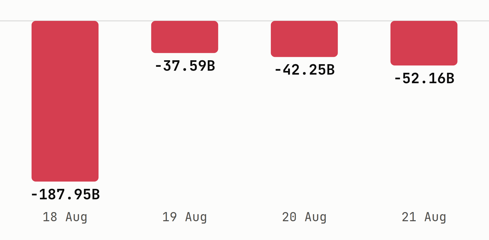
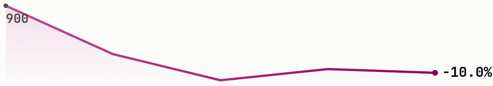

# Foreign investors turned net buyers again, and the rally reached deep into the LQ45

Trading resumed Tuesday after Monday's Independence Day holiday, and foreign
investors added a net IDR 614.96B by Friday, yet the week's single biggest
foreign exit came from a stock that still closed the week up 7.09%.

**Issue #34 | 24 August 2026 | week of 17-21 August | data as of 21 August 2026**

## Key Data Bites

*Foreign investors flipped back to net buying for the first time in three weeks,
and the rally showed up broadly across the benchmark, not just in the handful of
names the foreign money actually touched.*

- IDX total market cap closed a holiday-shortened week (the exchange was shut
  Monday for Indonesia's 81st Independence Day) at **IDR 11,445.45T**, up
  **+0.89% WoW** from Tuesday's reopening level of IDR 11,344.78T, behind the
  prior week's +1.01%.
- **LQ45 +1.95%** and **IDX30 +1.77%**, both measured Friday to Friday, reversed
  last week's declines of -1.25% and -1.58%.
- LQ45 breadth was **34 up, 9 down**, two unchanged, of 45 constituents.
- [**$HRTA**](https://sectors.app/idx/hrta?utm_source=newsletter&utm_medium=email&utm_campaign=weekly-insights-v2_2026-08-24&utm_content=key-data-bites&utm_term=hrta) (Hartadinata Abadi) was the best LQ45 name at **+8.84%**, closing
  at IDR 2,340.
- [**$JPFA**](https://sectors.app/idx/jpfa?utm_source=newsletter&utm_medium=email&utm_campaign=weekly-insights-v2_2026-08-24&utm_content=key-data-bites&utm_term=jpfa) (Japfa Comfeed Indonesia) was the worst LQ45 name at **-4.74%**,
  closing at IDR 2,210.
- Foreign investors were **net buyers of IDR 614.96B** market-wide this week, a
  reversal from the prior week's IDR 2.37T net sell.
- [**$BBRI**](https://sectors.app/idx/bbri?utm_source=newsletter&utm_medium=email&utm_campaign=weekly-insights-v2_2026-08-24&utm_content=key-data-bites&utm_term=bbri) led every name in net foreign buying at **+IDR 750.38B**, while
  [**$ISAT**](https://sectors.app/idx/isat?utm_source=newsletter&utm_medium=email&utm_campaign=weekly-insights-v2_2026-08-24&utm_content=key-data-bites&utm_term=isat) led net selling at **-IDR 319.95B**.
- [**$BUMI**](https://sectors.app/idx/bumi?utm_source=newsletter&utm_medium=email&utm_campaign=weekly-insights-v2_2026-08-24&utm_content=key-data-bites&utm_term=bumi) (Bumi Resources) topped daily trading volume every session for a
  third straight week, 1.0 to 6.2 billion shares a day, closing at IDR 196
  against last Friday's IDR 181, a **+8.29%** week.

## Top Weekly Movers

*None of this week's ten biggest movers, gainers or losers, sit inside the
LQ45, so the benchmark's calm breadth still hides a much wilder tail
underneath it.*

Measured across all IDX-listed names, 7-day trailing window ending 21 August
(`companies/top-changes`, which matches the window's Friday this run).

**Top gainers**

| Ticker | Close (IDR) | 7d change |
|---|---|---|
| [**$JARR**](https://sectors.app/idx/jarr?utm_source=newsletter&utm_medium=email&utm_campaign=weekly-insights-v2_2026-08-24&utm_content=top-movers&utm_term=jarr) | 3,070 | +52.74% |
| [**$INET**](https://sectors.app/idx/inet?utm_source=newsletter&utm_medium=email&utm_campaign=weekly-insights-v2_2026-08-24&utm_content=top-movers&utm_term=inet) | 330 | +41.03% |
| [**$BSWD**](https://sectors.app/idx/bswd?utm_source=newsletter&utm_medium=email&utm_campaign=weekly-insights-v2_2026-08-24&utm_content=top-movers&utm_term=bswd) | 1,490 | +32.44% |
| [**$PACK**](https://sectors.app/idx/pack?utm_source=newsletter&utm_medium=email&utm_campaign=weekly-insights-v2_2026-08-24&utm_content=top-movers&utm_term=pack) | 386 | +30.41% |
| [**$PSAB**](https://sectors.app/idx/psab?utm_source=newsletter&utm_medium=email&utm_campaign=weekly-insights-v2_2026-08-24&utm_content=top-movers&utm_term=psab) | 640 | +29.03% |

**Top losers**

| Ticker | Close (IDR) | 7d change |
|---|---|---|
| [**$TCPI**](https://sectors.app/idx/tcpi?utm_source=newsletter&utm_medium=email&utm_campaign=weekly-insights-v2_2026-08-24&utm_content=top-movers&utm_term=tcpi) | 2,320 | -35.56% |
| [**$ARTO**](https://sectors.app/idx/arto?utm_source=newsletter&utm_medium=email&utm_campaign=weekly-insights-v2_2026-08-24&utm_content=top-movers&utm_term=arto) | 1,060 | -10.55% |
| [**$FILM**](https://sectors.app/idx/film?utm_source=newsletter&utm_medium=email&utm_campaign=weekly-insights-v2_2026-08-24&utm_content=top-movers&utm_term=film) | 810 | -10.00% |
| [**$MPRO**](https://sectors.app/idx/mpro?utm_source=newsletter&utm_medium=email&utm_campaign=weekly-insights-v2_2026-08-24&utm_content=top-movers&utm_term=mpro) | 13,125 | -7.24% |
| [**$MSIN**](https://sectors.app/idx/msin?utm_source=newsletter&utm_medium=email&utm_campaign=weekly-insights-v2_2026-08-24&utm_content=top-movers&utm_term=msin) | 344 | -7.03% |

[**$JARR**](https://sectors.app/idx/jarr?utm_source=newsletter&utm_medium=email&utm_campaign=weekly-insights-v2_2026-08-24&utm_content=top-movers&utm_term=jarr) (Jhonlin Agro Raya) topped the market by a wide margin, and
[**$FILM**](https://sectors.app/idx/film?utm_source=newsletter&utm_medium=email&utm_campaign=weekly-insights-v2_2026-08-24&utm_content=top-movers&utm_term=film) (MD Entertainment)'s spot among the losers lines up with a
substantial-holder filing dated the same week, both detailed below.

## What the Data Unearthed

*Every finding below pairs this week's price action with a structured filing, a
market-wide flow figure, or a volume record already on the record, not a
coincidence of timing alone.*

### JARR's volume roughly doubled the same week Haji Isam's Jhonlin Group was rumored to be circling Bayan Resources

*[**$JARR**](https://sectors.app/idx/jarr?utm_source=newsletter&utm_medium=email&utm_campaign=weekly-insights-v2_2026-08-24&utm_content=data-unearthed&utm_term=jarr)'s volume-spike card for 21 August (Instagram: [instagram.com/sectorsapp](https://www.instagram.com/sectorsapp)).*

- $JARR (Jhonlin Agro Raya) rose **+52.74%** this week to IDR 3,070, the
  market's single biggest mover (`companies/top-changes`, 7-day window ending
  21 August).
- Daily volume roughly doubled from last Friday's 20.4M shares to a range of
  29.3M-44.8M shares a day this week, peaking Friday at 44.8M.
- Foreign investors were mixed on $JARR through the week, netting a slim
  **+IDR 0.83B** overall (exchange definition, `idx_daily_data`), so the move
  reads as domestically driven, not foreign-led.
- The volume surge lines up with a week of news coverage tying Jhonlin Group,
  JARR's own conglomerate parent, to a rumored 62% takeover of $BYAN (Bayan
  Resources), a claim Bayan Resources explicitly denied twice during the week
  (Kontan, 18 Aug 2026).
- $BYAN isn't among this week's ten biggest movers by our 7-day measure, but its
  own single-day -9.41% drop on 19 August, after the denial, shows the rumor
  moved prices well beyond JARR alone (CNBC Indonesia, 19 Aug 2026).

### ISAT rallied 7.09% even as it topped the market in foreign selling

*[**$ISAT**](https://sectors.app/idx/isat?utm_source=newsletter&utm_medium=email&utm_campaign=weekly-insights-v2_2026-08-24&utm_content=data-unearthed&utm_term=isat)'s daily net foreign flow this week, in IDR billion (chart generated this run, no matching social card was available for the window, see appendix).*

- $ISAT (Indosat) rose from IDR 2,540 to IDR 2,720 this week, a **+7.09%**
  move, even though it wasn't among the week's ten biggest market-wide gainers.
- Foreign investors sold a net **-IDR 319.95B** of $ISAT this week, the single
  largest foreign exit of any name on the exchange (exchange definition,
  `idx_daily_data`).
- The selling ran every session from Tuesday through Friday, deepening from
  -IDR 37.59B on Wednesday to -IDR 52.16B by Friday's close, even as the stock
  kept climbing.
- Nothing in this week's filings or corporate-action record explains who was on
  the other side of that foreign selling; the price gain and the foreign
  outflow are concurrent facts, not proven cause and effect.

### A major shareholder cut its FILM stake the same week the stock led the market's losers

*[**$FILM**](https://sectors.app/idx/film?utm_source=newsletter&utm_medium=email&utm_campaign=weekly-insights-v2_2026-08-24&utm_content=data-unearthed&utm_term=film)'s daily close this week (chart generated this run, no matching social card was available for the window, see appendix).*

- $FILM (MD Entertainment) fell from IDR 900 to IDR 810 this week, a **-10.00%**
  move that put it third among the market's biggest losers.
- A filing dated 21 August shows Samuel Sekuritas Indonesia selling 83.71
  million shares, cutting its stake from 7.55% to 6.78%.
- The filing lands on the same Friday session as the stock's close, though the
  decline was already underway before it, from IDR 900 to IDR 800 by Wednesday,
  two days ahead of the filing.
- Nothing in the disclosed record ties the sale directly to the week's price
  action; the filing and the decline are concurrent, not proven cause and
  effect.

**Follow [Instagram](https://www.instagram.com/sectorsapp) and [Threads](https://www.threads.net/@sectorsapp) for daily reads on filings, flows and movers like these.**

## Insider Filings

*Samuel Sekuritas Indonesia filed four of the week's five disclosures,
including both sides of a same-day reallocation and the FILM sale detailed
above.*

Five most recent disclosures in the 17-21 August window.

| Date | Holder | Ticker | Type | Shares | Stake |
|---|---|---|---|---|---|
| 21 Aug | Samuel Sekuritas Indonesia | [**$NSSS**](https://sectors.app/idx/nsss?utm_source=newsletter&utm_medium=email&utm_campaign=weekly-insights-v2_2026-08-24&utm_content=insider-filings&utm_term=nsss) | Sell | -194.87M | 24.721% to 23.9% |
| 21 Aug | Samuel Sekuritas Indonesia | [**$NSSS**](https://sectors.app/idx/nsss?utm_source=newsletter&utm_medium=email&utm_campaign=weekly-insights-v2_2026-08-24&utm_content=insider-filings&utm_term=nsss) | Buy | +157.34M | 24.06% to 24.721% |
| 21 Aug | Samuel Sekuritas Indonesia | [**$RLCO**](https://sectors.app/idx/rlco?utm_source=newsletter&utm_medium=email&utm_campaign=weekly-insights-v2_2026-08-24&utm_content=insider-filings&utm_term=rlco) | Buy | +34.36M | 4.95% to 6.05% |
| 21 Aug | Samuel Sekuritas Indonesia | [**$FILM**](https://sectors.app/idx/film?utm_source=newsletter&utm_medium=email&utm_campaign=weekly-insights-v2_2026-08-24&utm_content=insider-filings&utm_term=film) | Sell | -83.71M | 7.55% to 6.78% |
| 21 Aug | Tunggal Jaya Investama | [**$IMPC**](https://sectors.app/idx/impc?utm_source=newsletter&utm_medium=email&utm_campaign=weekly-insights-v2_2026-08-24&utm_content=insider-filings&utm_term=impc) | Buy | +8.30M | 37.12% to 37.14% |

The two $NSSS filings, filed at the same timestamp, net out to a small overall
stake reduction (24.06% to 23.9%) once read in sequence, alongside the outright
$FILM sale that ran against the week's third-worst mover.

## Other Major Headlines

*Petrochemical M&A, a rate hold and state-owned restructuring, not any single
market-data surprise, carried this week's non-Sectors news.*

- [**$TPIA**](https://sectors.app/idx/tpia?utm_source=newsletter&utm_medium=email&utm_campaign=weekly-insights-v2_2026-08-24&utm_content=headlines&utm_term=tpia) (Chandra Asri Pacific) agreed to acquire Cycle & Carriage's
  automotive business for US$207 million ([Kontan](https://investasi.kontan.co.id/news/tpia-akuisisi-cycle-carriage-us-207-juta-cermati-rekomendasi-analis), 21 Aug 2026).
- Bank Indonesia held its benchmark rate at 5.75%, described as neutral to
  positive for stocks and bonds ([Bisnis](https://market.bisnis.com/read/20260819/7/1997546/bi-rate-ditahan-575-ini-dampaknya-ke-pasar-saham-dan-obligasi), 19 Aug 2026).
- [**$BBCA**](https://sectors.app/idx/bbca?utm_source=newsletter&utm_medium=email&utm_campaign=weekly-insights-v2_2026-08-24&utm_content=headlines&utm_term=bbca) (Bank Central Asia) announced a IDR 3.07 trillion interim dividend
  for Q3 FY2026 ([Kontan](https://keuangan.kontan.co.id/news/bca-tebar-dividen-interim-rp-307-triliun-ini-jadwal-pembagiannya), 19 Aug 2026).
- Danantara outlined a merger and restructuring plan for [**$PTPP**](https://sectors.app/idx/ptpp?utm_source=newsletter&utm_medium=email&utm_campaign=weekly-insights-v2_2026-08-24&utm_content=headlines&utm_term=ptpp) (PP
  Persero) ([Bloomberg Technoz](https://www.bloombergtechnoz.com/detail-news/119142/danantara-siapkan-skema-merger-dan-restrukturisasi-ptpp), 21 Aug 2026).
- [**$WSKT**](https://sectors.app/idx/wskt?utm_source=newsletter&utm_medium=email&utm_campaign=weekly-insights-v2_2026-08-24&utm_content=headlines&utm_term=wskt) (Waskita Karya) and [**$WIKA**](https://sectors.app/idx/wika?utm_source=newsletter&utm_medium=email&utm_campaign=weekly-insights-v2_2026-08-24&utm_content=headlines&utm_term=wika) (Wijaya Karya) face possible
  delisting from the IDX ([Kontan](https://investasi.kontan.co.id/news/saham-wskt-dan-wika-terancam-delisting-bagaimana-nasib-investor), 20 Aug 2026).

Read more market headlines at [sectors.app/indonesia/news](https://sectors.app/indonesia/news?utm_source=newsletter&utm_medium=email&utm_campaign=weekly-insights-v2_2026-08-24&utm_content=headlines).

## What's Ahead

*Every scheduled print below lands on a name or sector already named in this
issue, none of them are wire-feed filler.*

**Week of 24-28 August**

| Mon 24 | Tue 25 | Wed 26 | Thu 27 | Fri 28 |
|---|---|---|---|---|
| — | — | — | **AGM** [**$BWPT**](https://sectors.app/idx/bwpt?utm_source=newsletter&utm_medium=email&utm_campaign=weekly-insights-v2_2026-08-24&utm_content=whats-ahead&utm_term=bwpt) 10:00 | — |

$BWPT (Eagle High Plantations) holds its AGM Thursday, the only calendar
event landing inside this issue's own send week across the poll list below.

**Beyond the week**

| Date | Ticker | Action | Detail |
|---|---|---|---|
| 4 Sep | [**$BBTN**](https://sectors.app/idx/bbtn?utm_source=newsletter&utm_medium=email&utm_campaign=weekly-insights-v2_2026-08-24&utm_content=whats-ahead&utm_term=bbtn) | AGM | 14:00 |
| 11 Sep | [**$TCPI**](https://sectors.app/idx/tcpi?utm_source=newsletter&utm_medium=email&utm_campaign=weekly-insights-v2_2026-08-24&utm_content=whats-ahead&utm_term=tcpi) | AGM | 14:00 |
| 11 Sep | [**$WIFI**](https://sectors.app/idx/wifi?utm_source=newsletter&utm_medium=email&utm_campaign=weekly-insights-v2_2026-08-24&utm_content=whats-ahead&utm_term=wifi) | AGM | 14:00 |
| 21 Sep | [**$JARR**](https://sectors.app/idx/jarr?utm_source=newsletter&utm_medium=email&utm_campaign=weekly-insights-v2_2026-08-24&utm_content=whats-ahead&utm_term=jarr) | AGM | 11:00 |
| 29 Sep | [**$ISAT**](https://sectors.app/idx/isat?utm_source=newsletter&utm_medium=email&utm_campaign=weekly-insights-v2_2026-08-24&utm_content=whats-ahead&utm_term=isat) | AGM | 14:00 |
| 30 Sep | [**$TLKM**](https://sectors.app/idx/tlkm?utm_source=newsletter&utm_medium=email&utm_campaign=weekly-insights-v2_2026-08-24&utm_content=whats-ahead&utm_term=tlkm) | AGM | 14:00 |

**Scheduled macro**

| Date | Event | Why it matters |
|---|---|---|
| 22-23 Sep | Bank Indonesia RDG rate decision ([bi.go.id](https://www.bi.go.id/id/publikasi/ruang-media/news-release/Pages/sp_2730825.aspx)) | Sets the funding-cost backdrop for $BBRI, this week's top net foreign buy, and $BBCA, named in Headlines above |
| 21 Sep | FTSE Russell September 2026 Index Review takes effect ([Bisnis](https://market.bisnis.com/read/20260818/7/1997202/ftse-russell-tahan-rebalancing-penuh-saham-indonesia-hingga-akhir-2026), 18 Aug 2026) | Reflects free-float and classification changes for $PTPP, named in Headlines above |
| 16 Sep | FOMC rate decision ([federalreserve.gov](https://www.federalreserve.gov/monetarypolicy/fomccalendars.htm)) | Sets the global rate backdrop behind this week's foreign buying in $AMMN and $ANTM, two of the week's three largest net foreign buys |

See the full [dividend calendar](https://sectors.app/indonesia/calendars/dividend-calendar?utm_source=newsletter&utm_medium=email&utm_campaign=weekly-insights-v2_2026-08-24&utm_content=whats-ahead) for ex-dates beyond this list.

## The Other Side

*Every figure below already appeared earlier in this issue; nothing new is
introduced here.*

**The bull read**

- Foreign investors turned net buyers again, +IDR 614.96B market-wide, a sharp
  reversal from the prior week's -IDR 2.37T net sell.
- LQ45 breadth was broad, 34 of 45 constituents higher for the week, not just a
  handful of large caps carrying the index.
- Both benchmarks reversed last week's declines, LQ45 +1.95% and IDX30 +1.77%,
  Friday to Friday.

**The bear read**

- IDX total market cap gained only +0.89% for the week, smaller than LQ45's own
  +1.95%, in a week that also had one fewer trading day after Monday's holiday.
- $ISAT, the market's single largest foreign net sell at -IDR 319.95B, still
  closed the week up +7.09%, a gap between price and foreign flow the record
  doesn't explain.
- $JARR's +52.74% rally ran on volume that roughly doubled from the prior week,
  tied to a takeover rumor its own target, $BYAN, explicitly denied twice
  during the week.

**What would settle it**: the FTSE Russell September 2026 review, effective 21
September, is the nearest dated test. A smooth reclassification for $PTPP and
other affected names would support the bull case that this week's broad LQ45
gain reflects durable demand; renewed selling pressure around that date would
instead favor the bear case that this week's rally, like $JARR's, leans more on
rumor and index mechanics than on confirmed fundamental demand.

## Keep the signals coming

Track every name in this issue, and the ones that don't make the cut, with a
[watchlist](https://sectors.app/watchlist?utm_source=newsletter&utm_medium=email&utm_campaign=weekly-insights-v2_2026-08-24&utm_content=cta) for the exclusive reports, or a [workflow](https://sectors.app/workflow?utm_source=newsletter&utm_medium=email&utm_campaign=weekly-insights-v2_2026-08-24&utm_content=cta) alert for the next filing or foreign-flow reversal like the ones above.

## Upcoming Events

**Making Claude your Investment Companion**

A beginner-friendly workshop on turning Claude into a personal investment research
companion, grounded in live IDX & SGX market data through the Sectors MCP, then
learning to ask the right questions to research companies, compare stocks, and stay
on top of your watchlist.

- **Date:** 24th and 25th August, 2026
- **Time:** 18.30 to 21.00 (GMT+7)
- **Medium:** Zoom Conferencing (Online)
- **Language:** English (by Aidityas Adhakim)
- **Intended Audience:** Retail investors and newcomers curious about using AI for investing

[Register here](https://supertype.ai/events/learn-claude)

## Sources

- [BEI Libur 17 Agustus 2026, Cek Penyesuaian Transaksi Saham, Reksadana & Emas](https://www.bareksa.com/berita/belajar-investasi/2026-08-14/bei-libur-17-agustus-2026-cek-penyesuaian-transaksi-saham-reksadana-emas), Bareksa, 14 Aug 2026
- [Ada Rumor Akuisisi oleh Haji Isam, Begini Respons Bayan Resources (BYAN)](https://investasi.kontan.co.id/news/ada-rumor-akuisisi-oleh-haji-isam-begini-respons-bayan-resources-byan), Kontan, 18 Aug 2026
- [Saham Bayan Resources (BYAN) Melonjak 43 Persen Sepekan Efek Rumor Akuisisi Haji Isam](https://money.kompas.com/read/2026/08/18/181702526/saham-bayan-resources-byan-melonjak-43-persen-sepekan-efek-rumor-akuisisi-haji), Kompas, 18 Aug 2026
- [IHSG Terkoreksi 0,86% Terseret Kinerja Saham Bayan Resources (BYAN)](https://www.cnbcindonesia.com/market/20260819162056-17-760699/ihsg-terkoreksi-086-terseret-kinerja-saham-bayan-resources--byan-), CNBC Indonesia, 19 Aug 2026
- [BI Rate Ditahan 5,75%, Ini Dampaknya ke Pasar Saham dan Obligasi](https://market.bisnis.com/read/20260819/7/1997546/bi-rate-ditahan-575-ini-dampaknya-ke-pasar-saham-dan-obligasi), Bisnis, 19 Aug 2026
- [BCA Tebar Dividen Interim Rp 3,07 Triliun, Ini Jadwal Pembagiannya](https://keuangan.kontan.co.id/news/bca-tebar-dividen-interim-rp-307-triliun-ini-jadwal-pembagiannya), Kontan, 19 Aug 2026
- [Danantara Siapkan Skema Merger dan Restrukturisasi PTPP](https://www.bloombergtechnoz.com/detail-news/119142/danantara-siapkan-skema-merger-dan-restrukturisasi-ptpp), Bloomberg Technoz, 21 Aug 2026
- [Saham WSKT dan WIKA Terancam Delisting, Bagaimana Nasib Investor?](https://investasi.kontan.co.id/news/saham-wskt-dan-wika-terancam-delisting-bagaimana-nasib-investor), Kontan, 20 Aug 2026
- [TPIA Akuisisi Cycle & Carriage US$207 Juta, Cermati Rekomendasi Analis](https://investasi.kontan.co.id/news/tpia-akuisisi-cycle-carriage-us-207-juta-cermati-rekomendasi-analis), Kontan, 21 Aug 2026
- [FTSE Russell Tahan Rebalancing Penuh Saham Indonesia hingga Akhir 2026](https://market.bisnis.com/read/20260818/7/1997202/ftse-russell-tahan-rebalancing-penuh-saham-indonesia-hingga-akhir-2026), Bisnis, 18 Aug 2026
- [Bank Indonesia Tetapkan Jadwal Rapat Dewan Gubernur Bulanan Tahun 2026](https://www.bi.go.id/id/publikasi/ruang-media/news-release/Pages/sp_2730825.aspx), Bank Indonesia
- [FOMC Meeting Calendars](https://www.federalreserve.gov/monetarypolicy/fomccalendars.htm), Federal Reserve

**Appendix: Sectors API endpoints (fields used)**
- `idx-total/` — `idx_total_market_cap` (this week, prior week)
- `index-daily/lq45/`, `index-daily/idx30/` — `price` (this week, prior week, and
  the Friday before the prior week for the prior week's own WoW base)
- `companies/top-changes/?classifications=top_gainers,top_losers&periods=7d` —
  Top Weekly Movers
- `companies/?where=indices in ['LQ45']`, `daily/<TICKER>/` across all 45
  constituents — LQ45 breadth, best/worst LQ45 performer, $ISAT and $FILM price
  series
- `company/corporate-actions/<TICKER>/` across the 45 LQ45 constituents plus
  JARR, INET, BSWD, PACK, PSAB, TCPI, ARTO, FILM, MPRO, MSIN, TPIA, BREN, KIJA,
  BNBR, IATA, BWPT, KOTA, PIPA, BYAN, GGRM, TINS, AVIA, ENRG, BSDE, CBDK, YUPI,
  SMGR, WSKT, WIKA, ADHI, PTPP and BBKP — What's Ahead calendar
- `filings/?limit=30&offset=0..210` — Insider Filings table, NSSS/RLCO/FILM/IMPC
  filings in What the Data Unearthed
- `news/?start=<day>&end=<day>&limit=30` called once per day, 17-21 Aug — Other
  Major Headlines
- `daily/JARR.JK/`, `daily/ISAT.JK/`, `daily/FILM.JK/` — price series for What
  the Data Unearthed
- Foreign flow (exchange definition, `idx_daily_data`, `foreign_buy_volume` /
  `foreign_sell_volume` × `close`) — pinned Supabase query, market-wide and
  JARR/ISAT/BBRI figures
- Social images from [instagram.com/sectorsapp](https://www.instagram.com/sectorsapp)

---
*This newsletter is data reporting and market commentary, not investment advice or a
recommendation to buy or sell any security. Figures are from sectors.app as of 21
August 2026 unless otherwise cited. Do your own research.*
