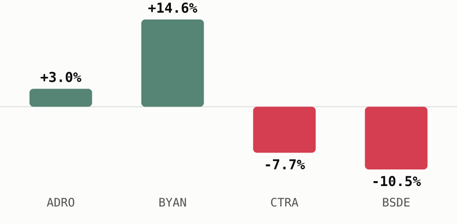

# A weaker rupiah splits coal miners from property developers

The rupiah closed at IDR 18,128 per dollar this week on Middle East risk-off flows, and that single move plays out in opposite directions for a dollar-earning coal exporter and a rupiah-funded homebuilder.

## The news

- **Rupiah** closed at **IDR 18,128 per dollar** on 9 Jul 2026, down 0.63% on the day, as escalating US-Iran tensions over the Strait of Hormuz drove safe-haven demand for the dollar ([Jakarta Globe](https://jakartaglobe.id/business/rupiah-plunges-to-rp-18128-as-usiran-tensions-escalate), 9 Jul 2026).
- Minutes from the Fed's June meeting showed policymakers "largely divided" over further hikes this year, and that uncertainty kept US rates higher for longer and the dollar bid (Jakarta Globe, 9 Jul 2026).
- Domestic headwinds added to the pressure too: faster 2026 state budget spending and softening consumer confidence weighed on sentiment (Jakarta Globe, 9 Jul 2026).
- Separately, S&P Dow Jones Indices placed Indonesia on a watch list for possible downgrade to frontier-market status at its 2027 review, citing stock-ownership transparency and disclosure concerns ([The Jakarta Post](https://www.thejakartapost.com/business/2026/07/08/sp-dji-flags-risk-of-frontier-market-downgrade-for-indonesia), 8 Jul 2026).
- Bank Indonesia had already raised its policy rate 50 basis points to 5.25% in May, explicitly to defend the rupiah against Middle East-driven turmoil ([Bank Indonesia](https://www.bi.go.id/en/publikasi/ruang-media/news-release/Pages/sp_2810726.aspx), 20 May 2026).

## Winners and losers

Coal is priced and sold internationally in dollars, so a weaker rupiah turns every dollar of export revenue into more rupiah on the way home. Property developers sit on the other side of that trade: their sales and buyer financing are denominated in rupiah, but building materials and a share of servicing costs move with the dollar or with Bank Indonesia's own policy rate, and its higher-for-longer defense of the currency raises exactly those financing costs.

The month to 10 Jul 2026 already shows the split. As the rupiah slid, [**$ADRO**](https://sectors.app/idx/adro) (Alamtri Resources Indonesia) rose **3.0%** and [**$BYAN**](https://sectors.app/idx/byan) (Bayan Resources) rose **14.6%**, while [**$BSDE**](https://sectors.app/idx/bsde) (Bumi Serpong Damai) fell **10.5%** and [**$CTRA**](https://sectors.app/idx/ctra) (Ciputra Development) fell **7.7%** (sectors.app).

*The same rupiah slide moved coal miners and property developers in opposite directions over the month to 10 Jul 2026 (sectors.app).*

## Valuation & fundamentals context

| Ticker | Price (IDR) | P/E (ttm) | P/E vs peer avg | ROE | Div yield (ttm) |
|---|---|---|---|---|---|
| [**$ADRO**](https://sectors.app/idx/adro) | 2,390 | 8.4x | 10.0x | 8.9% | 6.1% |
| [**$BYAN**](https://sectors.app/idx/byan) | 11,200 | 30.2x | 10.0x | 28.5% | 2.4% |
| [**$BSDE**](https://sectors.app/idx/bsde) | 555 | 4.2x | 7.5x | 4.8% | n/a |
| [**$CTRA**](https://sectors.app/idx/ctra) | 540 | 3.7x | 7.5x | 9.9% | 6.7% |

Alamtri Resources Indonesia ([**$ADRO**](https://sectors.app/idx/adro)) trades below its coal peer average on trailing earnings and carries a forward P/E of 4.6x, and its seven covering analysts skew heavily toward strong buy (5 strong buy, 1 buy, 1 hold as of 7 May 2026). Consensus estimates put its 2026 EPS growth at 75% off a 2025 base, a forecast reported here as sourced consensus rather than this newsletter's own view (sectors.app). Bayan Resources ([**$BYAN**](https://sectors.app/idx/byan)) trades above both its own coal peers and the group average on trailing P/E, and its ROE of 28.5% is the highest of the four names, though no forward P/E or analyst coverage is available for it this run.

Bumi Serpong Damai ([**$BSDE**](https://sectors.app/idx/bsde)) and Ciputra Development ([**$CTRA**](https://sectors.app/idx/ctra)) both trade below their sub-sector's peer average P/E. BSDE's dividend yield field came back null this run and is omitted rather than guessed at; its seven analysts split 4 strong buy, 1 buy, 2 hold, and consensus estimates 2026 EPS growth of 19.2% against revenue growth of negative 15.7%. CTRA's six analysts lean 5 strong buy and 1 hold, but its consensus estimates run the other way, EPS growth of negative 14.3% and revenue growth of negative 11.1% for 2026 (all as of 7 May 2026, sectors.app).

## What to watch

- Whether US-Iran tensions and Strait of Hormuz shipping risk keep escalating or start to cool, the swing factor behind the current dollar bid.
- Bank Indonesia's next policy meeting for any further move to defend the rupiah.
- S&P DJI's disclosure-related engagement with IDX ahead of the 2027 classification review.
- CTRA's and BSDE's next quarterly prints, given the negative and mixed 2026 growth estimates now attached to each.

## Upcoming Events

**Automated IDX Stock Intelligence with n8n and Sectors API**

A hands-on exploration of workflow automation for Indonesian capital markets, from connecting live IDX data via Sectors API to building low-code intelligence pipelines and automated stock monitoring systems with n8n.

- **Date:** 27th and 28th July, 2026
- **Time:** 18.30 – 21.00 (GMT+7)
- **Medium:** Zoom Conferencing (Online)
- **Language:** Indonesian (by Alya Dwinanda)
- **Intended Audience:** Analysts, investors, and automation-curious professionals working with Indonesian capital markets

[Register here](https://supertype.ai/events/n8n)

**Hermes Agent x Sectors Community Meetup: Build a Financial AI Agent That Learns and Improves**

Install Hermes Agent, connect it to live IDX and SGX market data through the Sectors skill, and watch it write its own analytical skills. A casual, hands-on community meetup in Jakarta on building a self-improving financial AI agent.

- **Date:** 1st August, 2026
- **Time:** 13.00 – 16.00 (GMT+7)
- **Venue:** Block71, Ariobimo Sentral Building, 8th Floor, Jl. H. Rasuna Said, South Jakarta
- **Language:** English (by Andreas Christianto)

[Register here](https://supertype.ai/events/hermes)

## Sources

- [Rupiah Plunges to Rp 18,128 as US-Iran Tensions Escalate](https://jakartaglobe.id/business/rupiah-plunges-to-rp-18128-as-usiran-tensions-escalate), Jakarta Globe, 9 Jul 2026
- [S&P DJI Flags Risk of Frontier Market Downgrade for Indonesia](https://www.thejakartapost.com/business/2026/07/08/sp-dji-flags-risk-of-frontier-market-downgrade-for-indonesia), The Jakarta Post, 8 Jul 2026
- [BI-Rate Increased by 50 bps to 5.25%](https://www.bi.go.id/en/publikasi/ruang-media/news-release/Pages/sp_2810726.aspx), Bank Indonesia, 20 May 2026

**Appendix: Sectors API endpoints (fields used)**
- `companies/?where=sub_sector = 'coal-mining'&order_by=-market_cap` and the property-sector
  equivalent — candidate discovery for the winners/losers split
- `company/report/ADRO.JK,BYAN.JK,BSDE.JK,CTRA.JK/?sections=overview,valuation,financials,future,dividend` —
  `valuation.historical_valuation[]` (P/E, P/E vs peer avg), `financials.historical_financial_ratio[].profitability.roe`,
  `dividend.yield_ttm`, `future.analyst_rating_breakdown`/`company_growth_forecasts[]`
  (reported as sourced consensus only)
- `daily/{ADRO,BYAN,BSDE,CTRA}.JK/` — current price context for the winners/losers chart
- `news/?sector=<slug>` / `?keyword=<term>` — API-side corroboration for the macro news
  lead (primary sourcing was web search, see Sources above)

---
*This newsletter is data reporting and market commentary, not investment advice or a
recommendation to buy or sell any security. Figures are from sectors.app as of
2026-07-10 unless otherwise cited. Do your own research.*
