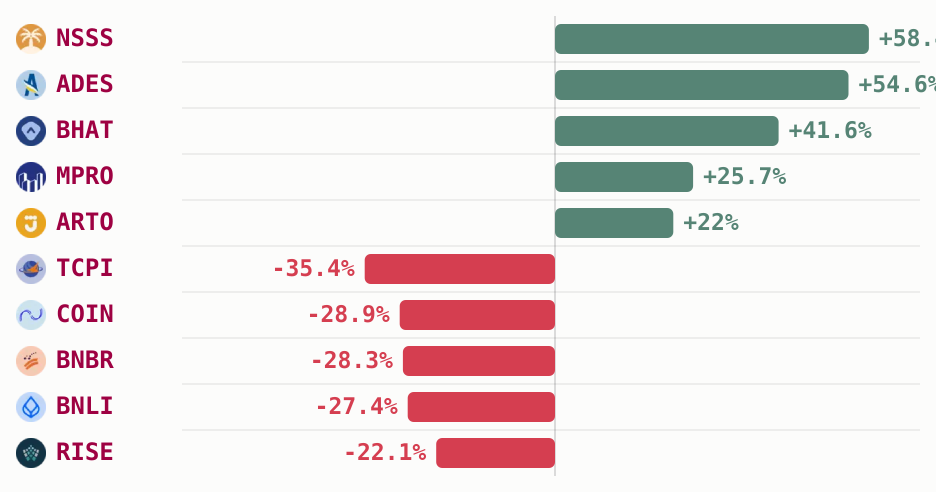

# IDX falls 3.2% over the month as small caps swing double digits

IDX total market cap closed the 30 days to 15 July down **3.2%**, from IDR 10,899.41T to
IDR 10,548.18T, with a trough on 30 June at IDR 9,894.03T that the index has only
partly clawed back from since. That benchmark-level pullback sat well behind the real
story further down the board, where a handful of small caps moved more than 20% in
either direction over the same window (sectors.app).

## Top Movers

| Ticker | Company | Price (IDR) | 30d change |
|---|---|---|---|
| [**$NSSS**](https://sectors.app/idx/nsss) | Nusantara Sawit Sejahtera | 800 | +58.4% |
| [**$ADES**](https://sectors.app/idx/ades) | Akasha Wira International | 34,125 | +54.6% |
| [**$BHAT**](https://sectors.app/idx/bhat) | Bhakti Multi Artha | 1,770 | +41.6% |
| [**$MPRO**](https://sectors.app/idx/mpro) | Maha Properti Indonesia | 9,900 | +25.7% |
| [**$ARTO**](https://sectors.app/idx/arto) | Bank Jago | 1,250 | +22.0% |

| Ticker | Company | Price (IDR) | 30d change |
|---|---|---|---|
| [**$TCPI**](https://sectors.app/idx/tcpi) | Transcoal Pacific | 5,875 | -35.4% |
| [**$COIN**](https://sectors.app/idx/coin) | Indokripto Koin Semesta | 665 | -28.9% |
| [**$BNBR**](https://sectors.app/idx/bnbr) | Bakrie & Brothers | 86 | -28.3% |
| [**$BNLI**](https://sectors.app/idx/bnli) | Bank Permata | 2,330 | -27.4% |
| [**$RISE**](https://sectors.app/idx/rise) | Jaya Sukses Makmur Sentosa | 915 | -22.1% |

*The month's five biggest gainers and five biggest losers by 30-day price change, ranked by magnitude (sectors.app).*

## Most traded

Ranked by total volume traded over the 30 days to 15 July, summed across every session in
the window, not a single day's snapshot.

| Ticker | Company | 30d volume | Price (IDR) |
|---|---|---|---|
| [**$BUMI**](https://sectors.app/idx/bumi) | Bumi Resources | 62.10B | 148 |
| [**$BNBR**](https://sectors.app/idx/bnbr) | Bakrie & Brothers | 23.44B | 86 |
| [**$DEWA**](https://sectors.app/idx/dewa) | Darma Henwa | 15.32B | 362 |
| [**$DSSA**](https://sectors.app/idx/dssa) | Dian Swastatika Sentosa | 14.25B | 820 |
| [**$BIPI**](https://sectors.app/idx/bipi) | Astrindo Nusantara Infrastruktur | 12.67B | 141 |

[**$BUMI**](https://sectors.app/idx/bumi) topped the daily volume leaderboard on all 22 trading days in the window, the only
name on this list with a perfect streak (sectors.app). The stock drew a run of bullish
analyst notes through the second week of July, including a 14 July call flagging it
among the names foreign investors were net-buying as the IHSG rebounded to 6,000
(CNBC Indonesia, 14 Jul 2026) and a 15 July note citing continued upward momentum with
a Rp 154-159 target (Investor Daily, 15 Jul 2026). A government directive the same week
asking for higher coal deliveries to state utility PLN also put coal-linked names,
Bumi Resources among them, back on analysts' radar (Kontan, 14 Jul 2026).

## Broker Flow

Ranked by aggregate net value across the 30 days, summing each broker's daily net
buy/sell whenever it placed in that day's top 10 by net value.

**Top net buyers**

| Code | Broker | 30d net |
|---|---|---|
| [**XL**](https://sectors.app/idx/broker/xl) | Stockbit Sekuritas Digital | IDR 2,892.1B |
| [**YU**](https://sectors.app/idx/broker/yu) | CGS International Sekuritas Indonesia | IDR 2,260.9B |
| [**CC**](https://sectors.app/idx/broker/cc) | Mandiri Sekuritas | IDR 1,310.0B |

**Top net sellers**

| Code | Broker | 30d net |
|---|---|---|
| [**AK**](https://sectors.app/idx/broker/ak) | UBS Sekuritas Indonesia | -IDR 7,635.4B |
| [**ZP**](https://sectors.app/idx/broker/zp) | Maybank Sekuritas Indonesia | -IDR 6,554.9B |
| [**BK**](https://sectors.app/idx/broker/bk) | J.P. Morgan Sekuritas Indonesia | -IDR 2,049.9B |

All three of the month's heaviest net sellers are foreign-linked houses, UBS, Maybank
and J.P. Morgan, while the buy side is led by retail-facing Stockbit and domestic
Mandiri Sekuritas. The same month, a domestic industry story questioned whether IDX's
planned demutualization could weigh on foreign investor confidence (Kontan, 6 Jul
2026), a concurrent piece of context for the pattern above, not a stated cause of it.

## Upcoming Events

**Automated IDX Stock Intelligence with n8n and Sectors API**

A hands-on exploration of workflow automation for Indonesian capital markets, from connecting live IDX data via Sectors API to building low-code intelligence pipelines and automated stock monitoring systems with n8n.

- **Date:** 27th and 28th July, 2026
- **Time:** 18.30 – 21.00 (GMT+7)
- **Medium:** Zoom Conferencing (Online)
- **Language:** Indonesian (by Alya Dwinanda)
- **Intended Audience:** Analysts, investors, and automation-curious professionals working with Indonesian capital markets

[Register here](https://supertype.ai/events/n8n)

**Hermes Agent x Sectors Community Meetup: Build a Financial AI Agent That Learns and Improves**

Install Hermes Agent, connect it to live IDX and SGX market data through the Sectors skill, and watch it write its own analytical skills. A casual, hands-on community meetup in Jakarta on building a self-improving financial AI agent.

- **Date:** 1st August, 2026
- **Time:** 13.00 – 16.00 (GMT+7)
- **Venue:** Block71, Ariobimo Sentral Building, 8th Floor, Jl. H. Rasuna Said, South Jakarta
- **Language:** English (by Andreas Christianto)

[Register here](https://supertype.ai/events/hermes)

## Sources

- [PT Bumi Resources Tbk (BUMI) shows continued upward momentum with price targeting Rp 154-159](https://investor.id/market/446557/momentum-saham-bumi-masih-berlanjut), Investor Daily, 15 Jul 2026
- [Foreign investors net-buy PT Bumi Resources Tbk and PT Bank Rakyat Indonesia Tbk as the IHSG rebounds to 6,000](https://www.cnbcindonesia.com/market/20260714080152-17-750568/asing-gencar-serok-10-saham-ini-kala-ihsg-balik-ke-level-6000), CNBC Indonesia, 14 Jul 2026
- [Government requests higher coal deliveries to PLN, prompting analysts to evaluate prospects for coal-sector names](https://investasi.kontan.co.id/news/pemerintah-minta-pasokan-batubara-pln-ditambah-begini-prospek-emiten-sektor-batubara), Kontan, 14 Jul 2026
- [Demutualisasi BEI dapat menurunkan kepercayaan investor asing](https://investasi.kontan.co.id/news/demutualisasi-bei-bisa-turunkan-kepercayaan-investor-asing), Kontan, 6 Jul 2026

**Appendix: Sectors API endpoints (fields used)**
- `idx-total/` — `idx_total_market_cap` (headline 30-day change)
- `companies/top-changes/?classifications=top_gainers,top_losers&periods=30d` —
  `top_gainers[]`/`top_losers[]` `{symbol, name, price_change, last_close_price}`
- `most-traded/?n_stock=10` — `volume` (Most traded table)
- `brokers/top/?metric=net&origin=all&n_brokers=10` — `net`/`gross` per `broker_code`
  (Broker Flow tables)
- `brokers/` — broker code to name registry
- `news/?symbols=BUMI.JK` — headlines backing the Most traded "why" paragraph
- `news/?keyword=asing&start=2026-06-15&end=2026-07-15` — dated headlines backing the
  Broker Flow observation paragraph

---
*This newsletter is data reporting and market commentary, not investment advice or a
recommendation to buy or sell any security. Figures are from sectors.app as of
2026-07-15 unless otherwise cited. Do your own research.*
