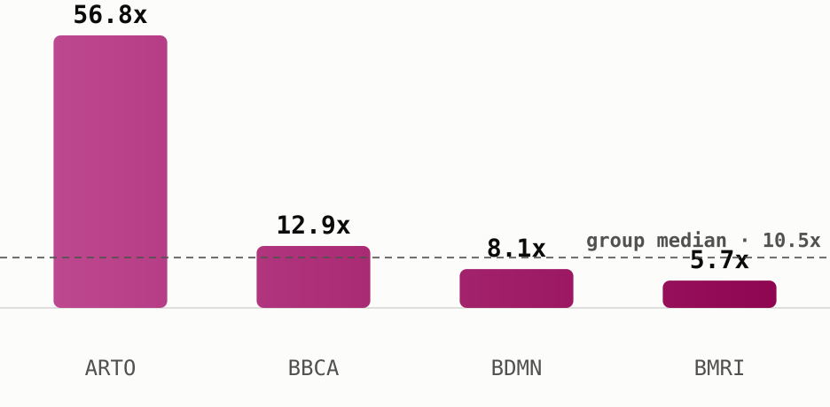

# Bank Jago led the banking sector's week, but not on a cheap multiple

Bank Jago ([**$ARTO**](https://sectors.app/idx/arto)) topped every bank on IDX over the past seven days, up **23.2%** while the banks sub-sector as a whole actually slipped **-1.1%** over the same window (sectors.app). That gap between one runaway name and a sector that mostly went nowhere is the reason to look at what these banks actually trade for.

## The group

Indonesian banks trade at a **median 2026 P/E of 10.5x**, down from 14.7x in 2025 and 16.9x in 2023, the cheapest multiple the group has carried in this five-year series (sectors.app). Median 2026 P/B sits at 0.74x, also the series low. Even so, the sub-sector's own market cap is down **-1.1% over the past week** and **-22.8% year-to-date**, so the multiple compression here is a re-rating lower, not a rally, and it's happening while at least one name inside the group is doing the opposite.

## The comparison

| Ticker | Price (IDR) | 2026 P/E | vs. group median (10.5x) | ROE (2025) | Div. yield (ttm) | 7d move |
|---|---|---|---|---|---|---|
| [**$ARTO**](https://sectors.app/idx/arto) | 1,250 | 56.8x | 5.4x the median | 3.1% | n/a | +23.2% |
| [**$BDMN**](https://sectors.app/idx/bdmn) | 4,160 | 8.1x | below median | 6.8% | 3.4% | +9.2% |
| [**$BMRI**](https://sectors.app/idx/bmri) | 4,200 | 5.7x | well below median | 17.2% | 11.4% | +5.8% |
| [**$BBCA**](https://sectors.app/idx/bbca) | 6,125 | 12.9x | above median | 20.4% | 5.8% | -0.8% |

*As of 15 Jul 2026, sectors.app. P/E and P/B are 2026 figures from each name's own historical valuation series.*

*Bank Jago trades at more than five times the group median, the clearest split between this week's mover and this week's multiples (sectors.app).*

Bank Jago ([**$ARTO**](https://sectors.app/idx/arto)) is this week's clearest case of price outrunning valuation: its 2026 P/E of 56.8x is more than five times the group median, and while its return on equity has been climbing, from 0.9% in 2023 to 3.1% in 2025, it's still a fraction of what the group's larger names post. Bank Danamon ([**$BDMN**](https://sectors.app/idx/bdmn)) and Bank Mandiri ([**$BMRI**](https://sectors.app/idx/bmri)) both rallied this week too, 9.2% and 5.8%, while staying at or below the group median on P/E; Mandiri's 17.2% ROE is the second-highest of the four names here, next to a dividend yield of 11.4%, the richest in this comparison. Bank Central Asia ([**$BBCA**](https://sectors.app/idx/bbca)), the sub-sector's largest name by market cap and the group's most profitable on ROE at 20.4%, was the odd one out this week: it slipped -0.8% even while trading at a premium to the group median.

## The takeaway

On this screen, "cheap" points at Bank Mandiri: the lowest P/E of the four against the second-highest ROE, still up on the week. Bank Jago's move is the opposite kind of story, a rally that has pushed its multiple well past what any other name in the group commands, on fundamentals that are improving but still thin. Neither is a call to buy or avoid either name, it's a reminder that this week's biggest mover and this week's cheapest multiple weren't the same stock.

## Upcoming Events

**Automated IDX Stock Intelligence with n8n and Sectors API**

A hands-on exploration of workflow automation for Indonesian capital markets, from connecting live IDX data via Sectors API to building low-code intelligence pipelines and automated stock monitoring systems with n8n.

- **Date:** 27th and 28th July, 2026
- **Time:** 18.30 – 21.00 (GMT+7)
- **Medium:** Zoom Conferencing (Online)
- **Language:** Indonesian (by Alya Dwinanda)
- **Intended Audience:** Analysts, investors, and automation-curious professionals working with Indonesian capital markets

[Register here](https://supertype.ai/events/n8n)

**Hermes Agent x Sectors Community Meetup: Build a Financial AI Agent That Learns and Improves**

Install Hermes Agent, connect it to live IDX and SGX market data through the Sectors skill, and watch it write its own analytical skills. A casual, hands-on community meetup in Jakarta on building a self-improving financial AI agent.

- **Date:** 1st August, 2026
- **Time:** 13.00 – 16.00 (GMT+7)
- **Venue:** Block71, Ariobimo Sentral Building, 8th Floor, Jl. H. Rasuna Said, South Jakarta
- **Language:** English (by Andreas Christianto)

[Register here](https://supertype.ai/events/hermes)

**Appendix: Sectors API endpoints (fields used)**
- `companies/top-changes/?classifications=top_gainers,top_losers&periods=7d&sub_sector=banks&n_stock=5` —
  the week's standout discovery (Bank Jago's +23.2%)
- `subsector/report/banks/` — `statistics.filtered_median_pe` (10.5x group median),
  `market_cap.mcap_summary.mcap_change.1w`/`.ytd` (sector's own -1.1% week, -22.8% YTD)
- `companies/?where=sub_sector = 'banks' and pe_ttm > 0&order_by=pe_ttm&limit=15&include_query_values=true` —
  ranked members, `pe_ttm > 0` guard kept two negative-P/E names out of the ranking
- `company/report/{ARTO,BDMN,BMRI,BBCA}.JK/?sections=overview,valuation,financials,dividend` —
  `valuation.historical_valuation[]` (2026 P/E, P/B), `financials.historical_financial_ratio[].profitability.roe`,
  `dividend.yield_ttm`

No web-sourced claims this issue; every figure traces to a Sectors API field, cited
inline `(sectors.app)`.

---
*This newsletter is data reporting and market commentary, not investment advice or a
recommendation to buy or sell any security. Figures are from sectors.app as of
2026-07-15 unless otherwise cited. Do your own research.*
