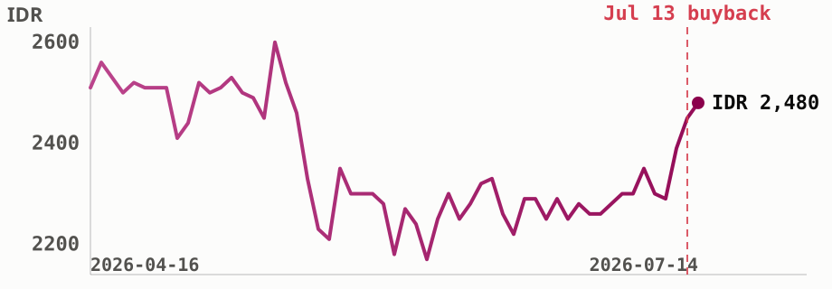

# ADRO tops LQ45's dividend screen as profit rebounds

Alamtri Resources Indonesia ([**$ADRO**](https://sectors.app/idx/adro)) just retired
589.2 million shares in a completed buyback, and days later reported a Q1 2026 profit
that beat last year's by two thirds.

## What happened this week

Shareholders approved a capital reduction that PT Alamtri Resources Indonesia Tbk
completed on 13 July 2026, retiring 589,195,200 treasury shares and cutting the
company's issued share count from 29,389,689,400 to 28,800,494,200 (Investor Daily, 13
Jul 2026). The stock traded up through the week on the news, and a day later
[**$ADRO**](https://sectors.app/idx/adro) disclosed its Q1 2026 numbers alongside notice that a limited-review Q2 report is coming
under Bursa Regulation I-E: revenue of US$470.9 million, up from US$381.6 million a year
earlier, and net profit attributable to the parent of US$128.1 million, against
US$76.7 million in Q1 2025 (Investor Daily, 14 Jul 2026). The stock closed the week at
IDR 2,480, up from IDR 2,390 the prior Friday (sectors.app).

## Priced below peers, earnings turning

Screening the LQ45 index by 2025 dividend distributions puts
[**$ADRO**](https://sectors.app/idx/adro) at the top of 38 constituents, a rank set by
dividends already paid last year against a price that has since fallen, not by this
week's news. What this week's buyback and earnings beat do change is the earnings
picture going forward, and that hasn't shown up in the share price yet.
[**$ADRO**](https://sectors.app/idx/adro) trades at a 2026 price to earnings ratio of
8.6x against a 10.4x peer average in the same year, and its forward P/E sits at 4.8x
(sectors.app).

*ADRO's 90-day price path through the completed buyback on July 13, still 8% below its March 2026 52-week high of IDR 2,700 but 53% above its October 2025 low of IDR 1,625 (sectors.app).*

## From a 2025 slump to a Q1 rebound

Alamtri's 2025 was a down year before this rebound: full-year EPS fell 65% to IDR 254.9
from IDR 724.9 in 2024, as return on equity dropped to 8.9% from 25.7% the year before,
tracking softer coal prices through the year. Q1 2026 is the first clean read against
that base, and it moved the other way.

| Period | Revenue | Net profit | YoY change |
|---|---|---|---|
| Q1 2026 | US$470.9M | US$128.1M | +67% earnings, +26% revenue |
| FY2025 | IDR 31.4T | EPS IDR 254.9 | -65% EPS vs FY2024 |
| FY2024 | IDR 33.6T | EPS IDR 724.9 | -8.5% EPS vs FY2023 |

Consensus from seven analysts models a 2026 recovery in EPS to IDR 445.9, up 74.9% from
the 2025 base, alongside revenue growth to IDR 64.1T, a figure that leans on the ramp-up
of subsidiary PT Kalimantan Aluminium Industry's smelter, which made its first US export
shipment of 31,494 metric tons in June 2026 (Kompas, 10 Jul 2026; sectors.app). Of the
seven, five rate the stock a strong buy and one a buy, one a hold, none a sell
(sectors.app, updated 7 May 2026).

## Peer valuation, and what the yield figure actually means

[**$ADRO**](https://sectors.app/idx/adro)'s 2026 price to book of 0.86x also sits below
the 1.19x peer average (sectors.app), continuing a gap that's held for several years,
its 2025 P/E of 7.1x ran well under that year's 16.0x peer average too.

On dividends, the trailing twelve-month yield sits at 5.85%, with a payout ratio of 51%
(sectors.app), both inside a normal range for the stock. The 16.2% figure that put
[**$ADRO**](https://sectors.app/idx/adro) on top of the LQ45 screen sums two separate cash distributions paid across
calendar 2025, not a stable forward rate, and the stock's own 5-year average yield of
25.5% is skewed by a 2024 payout of IDR 1,358 per share, a distribution tied to Alamtri's
corporate restructuring that year rather than an ordinary cash dividend, so neither
figure should be read as what a holder can expect to repeat annually.

## What comes next

The Q2 2026 limited-review financial statements are due under Bursa Regulation I-E, the
first full test of whether Q1's earnings recovery continues (Investor Daily, 14 Jul
2026). No upcoming dividend date is disclosed yet (sectors.app); the last ex-dividend
date was 30 December 2025. Institutional ownership data through 30 June 2026 shows
Lazard Asset Management, Causeway Capital Management and PIMCO among the period's top
buyers, while BlackRock's US and UK entities and Vanguard were the largest sellers
(sectors.app), a split between active managers adding and index-linked managers trimming
around the buyback.

---

## Upcoming Events

**Automated IDX Stock Intelligence with n8n and Sectors API**

A hands-on exploration of workflow automation for Indonesian capital markets, from connecting live IDX data via Sectors API to building low-code intelligence pipelines and automated stock monitoring systems with n8n.

- **Date:** 27th and 28th July, 2026
- **Time:** 18.30 – 21.00 (GMT+7)
- **Medium:** Zoom Conferencing (Online)
- **Language:** Indonesian (by Alya Dwinanda)
- **Intended Audience:** Analysts, investors, and automation-curious professionals working with Indonesian capital markets

[Register here](https://supertype.ai/events/n8n)

**Hermes Agent x Sectors Community Meetup: Build a Financial AI Agent That Learns and Improves**

Install Hermes Agent, connect it to live IDX and SGX market data through the Sectors skill, and watch it write its own analytical skills. A casual, hands-on community meetup in Jakarta on building a self-improving financial AI agent.

- **Date:** 1st August, 2026
- **Time:** 13.00 – 16.00 (GMT+7)
- **Venue:** Block71, Ariobimo Sentral Building, 8th Floor, Jl. H. Rasuna Said, South Jakarta
- **Language:** English (by Andreas Christianto)

[Register here](https://supertype.ai/events/hermes)

**Sources**
- Investor Daily, "ADRO Ungkap Info Terkait Lapkeu," 14 Jul 2026, https://investor.id/market/446416/adro-ungkap-info-terkait-lapkeu
- Investor Daily, "Saham ADRO Menciut, Jangan-Jangan Jadi Segini," 13 Jul 2026, https://investor.id/market/446258/saham-adro-menciut-janganjangan-jadi-segini
- Kompas, "Smelter Aluminium Alamtri Tembus Pasar AS," 10 Jul 2026, https://money.kompas.com/read/2026/07/10/155358926/smelter-aluminium-alamtri-tembus-pasar-as-ekspor-perdana-capai-31494-ton

**Appendix: Sectors API endpoints (fields used)**
- `companies/` screener — `total_yield[2025]`
- `company/report/ADRO.JK/` — `valuation.historical_valuation[]` (P/E, P/B vs peer
  average), `financials.historical_eps`, `financials.historical_financial_ratio[]`
  (ROE), `dividend.yield_ttm`, `dividend.payout_ratio`, `dividend.historical_dividends`,
  `dividend.dividend_yield_avg`, `future.company_growth_forecasts`,
  `future.company_value_forecasts`, `future.analyst_rating_breakdown`
- `daily/ADRO.JK/` — close price series (hero chart)
- `company/corporate-actions/ADRO.JK/` — `dividend[]` history, AGM result text
- `filings/`, `news/`, ADRO-tagged — "why now" trigger (see Sources above)

---
*This newsletter is data reporting and market commentary, not investment advice or a
recommendation to buy or sell any security. Figures are from sectors.app as of
2026-07-14 unless otherwise cited. Do your own research.*
