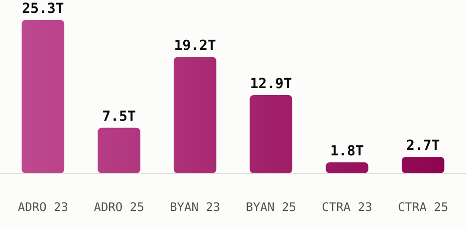

# Coal fortunes rebound while a property dynasty holds its nerve

Alamtri Resources, Bayan Resources and Ciputra Development are each still run by the families that built them, and 2026 is testing that control in three different ways.

## Alamtri Resources Indonesia ([**$ADRO**](https://sectors.app/idx/adro))

**The story.** Alamtri Resources Indonesia traces back to a 1982 coal cooperation agreement in South Kalimantan, but the company most people know as Adaro was formed in 2004, when a consortium led by Garibaldi Thohir and Edwin Soeryadjaya bought the operation through a leveraged buyout financed with just US$50 million of equity against a US$923 million price tag ([Wikipedia](https://en.wikipedia.org/wiki/AlamTri_Resources); [Alamtri, Our History](https://www.alamtri.com/pages/read/6/14/History)). Its 2008 IPO was Indonesia's largest ever at the time. In November 2024 the company dropped the Adaro name entirely for AlamTri Resources, marking its shift from a pure coal miner into a group that also runs an aluminium smelter (Wikipedia), a shift visible in this week's own filings: AlamTri just guaranteed up to US$100 million of a hedging facility for its aluminium subsidiary, PT Kalimantan Aluminum Industry ([Petromindo](https://www.petromindo.com/news/article/alamtri-to-guarantee-up-to-100-mln-hedging-facility-for-aluminium-unit)).

**The people.** Garibaldi Thohir, the former CEO, sits as Vice President Commissioner and holds 6.7% of the company directly. Edwin Soeryadjaya, son of Astra International founder William Soeryadjaya, holds 3.6%. Both, along with T Permadi Rachmat and Sandiaga Uno, are flagged by sectors.app as whale investors, and the holding vehicle PT Adaro Strategic Investment still controls 47.8% of the register (sectors.app).

**The numbers.** Earnings fell hard through the coal downturn, from IDR 25.3T in 2023 to IDR 7.5T in 2025, even as revenue held roughly flat around IDR 31-34T across the same three years. ROE for 2025 sits at 8.9%, well off the highs of the boom years (sectors.app).

**The outlook.** UOB Kay Hian projects AlamTri's 2026 net profit rising 60% to US$719 million, citing higher metallurgical-coal prices, a roughly 500-kiloton increase in sales volume, the new aluminium-smelter operation and a larger contribution from its BPI unit ([Indopremier](https://www.indopremier.com/ipotnews/newsDetail.php?jdl=Siapa_Pemilik_ADRO__Saham_yang_Terdepak_dari_Indeks_MSCI_Global_Standard&news_id=471525&group_news=RESEARCHNEWS&news_date=&taging_subtype=AADI&name=&search=y_general&q=Adaro+Andalan+Indonesia&halaman=1)). Sectors.app's own consensus field points the same direction, estimating 2026 EPS growth of 75% off the depressed 2025 base, and the seven analysts covering the stock split 5 strong buy, 1 buy and 1 hold as of 7 May 2026 (sectors.app). Both figures are reported here as sourced consensus, not this newsletter's own view.

## Bayan Resources ([**$BYAN**](https://sectors.app/idx/byan))

**The story.** Bayan Resources was built by Low Tuck Kwong, a Singapore-born contractor who moved to Indonesia in 1972 and founded earthworks firm PT Jaya Sumpiles Indonesia the following year. He became an Indonesian citizen in 1992, a move that let him hold mining concessions directly under Indonesian ownership rules, then entered coal ownership with the 1997 acquisition of PT Gunungbayan Pratamacoal ([Wikipedia](https://en.wikipedia.org/wiki/Low_Tuck_Kwong)). ADRO and BYAN listed within four weeks of each other in 2008, ADRO on 16 July and BYAN on 12 August, both riding the same coal boom into the market just before that year's global financial crisis (sectors.app).

**The people.** Low Tuck Kwong remains President Director and the controlling shareholder at 40.2%. In August 2024 he transferred a stake then worth US$6.6 billion to his daughter Elaine Low ([Wikipedia](https://en.wikipedia.org/wiki/Low_Tuck_Kwong)), who now holds 22.0% directly and appears in sectors.app's ownership data as the second-largest shareholder and a whale investor alongside her father. Forbes ranked Low Indonesia's third-richest person in 2024, with a net worth of US$27 billion.

**The numbers.** Bayan's revenue kept climbing, from IDR 55.3T in 2023 to IDR 57.4T in 2025, but earnings moved the other way, down 32.8% to IDR 12.9T over the same stretch as cost of revenue rose faster than sales (sectors.app). ROE for 2025 is 28.5%, the highest of the three names here, on a net profit margin of 22.4%.

**The outlook.** Sectors.app carries no analyst rating breakdown or company growth forecast for Bayan this run, both fields return null, so no consensus figure is reported here rather than guessed at.

## Ciputra Development ([**$CTRA**](https://sectors.app/idx/ctra))

**The story.** Ciputra Development was founded on 22 October 1981 by the architect and developer born Tjie Tjin Hoan, who at 25 adopted the single name Ciputra, combining his Chinese surname Tjie with the Indonesian word for son, putra ([Wikipedia](https://en.wikipedia.org/wiki/Ciputra)). The company was renamed Ciputra Development in 1990 and listed on the Jakarta Stock Exchange in 1994, by far the oldest listing of the three names in this issue (sectors.app). Ciputra died in 2019, but the group he built has since developed more than 76 projects across 33 Indonesian cities.

**The people.** His son Candra Ciputra now serves as President Director, and the family holding vehicle PT Sang Pelopor still controls 53.3% of the company (sectors.app). The most notable recent ownership move belongs to an outside investor rather than the family: Morgan Stanley disclosed to the OJK on 7 July 2026 that it had lifted its stake to 18.40%, buying 3 billion shares on 2 July 2026 at prices between Rp 555 and Rp 570 ([CNBC Indonesia](https://www.cnbcindonesia.com/market/20260707164934-17-748878/morgan-stanley-borong-saham-emiten-ciputra--ctra--di-harga-rp560), 7 Jul 2026), the same week CTRA shares rose 5.81% to Rp 565.

**The numbers.** Unlike the two coal names, Ciputra's recent trend has been improving: revenue rose from IDR 9.2T in 2023 to IDR 12.6T in 2025, and earnings grew 44.3% over the same period, from IDR 1.8T to IDR 2.7T (sectors.app). ROE for 2025 stands at 9.9%, on a net profit margin of 21.1%.

**The outlook.** That improving trend is not what the company itself expects for 2026. Management's own marketing sales target for the year is IDR 9.5 trillion, and it has told investors the property market in several regions is "still sluggish," with weak consumer purchasing power and higher financing costs slowing new launches ([Kontan](https://investasi.kontan.co.id/news/strategi-ciputra-development-ctra-bidik-marketing-sales-rp-95-triliun-di-2026); [Kontan](https://investasi.kontan.co.id/news/ciputra-development-ctra-proyeksikan-laba-turun-10-pada-2026)). Sectors.app's consensus field agrees directionally, estimating 2026 EPS growth of negative 14.3% and revenue growth of negative 11.1% off the 2025 base. The six analysts covering the stock are still positioned 5 strong buy and 1 hold as of 7 May 2026, a rating last updated before the more recent guidance, reported here as sourced consensus rather than this newsletter's own view (sectors.app). To meet its target despite the headwinds, CTRA has launched two new residential projects this year, Citra Homes Halim in Jakarta and Citra Bukit Golf Sentul in Bogor (Kontan).

*Two coal earnings streams roughly halved while Ciputra's grew, the same divergence the outlook sections above describe from the other direction (sectors.app).*

Three founders, three different points in the cycle: two coal families riding a rebound they built the balance sheet to survive, and a third generation defending a target it has already told the market it may not fully reach.

## Upcoming Events

**Automated IDX Stock Intelligence with n8n and Sectors API**

A hands-on exploration of workflow automation for Indonesian capital markets, from connecting live IDX data via Sectors API to building low-code intelligence pipelines and automated stock monitoring systems with n8n.

- **Date:** 27th and 28th July, 2026
- **Time:** 18.30 – 21.00 (GMT+7)
- **Medium:** Zoom Conferencing (Online)
- **Language:** Indonesian (by Alya Dwinanda)
- **Intended Audience:** Analysts, investors, and automation-curious professionals working with Indonesian capital markets

[Register here](https://supertype.ai/events/n8n)

**Hermes Agent x Sectors Community Meetup: Build a Financial AI Agent That Learns and Improves**

Install Hermes Agent, connect it to live IDX and SGX market data through the Sectors skill, and watch it write its own analytical skills. A casual, hands-on community meetup in Jakarta on building a self-improving financial AI agent.

- **Date:** 1st August, 2026
- **Time:** 13.00 – 16.00 (GMT+7)
- **Venue:** Block71, Ariobimo Sentral Building, 8th Floor, Jl. H. Rasuna Said, South Jakarta
- **Language:** English (by Andreas Christianto)

[Register here](https://supertype.ai/events/hermes)

## Sources

- [AlamTri Resources, Wikipedia](https://en.wikipedia.org/wiki/AlamTri_Resources)
- [Alamtri, Our History](https://www.alamtri.com/pages/read/6/14/History)
- [Alamtri to guarantee up to $100 mln hedging facility for aluminium unit, Petromindo](https://www.petromindo.com/news/article/alamtri-to-guarantee-up-to-100-mln-hedging-facility-for-aluminium-unit)
- [Siapa Pemilik ADRO, Indopremier](https://www.indopremier.com/ipotnews/newsDetail.php?jdl=Siapa_Pemilik_ADRO__Saham_yang_Terdepak_dari_Indeks_MSCI_Global_Standard&news_id=471525&group_news=RESEARCHNEWS&news_date=&taging_subtype=AADI&name=&search=y_general&q=Adaro+Andalan+Indonesia&halaman=1)
- [Low Tuck Kwong, Wikipedia](https://en.wikipedia.org/wiki/Low_Tuck_Kwong)
- [Ciputra, Wikipedia](https://en.wikipedia.org/wiki/Ciputra)
- [Morgan Stanley Borong Saham Emiten Ciputra (CTRA), CNBC Indonesia, 7 Jul 2026](https://www.cnbcindonesia.com/market/20260707164934-17-748878/morgan-stanley-borong-saham-emiten-ciputra--ctra--di-harga-rp560)
- [Strategi Ciputra Development (CTRA) Bidik Marketing Sales Rp 9,5 Triliun di 2026, Kontan](https://investasi.kontan.co.id/news/strategi-ciputra-development-ctra-bidik-marketing-sales-rp-95-triliun-di-2026)
- [Ciputra Development (CTRA) Proyeksikan Laba Turun 10% pada 2026, Kontan](https://investasi.kontan.co.id/news/ciputra-development-ctra-proyeksikan-laba-turun-10-pada-2026)

**Appendix: Sectors API endpoints (fields used)**
- `companies/top-changes/?classifications=top_gainers,top_losers&periods=30d`,
  `filings/?limit=20` — candidate discovery for the three picks
- `company/report/{ADRO,BYAN,CTRA}.JK/?sections=overview,management,ownership,financials,future` —
  `management.key_executives[]`, `ownership.major_shareholders[]`/`whale_investors[]`
  (the people section), `financials.historical_financials[]`/`historical_financial_ratio[]`
  (the numbers table), `future.company_growth_forecasts[]`/`analyst_rating_breakdown`
  (attributed outlook only)

---
*This newsletter is data reporting and market commentary, not investment advice or a
recommendation to buy or sell any security. Figures are from sectors.app as of
2026-07-10 unless otherwise cited. Do your own research.*
