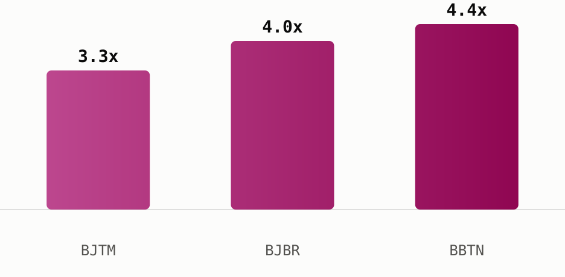

# Build a self-running IDX screener in two nights

In two hands-on evenings, you walk out with **three tools that run on their own**: 
- a screener that filters IDX by your rules
- a price alert that pings on big moves
- a morning digest of the day's top movers

All built live on the Sectors API, no coding background needed.

**[→ Claim your seat now](https://supertype.ai/events/n8n)** 
— July 27 & 28, 18.30 WIB · Online · IDR 590,000 · limited seats.

*Two evenings, hands-on, building automated IDX workflows on live Sectors data.*

## The essentials
| | |
| ----- | ----- |
| **Dates** | July 27 and 28, 2026 |
| **Time** | 18.30 to 21.00 WIB (GMT+7), both days |
| **Format** | Online, Zoom Conferencing |
| **Language** | Bahasa Indonesian |
| **Price** | IDR 590,000 |
| **Who it's for** | Analysts, investors, and automation-curious professionals working with Indonesian capital markets |
| **Can't attend live?** | Register anyway — the recording ships to your inbox |

**[Claim your seat →](https://supertype.ai/events/n8n)**

## What you walk away with

- **Zero manual screening, ever again.** Set your rules once (P/E, market cap, dividend yield) — the workflow screens IDX for you, every day, forever.
- **You hear about the move before your group chat does.** Price alert pings the moment a stock swings 5%+, no more checking the terminal every hour.
- **Your morning brief writes itself.** Top movers land in Telegram, Gmail, or Sheets before you've opened your laptop.
- **No engineer required.** Built on n8n's drag-and-drop workflow builder — if you can use a spreadsheet, you can build this.
- **Taught by someone who ships this in production.** Not a theory class — you're copying a system your instructor actually runs.

### How the two nights build to that
1. **Connect** — wire n8n to live Sectors data
2. **Filter** — turn raw numbers into buy/watch/ignore rules
3. **Deliver** — route results to where you already work (Sheets, Telegram, Gmail)
4. **Ship** — capstone: your own Daily Screener + Price Alert + Morning Digest, running on a schedule

## Your first screener could surface these
On night one, a screener you build yourself — filtering IDX banks trading under 12x trailing earnings — pulls names like this from a live `sectors.app` query:

| Ticker | Bank | P/E (TTM) |
|---|---|---|
| [**$BJTM**](https://sectors.app/idx/bjtm) | Bank Pembangunan Daerah Jawa Timur | 3.3x |
| [**$BJBR**](https://sectors.app/idx/bjbr) | Bank Pembangunan Daerah Jawa Barat dan Banten | 4.0x |
| [**$BBTN**](https://sectors.app/idx/bbtn) | Bank Tabungan Negara | 4.4x |

*Figures are from sectors.app as of 2026-07-13 unless otherwise cited. 
Do your own research.*

*The exact three names your own screener would surface on night one, at the moment this issue went out (sectors.app).*

That is the kind of result the workshop teaches you to pull automatically, on a schedule, without opening a spreadsheet by hand.

## Speaker

**Alya Dwinanda** is a Knowledge Expert at Supertype and Sectors who builds and ships API-based AI systems in production — including the kind of n8n workflow automation and RAG pipelines you'll build in this workshop. She's a published deep-learning and computer-vision researcher (IEEE, with work under review at Elsevier), a former AI Researcher at BRIN, and a BNSP-certified Data Scientist. She teaches both nights in Indonesian.

>The best person to teach a workflow is someone who runs it in production. What you'll build over these two nights is drawn from systems your instructor ships for real.

### Register now. Seats are limited. 

**[Claim your seat now →](https://supertype.ai/events/n8n)**

**Appendix: Sectors API endpoints (fields used)**
- `companies/?where=sub_sector = 'banks' AND pe_ttm < 12&order_by=pe_ttm` — the "what
  you'll build" teaser table (BJTM, BJBR, BBTN), `pe_ttm` band-checked before display

---
*This newsletter is data reporting and market commentary, not investment advice or a
recommendation to buy or sell any security. Figures are from sectors.app as of
2026-07-13 unless otherwise cited. Do your own research.*
