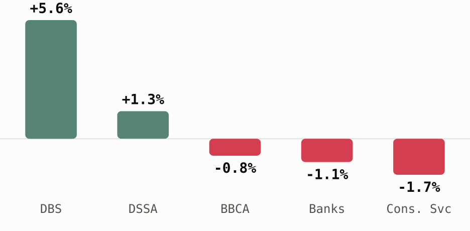

## Template

Hi {{first_name}},

**{{headline_ticker}}** is the standout among what you're tracking this week,
{{headline_move}} over the past seven days{{headline_context}}.

{{ranked_table}}

{{takeaway_paragraph}}

[See your full watchlist on Sectors]({{watchlist_link}}) to check the rest of what
you're tracking.

---
*This email is account and market information, not investment advice or a
recommendation to buy or sell any security. Market figures are from sectors.app as of
{{data_as_of}} unless otherwise cited. Do your own research.*

*You're receiving this because of your Sectors account activity. Unsubscribe / manage
preferences: {{unsubscribe_link}}*

**Merge-tag notes for a downstream renderer**

- `{{first_name}}` — static, from the dbquery row. **Falls back to "there"** ("Hi
  there,") when the row's `first_name` is `null`, per `compliance.md`'s rule 2 (omit
  the claim, don't drop the recipient). Sample row 1 hits this fallback.
- `{{headline_ticker}}`, `{{headline_move}}`, `{{headline_context}}`,
  `{{ranked_table}}` — all computed at render time from the live 7-day fetch against
  that recipient's own tracked tickers/sectors, not stored anywhere. Recompute per
  recipient at actual send time, don't cache these.
- `{{takeaway_paragraph}}` — the recipient's real, dated, cited factors/news/upcoming
  events for whichever of their tracked items the fetch actually turned up something
  real for. Not every row gets a factor, only the ones with a genuine source (Sectors
  API news/corporate-actions, or a cited web search). Never manufactured to fill every
  row.
- `{{watchlist_link}}`, `{{unsubscribe_link}}` — supplied by the downstream
  sending/CRM system, this skill never invents or hardcodes either.

## Rendered example (sample-row-1)

Real data used, real emails/names scrubbed per `../supabase-access.md`'s PII rule. This
user's `first_name` was `null` in the source row, so the greeting uses the fallback.

---
subject: "there, DBS just hit an all-time high"
preview: A look at how your tracked names and sectors moved this week.
issue_type: watchlist-performance-digest
date: 2026-07-16
data_as_of: 2026-07-15
sample_recipient: sample-row-1
---

# Your tracked names this week: DBS breaks out, Indonesian banks cool off

Hi there,

**DBS Group Holdings (D05)** is the standout among what you're tracking this week, up
**5.6% over the past seven days** to a fresh all-time high on July 15, its second
record close this week after July 14's high was broken the very next session. That
puts it 68% above its 52-week low of SGD 43.56, set almost exactly a year ago. It's
the biggest move of anything on your list, in either direction.

| Ticker / sector | Exchange | 7-day move | Peer comparison |
|---|---|---|---|
| **[Dian Swastatika Sentosa ($DSSA)](https://sectors.app/idx/dssa)** | IDX | +1.3% | 39.6x earnings vs 17.0x peer average |
| **[Bank Central Asia ($BBCA)](https://sectors.app/idx/bbca)** | IDX | -0.8% | 12.9x earnings vs 9.3x peer average |
| **[Banks](https://sectors.app/indonesia/banks)** (sector) | IDX | -1.1% | top mover: Bank Jago ([**$ARTO**](https://sectors.app/idx/arto)), +23.2% |
| **[Consumer Services](https://sectors.app/indonesia/consumer-services)** (sector) | IDX | -1.7% | top mover: MNC Tourism Indonesia ([**$KPIG**](https://sectors.app/idx/kpig)), +6.5% |
| **[DBS Group Holdings (D05)](https://sectors.app/sgx/d05)** | SGX | +5.6% | coming soon |

*DBS is the outlier on this recipient's own list, everything else tracked moved within a point of flat (sectors.app).*

Foreign investors were net sellers of BBCA, Bank Rakyat Indonesia, and Bank Mandiri on
July 14, and multiple local brokerages flagged bank profit-taking heading into midweek
(sectors.app), consistent with the Banks sector's -1.1% pullback even as the broader
IHSG held up. DSSA's own move came alongside two disclosed corporate actions in the
same week: a Rp 8.54 trillion acquisition of a controlling stake in EXCL, and a
reallocation of 620.4 million buyback shares raising Rp 794 billion, both dated July
13 (sectors.app). DBS crossed SGD 200 billion in market capitalization this week, the
first SGX-listed stock to do so (Yahoo News Singapore, 15 Jul 2026), and its next
results are due August 6 (DBS Investor Relations), a specific date to watch for
whether the current run holds into earnings.

[See your full watchlist on Sectors](https://sectors.app/watchlist) to check the rest
of what you're tracking.

---
*This email is account and market information, not investment advice or a
recommendation to buy or sell any security. Market figures are from sectors.app as of
2026-07-15 unless otherwise cited. Do your own research.*

*You're receiving this because of your Sectors account activity. Unsubscribe / manage
preferences: {{unsubscribe_link}}*

## Upcoming Events

**Automated IDX Stock Intelligence with n8n and Sectors API**

A hands-on exploration of workflow automation for Indonesian capital markets, from connecting live IDX data via Sectors API to building low-code intelligence pipelines and automated stock monitoring systems with n8n.

- **Date:** 27th and 28th July, 2026
- **Time:** 18.30 – 21.00 (GMT+7)
- **Medium:** Zoom Conferencing (Online)
- **Language:** Indonesian (by Alya Dwinanda)
- **Intended Audience:** Analysts, investors, and automation-curious professionals working with Indonesian capital markets

[Register here](https://supertype.ai/events/n8n)

**Hermes Agent x Sectors Community Meetup: Build a Financial AI Agent That Learns and Improves**

Install Hermes Agent, connect it to live IDX and SGX market data through the Sectors skill, and watch it write its own analytical skills. A casual, hands-on community meetup in Jakarta on building a self-improving financial AI agent.

- **Date:** 1st August, 2026
- **Time:** 13.00 – 16.00 (GMT+7)
- **Venue:** Block71, Ariobimo Sentral Building, 8th Floor, Jl. H. Rasuna Said, South Jakarta
- **Language:** English (by Andreas Christianto)

[Register here](https://supertype.ai/events/hermes)

**Sources**
- [DBS becomes first SGX stock to exceed $200 billion market capitalisation](https://sg.news.yahoo.com/live/singapore-live-news-dbs-becomes-first-sgx-stock-to-exceed-200-billion-market-capitalisation-singapore-leads-ai-readiness-despite-higher-work-exposure-as-80-million-asean-jobs-face-change-011226189.html), Yahoo News Singapore, 15 Jul 2026
- [Events Calendar](https://www.dbs.com/investors/events-calendar/default.page), DBS Bank Investor Relations (Q2 2026 results, 6 Aug 2026)

**Appendix: Sectors API endpoints (fields used)**
- `sectors-newsletter-dbquery` skill's approved `watchlist-tracked-interest.sql` —
  audience and tracked tickers/sectors
- `company/report/BBCA/?sections=overview,peers`, `daily/BBCA/` — performance + peer P/E
- `company/report/DSSA/?sections=overview,peers`, `daily/DSSA/` — performance + peer P/E
- `sgx/company/report/D05/?sections=overview`, `sgx/daily/D05/` — performance,
  all-time-high context
- `subsector/report/banks/`, `subsector/report/consumer-services/` — sector aggregate move
- `companies/top-changes/?classifications=top_gainers,top_losers&periods=7d&sub_sector=banks&n_stock=1`
- `companies/top-changes/?classifications=top_gainers,top_losers&periods=7d&sub_sector=consumer-services&n_stock=1`
- `news/?symbols=BBCA.JK`, `news/?sub_sector=banks` — foreign-selling/profit-taking context
- `news/?symbols=DSSA.JK` — EXCL stake acquisition, buyback reallocation
- `idx-total/` — composite benchmark
- Web search: DBS market-cap milestone, DBS Q2 2026 earnings date (see Sources above)
