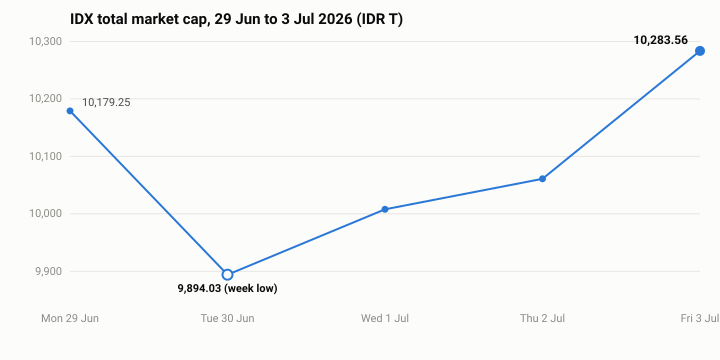

# Foreign money left as the index turned up

The market closed the week higher after a sharp Tuesday dip, but the buying that pulled it back came from local hands, not foreign ones.

## The week in one line

IDX total market cap rose **+1.02%** over the trading week to **IDR 10,283.56T**, recovering **+3.94%** off Tuesday's low, yet foreign investors sold Bank Rakyat Indonesia ([**$BBRI**](https://sectors.app/idx/bbri)) on every one of the five sessions, a net **IDR 979B** out of a single name (sectors.app). The tape turned up on domestic flow while the largest bank kept bleeding foreign money.

## Index & market

The week was V-shaped. The whole-market cap opened Monday at IDR 10,179.25T, fell to IDR 9,894.03T on Tuesday, then climbed four straight sessions into Friday's close. It reverses the prior week, which lost ground Monday to Friday.

*The week's daily path: one dip on Tuesday, then a four-session recovery to close up +1.02% WoW. Non-zero axis, so the real size of the move is visible.*

| | This week (29 Jun–3 Jul) | Prior week (22–26 Jun) |
|---|---|---|
| **IDX total mcap** | +1.02% WoW | -3.83% WoW |
| **LQ45** | +1.53% WoW | -2.58% WoW |
| **IDX30** | +1.19% WoW | -2.19% WoW |

The large-cap indices led the bounce, with LQ45 the strongest of the three at +1.53%.

## What actually traded

Volume did not follow the blue chips. The most-active list was dominated by low-priced Bakrie-group and coal-adjacent names, led by Bumi Resources ([**$BUMI**](https://sectors.app/idx/bumi)), which topped the daily volume table on four of the five sessions.

**Most active by peak daily volume (window)**

| Ticker | Peak daily volume | Price (IDR) |
|---|---|---|
| [**$BUMI**](https://sectors.app/idx/bumi) | 2.68B (30 Jun) | 139 |
| [**$BNBR**](https://sectors.app/idx/bnbr) | 2.29B (2 Jul) | 105 |
| [**$DEWA**](https://sectors.app/idx/dewa) | 0.72B (1 Jul) | 300 |
| [**$BRMS**](https://sectors.app/idx/brms) | 0.84B (1 Jul) | 484 |

Bumi Resources ([**$BUMI**](https://sectors.app/idx/bumi)) also ran roughly flat on foreign flow across the week (about +IDR 28B net), so its churn was a domestic-liquidity story, not a foreign-inflow one.

## Sector pulse: banks

Banks are where the split is clearest. The sub-sector recovered with the tape, but it sits near the bottom of the market on trailing performance and at a multi-year low on valuation.

- **Median P/E 10.5x** for 2026, against 14.7x in 2025, 16.2x in 2024, and 16.9x in 2023 (sectors.app).
- **Median P/B 0.74x**, the lowest reading in the 2022–2026 series (prior years 0.98x, 0.85x, 0.81x, 0.85x).
- Sub-sector market cap is still down **-22.96% year-to-date**, sitting in the bottom third of IDX sectors on trailing performance.

That is valuation context, not a call. It says banks are priced well below their own recent history; it does not say what happens next.

## Flows: the other side of the rally

The clearest read on who drove the week is the foreign tape on ([**$BBRI**](https://sectors.app/idx/bbri)), which was negative all five days.

| Date | Net foreign flow (IDR) |
|---|---|
| 29 Jun | -46.9B |
| 30 Jun | -251.9B |
| 1 Jul | -236.6B |
| 2 Jul | -268.3B |
| 3 Jul | -174.9B |

Even as bank prices rebounded into Friday, foreign investors were net sellers of BBRI every session. Someone local was on the other side of that trade.

## The takeaway

A green week on the index masked a hand-off. The recovery was carried by domestic buying and speculative volume in low-priced names, while foreign money kept exiting the market's flagship bank into the strength. Banks trade at 10.5x earnings and 0.74x book, near five-year lows, so the divergence between falling foreign participation and cheapening valuation is the thing to keep watching, not the headline +1% itself.

Explore the movers and the banks sub-sector for yourself on [sectors.app](https://sectors.app).

## Upcoming Events

**Automated IDX Stock Intelligence with n8n and Sectors API**

A hands-on exploration of workflow automation for Indonesian capital markets, from connecting live IDX data via Sectors API to building low-code intelligence pipelines and automated stock monitoring systems with n8n.

- **Date:** 27th and 28th July, 2026
- **Time:** 18.30 – 21.00 (GMT+7)
- **Medium:** Zoom Conferencing (Online)
- **Language:** Indonesian (by Alya Dwinanda)
- **Intended Audience:** Analysts, investors, and automation-curious professionals working with Indonesian capital markets

[Register here](https://supertype.ai/events/n8n)

**Hermes Agent x Sectors Community Meetup: Build a Financial AI Agent That Learns and Improves**

Install Hermes Agent, connect it to live IDX and SGX market data through the Sectors skill, and watch it write its own analytical skills. A casual, hands-on community meetup in Jakarta on building a self-improving financial AI agent.

- **Date:** 1st August, 2026
- **Time:** 13.00 – 16.00 (GMT+7)
- **Venue:** Block71, Ariobimo Sentral Building, 8th Floor, Jl. H. Rasuna Said, South Jakarta
- **Language:** English (by Andreas Christianto)

[Register here](https://supertype.ai/events/hermes)

**Appendix: Sectors API endpoints (fields used)**
- `idx-total/` — headline market cap, 7d/30d/YTD snapshot
- `idx-total/`, `index-daily/lq45/`, `index-daily/idx30/` — this-week vs. prior-week
- `companies/top-changes/?classifications=top_gainers,top_losers&periods=7d` — Weekly
  Top Movers
- `most-traded/?n_stock=3` — What actually traded
- `subsector/report/banks/` — Sector pulse (median P/E, P/B, 1w/YTD cap move)
- `foreign-flow/BBRI/` — Flows section, daily net foreign flow
- `filings/?limit=8` — New Filings
- `company/report/<TICKER>/?sections=overview`, `daily/<TICKER>/` — New IPOs, first-day
  change vs. offering price
- `news/?limit=12` — Headlines section

---
*This newsletter is data reporting and market commentary, not investment advice or a
recommendation to buy or sell any security. Figures are from sectors.app as of
2026-07-03 unless otherwise cited. Do your own research.*
